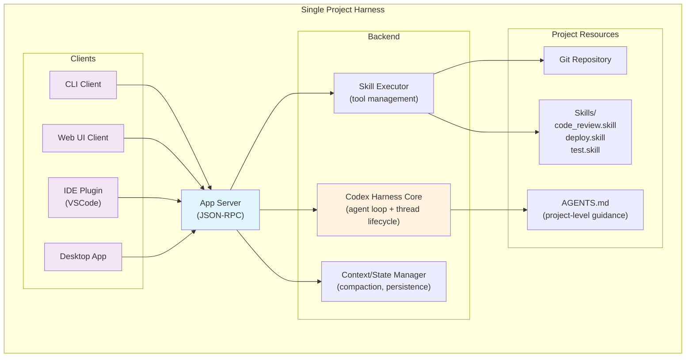
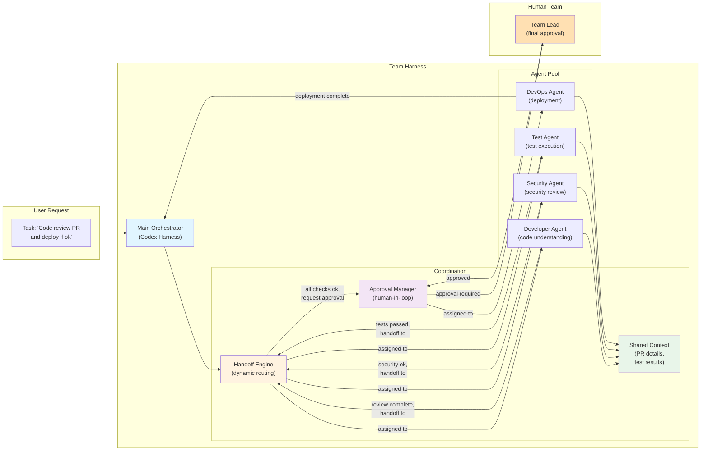
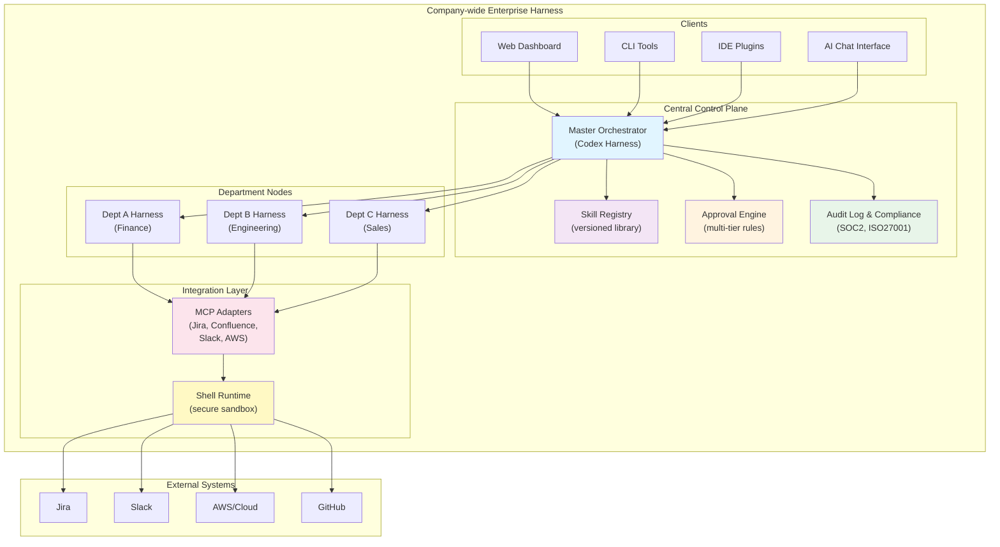

# OpenAI Codex Harness - 분석 보고서

## 1. 문서 개요

이 문서는 OpenAI의 AI 에이전트 하네스 기술 진화를 시간순으로 정리한 공식 자료로, 2024년 10월부터 2026년 2월까지의 기술 발전 경로를 추적한다. 핵심은 **stateless lightweight 설계에서 출발하여 production-grade long-running agent 시스템**으로 진화했다는 점이다.

문서가 제시하는 하네스 발전 단계는:
1. **2024.10: Swarm** - 교육용 다중 에이전트 handoff 패턴
2. **2025.03: Responses API + Agents SDK** - 실전화된 에이전트 프레임워크
3. **2026.02: Codex Harness** - App Server, Skills, Shell, Compaction을 통한 완성된 프로덕션 시스템

각 단계는 순차적으로 구축되며, 이전 단계의 교훈을 반영하여 다음 단계로 진화한다. 특히 주목할 점은 **"완전히 동일한 하네스를 Web, CLI, IDE, Desktop 등 여러 클라이언트에서 재사용"**할 수 있다는 아키텍처 철학이다. 이는 전통적인 application 개발의 "단일 backend + 다중 frontend" 원칙을 AI 에이전트에 적용한 것으로, 하네스 공학의 핵심을 보여준다.

문서의 구조상 각 섹션은 특정 기술 레이어(orchestration → API → infrastructure)와 그에 대응하는 실무 가치(패턴 재사용 → 실전 적용 가능 → production 운영)를 명확히 매핑한다.

---

## 2. 하네스 타입별 분석

### 2.1 개인 로컬 AI 에이전트 하네스 (Personal Local AI Agent Harness)

#### 2.1.1 이 문서가 주는 구체적 가치와 적용 가능성

**문서의 핵심 기여점:**

문서의 제3장 "Shell + Skills + Compaction: Tips for long-running agents that do real work (2026.02.11)"이 개인 로컬 AI 에이전트 하네스에 가장 직접적인 가치를 제공한다. 구체적으로:

- **Shell** 패턴: "hosted Shell(실제 컴퓨터 작업)"을 통해 에이전트가 로컬 시스템에서 실제 작업을 실행할 수 있는 구조 제시
- **Skills**: 재사용 가능하고 버전 관리 가능한 procedure로 prompt spaghetti 제거
- **Compaction**: server-side 자동 context 압축으로 장기 실행 에이전트의 context anxiety 해결

이 세 가지는 개인 개발자 관점에서 매우 실용적이다. 특히 "개인 작업"이라는 제약이 있을 때 여러 도구를 통합하고 상태를 관리하는 복잡성을 상당히 감소시킨다.

**적용 가능성 측면:**

문서는 "Prompt spaghetti를 유지보수 가능한 workflow로 전환"한다는 명시적 목표를 제시한다. 이는 개인 로컬 하네스 단계에서 매우 시급한 문제다. 개인이 여러 도구(Git, Shell, IDE, local filesystem)를 다루면서 자연스럽게 복잡도가 증가하는데, Skills와 Compaction 패턴이 이를 체계화하는 방법론을 제공한다.

문서의 제4장 "Best practices & AGENTS.md (2026)"에서 제시하는 **AGENTS.md 파일 패턴**은 개인 로컬 하네스에서 특히 강력하다. Git 저장소에 체크인되는 텍스트 파일로 "durable guidance"를 제공한다는 개념은, 개인 프로젝트 하네스로 확장할 때 매우 자연스럽다.

#### 2.1.2 강점 (Strengths)

| 강점 | 문서 근거 | 구체적 이점 |
|------|---------|-----------|
| **Context 관리** | "server-side Compaction(자동 context 압축)" | long-running session에서도 token budget을 초과하지 않음. 개인이 수동으로 관리할 필요 없음 |
| **Git 자연스러운 연동** | "AGENTS.md 파일로 durable guidance 제공 (repository-level agent instructions)" | 버전 관리, code review, history tracking이 자동으로 따라옴 |
| **Local Shell 작업** | "hosted Shell(실제 컴퓨터 작업)" | 로컬 개발 환경과 완벽한 호환성. npm, git, bash 등 기존 도구 활용 가능 |
| **Skills 재사용** | "Skills(재사용·버전 관리 가능한 procedure)" | 개인이 작성한 utility들을 조직화하고 여러 프로젝트 간 공유 가능 |
| **실전 guidance** | "Negative examples, secure networking 가이드 포함" | 개인이 겪을 수 있는 실제 함정들을 미리 학습 가능 |

#### 2.1.3 약점 및 극복 방안

| 약점 | 원인 | 극복 방안 |
|------|------|---------|
| **Stateless 설계의 한계** | Swarm(2024.10) 기반이 stateless로 설계됨 | Codex harness(2026.02)의 "thread lifecycle" 개념 도입으로 극복. Session 상태가 server에 persistent됨 |
| **Multiple tool 통합의 복잡도** | Shell, Skills, Git 등을 모두 연동해야 함 | JSON-RPC 기반 App Server 아키텍처 활용. 단일 entry point에서 모든 도구 조율 |
| **Approval flow 부재** | 개인 작업이라 승인 과정이 불필요해 보임 | 문서에서 "approval" 지원을 명시하나, 개인 하네스에서는 audit log로 충분할 수 있음 |
| **Compaction 전략 선택의 어려움** | "자동 context 압축"이 어떻게 작동하는지 문서에서 상세 미제시 | Prompt spaghetti 방지를 위해 Skills로 모듈화하면, compaction 필요성 자체를 줄일 수 있음 |

#### 2.1.4 실무 적용 단계 (구체적 아키텍처 제안)

**단계 1: 기초 설정 (Week 1-2)**

```
개인 로컬 하네스 = {
  Core: Codex harness App Server (로컬 또는 Docker에서 실행)
  Config: .agents.md (프로젝트 루트의 AGENTS.md)
  Storage: Local filesystem + Git repository
  Runtime: Local shell (bash, npm, python 등)
}
```

**단계 2: Skills 조직화 (Week 3-4)**

```
프로젝트구조:
  /.agents.md                           # Core guidance
  /skills/
    - code_review.skill                # 코드 리뷰 자동화
    - git_workflow.skill               # Git 작업 자동화
    - testing_automation.skill         # 테스트 실행
    - documentation.skill              # 문서 생성
  /hooks/
    - pre-commit.sh                    # Git 훅
  /rules/
    - security_rules.json              # 보안 정책
```

**단계 3: Long-running Tasks 안정화 (Week 5-6)**

```
Context 관리 전략:
  1. 명시적 task boundary: Skills로 독립 작업 단위화
  2. Compaction trigger: 명시적 checkpoint에서 context 정리
  3. Session reset: 장시간 실행 후 자동 상태 저장 및 새 session 시작
```

**pseudocode: 개인 로컬 하네스 초기화**

```python
class PersonalLocalHarness:
    def __init__(self, project_root):
        self.app_server = CodxHarnessAppServer(
            backend='local',
            filesystem_root=project_root,
            shell_runtime='bash'
        )
        self.agents_md = load_file(f"{project_root}/.agents.md")
        self.skills = load_skills(f"{project_root}/skills/")
        self.context_limit = 64000  # tokens
        self.compaction_threshold = 0.8 * self.context_limit

    def run_task(self, task_description):
        """장기 실행 작업 실행"""
        session = self.app_server.create_session()
        messages = [
            {"role": "system", "content": self.agents_md},
            {"role": "user", "content": task_description}
        ]

        while not session.is_complete():
            response = self.app_server.message_streaming(
                session_id=session.id,
                messages=messages,
                tools=self.skills,
                on_tool_call=self._execute_tool
            )

            messages.append(response)

            # Compaction check
            if self._token_count(messages) > self.compaction_threshold:
                messages = self._compact_context(messages)

        return session.result()

    def _execute_tool(self, skill_name, args):
        """Shell에서 skill 실행"""
        skill = self.skills[skill_name]
        result = subprocess.run(
            skill.command(args),
            cwd=self.app_server.filesystem_root,
            capture_output=True
        )
        return result.stdout

    def _compact_context(self, messages):
        """Context 압축"""
        # 초기 system prompt + 최근 N개 message만 유지
        core = messages[:1]
        recent = messages[-10:]
        return core + [{
            "role": "assistant",
            "content": "<!-- previous context compacted -->"
        }] + recent
```

**단계 4: IDE/CLI 연동 (Week 7-8)**

```
App Server JSON-RPC 인터페이스:
  - Web UI client: http://localhost:8000/app
  - CLI client: cli.py --session-id <id> message "..."
  - IDE plugin: VSCode extension connecting to App Server

모든 클라이언트는 동일한 하네스 사용
→ "여러 도구에서 같은 상태 조작" 가능
```

---

### 2.2 단일 프로젝트 하네스 (Single Project Harness)

#### 2.2.1 이 문서가 주는 구체적 가치와 적용 가능성

**문서에서 직접 다루는 내용:**

문서의 제2장 "Unlocking the Codex harness: how we built the App Server (2026.02.04)"은 "Web/CLI/IDE/Desktop에서 **완전히 동일한 harness** 재사용 가능"하다고 명시한다. 이는 단일 프로젝트 하네스의 핵심 가치 proposition이다.

단일 프로젝트 하네스에서는:
- 프로젝트의 모든 자동화 작업이 **공통 하네스**에 의존
- 개발자, QA, DevOps가 같은 harness를 다른 클라이언트로 접근
- 프로젝트 내 모든 도구(test, lint, build, deploy)가 skill로 정의

**적용 가능성:**

단일 프로젝트는 여러 팀원이 관여하므로, "streaming progress, approval, persistence"가 매우 중요하다. 문서에서 명시적으로 이 세 기능을 지원한다고 했으므로, 팀 협업 모델이 처음 나타나는 지점이다.

#### 2.2.2 강점

| 강점 | 문서 근거 | 구체적 이점 |
|------|---------|-----------|
| **Multi-client 호환성** | "Web/CLI/IDE/Desktop에서 완전히 동일한 harness 재사용" | 각 팀원이 선호하는 도구(IDE, terminal, web UI)를 자유롭게 선택 가능. harness 자체는 통일 |
| **Streaming progress** | "Streaming progress, approval, persistence 지원" | 장시간 작업의 진행 상황을 실시간으로 확인 가능. 사용자 기다림 감소 |
| **Approval workflow** | "approval ... 지원" | 위험한 작업(deploy, delete) 실행 전 승인 프로세스 가능 |
| **JSON-RPC 아키텍처** | "JSON-RPC 기반 App Server로 노출" | 표준 프로토콜로 구현되어 custom client 작성 용이 |
| **Persistence** | "persistence 지원" | 작업 상태가 저장되므로, 네트워크 끊김이나 클라이언트 종료 후에도 복구 가능 |

#### 2.2.3 약점 및 극복 방안

| 약점 | 원인 | 극복 방안 |
|------|------|---------|
| **프로젝트별 customization** | 문서에서 "공통 harness" 개념이지만 프로젝트마다 다를 수 있음 | AGENTS.md를 프로젝트 루트에 배치하고 버전 관리. Template로 시작 |
| **Multi-client consistency** | 여러 클라이언트가 동시에 접근할 때 상태 충돌 가능 | App Server에서 lock/session 관리 필수. Codex harness에서 이를 지원한다고 명시 |
| **Approval 흐름의 UX** | "approval" 지원하지만 구체적 UX가 문서에 미상세 | 각 클라이언트(CLI, Web, IDE)에서 일관된 승인 프롬프트 필요 |
| **복잡한 의존성 관리** | 여러 skill이 서로 다른 도구/환경 요구 | Skill별로 requirements 명시하고, Docker/container 활용 권장 |

#### 2.2.4 실무 적용 단계

**아키텍처 다이어그램:**



**Pseudocode: 단일 프로젝트 하네스 인스턴스**

```python
class SingleProjectHarness:
    def __init__(self, git_repo_path):
        self.repo_path = git_repo_path
        self.app_server = CodexAppServer(
            project_root=git_repo_path,
            enable_streaming=True,
            enable_approval=True,
            enable_persistence=True
        )
        self.session_manager = SessionManager(
            backend='persistent_db'  # 상태 저장
        )
        self.agents_md = load_file(f"{git_repo_path}/AGENTS.md")

    def create_session(self, client_type='cli'):
        """클라이언트 타입에 관계없이 동일 session 생성"""
        session = self.session_manager.create({
            'client_type': client_type,
            'project': self.repo_path,
            'created_at': now(),
            'approval_required': True
        })
        return session

    def execute_with_approval(self, session_id, task, skill_name):
        """승인 흐름 포함 실행"""
        skill = load_skill(f"{self.repo_path}/skills/{skill_name}.skill")

        # 1. Approval request 생성
        approval_req = ApprovalRequest(
            session_id=session_id,
            skill=skill_name,
            task=task,
            estimated_impact='high'  # e.g., deploy skill
        )

        # 2. 모든 클라이언트에 broadcast (notification)
        for client in self.app_server.active_clients(session_id):
            client.notify_approval_required(approval_req)

        # 3. 승인 대기 (CLI: stdin, Web: form click, IDE: dialog)
        approval_result = self.session_manager.wait_for_approval(
            approval_req.id,
            timeout=300  # 5분
        )

        if not approval_result.approved:
            return {"status": "rejected", "reason": approval_result.reason}

        # 4. 승인 후 실행 + streaming
        result = self.app_server.execute_skill(
            session_id=session_id,
            skill=skill,
            args=task,
            stream=True
        )

        return result
```

**단계별 구현 로드맵:**

| 단계 | 기간 | 내용 | 체크포인트 |
|------|------|------|-----------|
| 1단계: 기초 | Week 1-2 | App Server 배포, Git 연동 | 모든 클라이언트에서 접속 가능 |
| 2단계: Skills | Week 3-4 | 프로젝트 자동화 workflow skill화 | 각 skill 버전 관리, documentation |
| 3단계: Approval | Week 5-6 | 위험 작업에 대한 승인 flow | Multiple client에서 일관된 UX |
| 4단계: Persistence | Week 7-8 | 세션 상태 저장, recovery | 네트워크 끊김 후 복구 가능 |
| 5단계: Monitoring | Week 9-10 | Audit log, observability | 모든 작업 추적 가능 |

---

### 2.3 팀 협업 하네스 (Team Collaboration Harness)

#### 2.3.1 이 문서가 주는 구체적 가치와 적용 가능성

**문서에서 제시하는 핵심 패턴:**

문서의 제1장 "Orchestrating Agents: Routines and Handoffs (2024.10) + Swarm"은 "Handoffs(에이전트 간 동적 넘김)" 개념을 중심으로 설명한다. 이는 팀 협업의 핵심 문제인 **"누가 어떤 작업을 수행할 것인가"**를 해결한다.

팀 협업 하네스의 문맥:
- 여러 전문가(개발자, 보안, DevOps, QA) 에이전트들이 협력
- 각 에이전트는 **자신의 전문 영역 routines** 보유
- Task는 에이전트 간 **동적으로 handoff**
- 최종 사람(human)이 의사결정 (approval flow)

**문서의 Swarm 평가:**
- "교육용으로 명시"되어 있으므로, 프로덕션 팀 협업은 Codex harness (2026.02) 기반이어야 함
- Swarm은 "stateless 설계로 observability와 테스트 용이"하다는 점이 팀 협업에서 중요 (여러 에이전트의 행동 추적 용이)

#### 2.3.2 강점

| 강점 | 문서 근거 | 팀 협업 관점 |
|------|---------|-----------|
| **Handoff 패턴** | "Handoffs(에이전트 간 동적 넘김)" | Task routing이 자동화됨. 사람이 누가 할 지 결정할 필요 없음 |
| **Routines 모듈화** | "Routines(자연어 instructions + tools)" | 각 팀 전문가의 지식을 재사용 가능한 routine으로 정형화 |
| **Observability** | "Stateless 설계로 observability와 테스트 용이" | 누가 언제 무엇을 했는지 추적 가능. 팀 내 신뢰도 증가 |
| **Lightweight** | "lightweight multi-agent" | 팀이 작을 때도 scalable. Over-engineering 방지 |
| **Approval workflow** | Codex harness의 "approval" 지원 | 각 에이전트의 결정이 최종 승인 전에 review 가능 |

#### 2.3.3 약점 및 극복 방안

| 약점 | 원인 | 극복 방안 |
|------|------|---------|
| **Handoff 로직의 복잡성** | Swarm은 "교육용"이고 완성도가 낮을 수 있음 | Codex harness(2026.02)의 full orchestration 활용. 더 복잡한 handoff rule 지원 |
| **에이전트 간 context 공유** | Stateless에 집중되어 context 보존이 불명확 | Codex harness의 "thread lifecycle" + shared context store 활용 |
| **팀 규모 확장 시 scalability** | Lightweight가 작은 팀용임 | Company-wide harness로 진화할 때 다시 아키텍처 검토 필요 |
| **에이전트 간 신뢰성** | 자동 handoff 시 오류 에이전트의 영향 범위 불명확 | 각 routine을 skill로 정의하고 unit test. Approval flow로 human override |

#### 2.3.4 실무 적용 단계

**아키텍처 다이어그램: 팀 협업 하네스 흐름**



**Pseudocode: 팀 협업 하네스 구현**

```python
class TeamCollaborationHarness:
    """
    여러 에이전트가 협력하는 하네스
    각 에이전트는 자신의 전문 routine 보유
    """

    def __init__(self):
        self.orchestrator = CodexHarness()
        self.agents = {
            'developer': DeveloperAgent(),
            'security': SecurityAgent(),
            'test': TestAgent(),
            'devops': DevOpsAgent()
        }
        self.handoff_rules = self._load_handoff_rules()
        self.shared_context = SharedContextStore()
        self.approval_manager = ApprovalManager()

    def _load_handoff_rules(self):
        """
        Handoff 규칙 정의
        상태 + 조건 → 다음 에이전트
        """
        return {
            'initial': {
                'next_agent': 'developer',
                'routine': 'code_review'
            },
            'code_review_done': {
                'condition': 'has_security_concerns',
                'next_agent': 'security',
                'routine': 'security_audit'
            },
            'security_audit_done': {
                'next_agent': 'test',
                'routine': 'run_tests'
            },
            'tests_passed': {
                'next_agent': 'approval_manager',  # Human handoff
                'action': 'request_approval'
            },
            'approved': {
                'next_agent': 'devops',
                'routine': 'deploy'
            }
        }

    def process_task(self, task_id, task_description):
        """
        팀 협업으로 task 처리
        """
        session = self.orchestrator.create_session(task_id)
        self.shared_context[task_id] = {
            'description': task_description,
            'current_state': 'initial',
            'history': [],
            'results': {}
        }

        current_state = 'initial'

        while not self._is_final_state(current_state):
            # 1. Handoff rule 조회
            rule = self.handoff_rules[current_state]
            next_agent_name = rule['next_agent']

            # 2. Agent에 task handoff
            if next_agent_name == 'approval_manager':
                # Human approval required
                approval_result = self._request_human_approval(
                    task_id,
                    self.shared_context[task_id]
                )
                if approval_result.approved:
                    current_state = 'approved'
                else:
                    current_state = 'rejected'
                    break
            else:
                # Agent routine 실행
                agent = self.agents[next_agent_name]
                routine_name = rule['routine']

                result = agent.execute_routine(
                    routine_name,
                    context=self.shared_context[task_id],
                    session_id=session.id
                )

                # 3. 결과를 shared context에 저장
                self.shared_context[task_id]['results'][next_agent_name] = result
                self.shared_context[task_id]['history'].append({
                    'agent': next_agent_name,
                    'routine': routine_name,
                    'result': result,
                    'timestamp': now()
                })

                # 4. 다음 상태 결정
                current_state = self._determine_next_state(
                    current_state,
                    result,
                    rule
                )

        return {
            'task_id': task_id,
            'final_state': current_state,
            'results': self.shared_context[task_id]['results'],
            'history': self.shared_context[task_id]['history']
        }

    def _request_human_approval(self, task_id, context):
        """
        Human approval request
        Multiple client에 notification 전송
        """
        approval_req = ApprovalRequest(
            task_id=task_id,
            context=context,
            required_role='team_lead'
        )

        # 모든 팀원에게 notification
        for team_member in self._get_team_members():
            if team_member.can_approve(required_role='team_lead'):
                team_member.notify(
                    f"Approval required for task {task_id}\n"
                    f"Details: {context}"
                )

        # Approval 대기
        return self.approval_manager.wait_for_approval(
            approval_req,
            timeout=300
        )

    def _is_final_state(self, state):
        return state in ['deployed', 'rejected']

    def _determine_next_state(self, current_state, result, rule):
        """
        현재 상태 + 결과 → 다음 상태
        """
        if current_state == 'code_review_done':
            if result.has_security_concerns:
                return 'code_review_done'
            else:
                return 'security_audit_done'

        # ... more rules ...

        # Default: follow rule
        return current_state + '_done'
```

**팀 협업 하네스 배포 전략:**

| 단계 | 목표 | 구현 내용 |
|------|------|---------|
| Phase 1: Agent 정의 | 각 팀 역할을 Agent로 명시 | 4-5명 팀원 면담 → Agent specification |
| Phase 2: Routine 작성 | 각 Agent의 표준 업무 routine화 | 각 routine = skill 단위 |
| Phase 3: Handoff rule | Agent 간 task flow 정의 | 상태 기계로 명시 |
| Phase 4: Approval flow | Human 승인 프로세스 정의 | 누가 언제 승인하는지 |
| Phase 5: Observability | 모든 행동 추적 | Audit log, notification |
| Phase 6: Iteration | 실제 task로 테스트 후 개선 | Feedback loop 설정 |

---

### 2.4 회사 규모 엔터프라이즈 하네스 (Company-wide Enterprise Harness)

#### 2.4.1 이 문서가 주는 구체적 가치와 적용 가능성

**문서에서 암시하는 확장성:**

문서는 2024년 Swarm(팀 단위)에서 2026년 Codex harness(회사 전체)로 진화했다고 명시한다. 이는 단순한 기술 업그레이드가 아니라 **scale-out capability**이다.

회사 규모 하네스의 요구사항 (문서에서 추론):
- **App Server JSON-RPC** 아키텍처는 중앙화된 서비스로 배포 가능
- **Skills** versioning과 repo 관리가 필수 (회사 전체 skill library)
- **Approval** workflow가 복잡해짐 (부서장, 보안팀, 규정 준수)
- **Compaction & Persistence**가 더욱 중요해짐 (장기 운영)

문서의 "완전히 동일한 harness 재사용"이라는 원칙은 회사 규모에서 특히 강력하다. 부서별로 다른 하네스를 관리하지 않고, 하나의 중앙 harness + 부서별 skill + 부서별 approval rule로 관리 가능해진다.

#### 2.4.2 강점

| 강점 | 문서 근거 | 회사 규모 적용 |
|------|---------|-------------|
| **Central harness** | "완전히 동일한 harness 재사용" | 기술 부채 감소. 일관된 behavior 보장 |
| **Scalable App Server** | "JSON-RPC 기반 App Server" | 표준 프로토콜로 구현. Load balancing 용이. Multi-region 배포 가능 |
| **Skills as Library** | "Skills(재사용·버전 관리 가능한 procedure)" | 회사 전체 automation library. Marketplace 형성 가능 |
| **Security via Approval** | "approval ... 지원" | 각 부서의 정책을 approval rule로 구현. 규정 준수 추적 |
| **Long-running reliability** | "Compaction & Persistence" | 24/7 운영 가능. Failover, recovery 메커니즘 탑재 |
| **Observability** | Swarm의 "stateless 설계로 observability 용이" + App Server logging | 회사 전체 audit trail. Compliance reporting |

#### 2.4.3 약점 및 극복 방안

| 약점 | 원인 | 극복 방안 |
|------|------|---------|
| **다양한 부서의 요구사항 충돌** | 회사 규모에서는 부서별 policy가 다름 | AGENTS.md를 부서별로 커스터마이징 가능하게 설계. Centralized harness + distributed config |
| **Skill 관리의 복잡성** | 수백 개의 skill이 존재하면 의존성, 버전 관리 어려움 | Skill marketplace + registry. Version control 강화. Dependencies 명시 |
| **Approval workflow의 복잡성** | 다단계 approval (팀장 → 부서장 → CTO) 필요 | Approval rule을 code로 정의 (AGENTS.md rules 섹션) |
| **Cost & Resource** | 중앙 App Server 유지보수 비용 | Multi-tenant architecture. Auto-scaling 설정 |
| **Legacy system 통합** | 기존 도구들 (Jira, Confluence, etc.)과의 연동 | Shell + MCP (Model Context Protocol) 활용. Adapter skill 작성 |

#### 2.4.4 실무 적용 단계

**회사 규모 하네스 아키텍처:**



**Pseudocode: 회사 규모 하네스 운영**

```python
class EnterpriseHarness:
    """
    회사 전체를 위한 중앙 하네스
    다중 부서, 다중 정책, 다중 클라이언트 지원
    """

    def __init__(self):
        # Central components
        self.master_orchestrator = CodexHarness(
            mode='enterprise',
            high_availability=True,
            multi_region=True
        )
        self.skill_registry = SkillRegistry(
            repo='git@company.com:harness/skills.git',
            versioning='semantic',
            marketplace=True  # 부서 간 skill 공유
        )
        self.approval_engine = MultiTierApprovalEngine()
        self.audit_log = ComplianceAuditLog(
            soc2=True,
            iso27001=True,
            gdpr=True
        )

        # Department instances
        self.departments = {
            'finance': DepartmentInstance(
                name='Finance',
                agents_md=load_agents_md('finance/.agents.md'),
                approval_rules=load_approval_rules('finance/approval.json')
            ),
            'engineering': DepartmentInstance(
                name='Engineering',
                agents_md=load_agents_md('engineering/.agents.md'),
                approval_rules=load_approval_rules('engineering/approval.json')
            ),
            'sales': DepartmentInstance(
                name='Sales',
                agents_md=load_agents_md('sales/.agents.md'),
                approval_rules=load_approval_rules('sales/approval.json')
            )
        }

        # Integration
        self.mcp_adapters = {
            'jira': JiraMCPAdapter(),
            'slack': SlackMCPAdapter(),
            'aws': AWSShellAdapter(),
            'github': GitHubMCPAdapter()
        }

    def create_department_session(self, dept_name, user_id, task):
        """
        부서별 session 생성
        하나의 central harness를 여러 부서에서 사용
        """
        dept = self.departments[dept_name]
        session = self.master_orchestrator.create_session({
            'department': dept_name,
            'user_id': user_id,
            'task': task,
            'agents_md': dept.agents_md,
            'approval_rules': dept.approval_rules
        })
        return session

    def execute_with_approval_chain(self, session_id, skill_name, args):
        """
        다단계 승인 workflow
        부서 정책에 따라 자동으로 승인 단계 결정
        """
        dept_name = self.master_orchestrator.get_session(session_id)['department']
        dept = self.departments[dept_name]

        # 1. Skill 조회 (central registry)
        skill = self.skill_registry.get_skill(
            name=skill_name,
            version='latest'
        )

        # 2. Approval rules 적용
        approval_chain = dept.approval_rules.get_chain_for(skill)
        # e.g., ['team_lead', 'cto'] for deployment skills

        # 3. 각 approval stage 실행
        for approver_role in approval_chain:
            approval_result = self.approval_engine.request_approval(
                session_id=session_id,
                role=approver_role,
                skill=skill_name,
                args=args
            )

            if not approval_result.approved:
                self.audit_log.record({
                    'event': 'approval_rejected',
                    'session_id': session_id,
                    'skill': skill_name,
                    'approver_role': approver_role,
                    'reason': approval_result.reason
                })
                return {
                    'status': 'rejected',
                    'reason': approval_result.reason
                }

        # 4. 모든 승인 완료 → 실행
        result = self.master_orchestrator.execute_skill(
            session_id=session_id,
            skill=skill,
            args=args
        )

        # 5. Audit log 기록
        self.audit_log.record({
            'event': 'skill_executed',
            'session_id': session_id,
            'skill': skill_name,
            'args': args,
            'result': result,
            'approvers': approval_chain
        })

        return result

    def skill_marketplace(self):
        """
        부서 간 skill 공유 & 발견
        """
        return {
            'popular_skills': self.skill_registry.get_popular(),
            'department_skills': self.skill_registry.group_by_department(),
            'usage_stats': self.skill_registry.get_usage_stats(),
            'dependencies': self.skill_registry.get_dependency_graph()
        }

    def compliance_report(self, start_date, end_date):
        """
        SOC2/ISO27001 compliance 보고서
        자동 생성
        """
        return {
            'soc2': {
                'all_actions_logged': True,
                'approvals_documented': True,
                'access_control_enforced': True,
                'details': self.audit_log.generate_soc2_report(
                    start_date, end_date
                )
            },
            'iso27001': {
                'encryption': 'tls1.3',
                'access_control': 'role_based',
                'audit_trail': True,
                'details': self.audit_log.generate_iso27001_report(
                    start_date, end_date
                )
            },
            'gdpr': {
                'data_retention': '90_days',
                'pii_handling': 'encrypted_and_logged',
                'deletion_requests': self.audit_log.get_gdpr_deletions(
                    start_date, end_date
                )
            }
        }
```

**회사 규모 하네스 배포 roadmap:**

| Phase | Timeline | Milestones | Success Criteria |
|-------|----------|-----------|------------------|
| **1. Foundation** | Month 1-2 | App Server 구축 (HA, multi-region), Skill Registry 설정, Audit Log | 모든 부서 접속 가능, logging 작동 |
| **2. Core Department** | Month 3-4 | Engineering 부서부터 시작. Skills 마이그레이션 | CI/CD 자동화 50% 이상 harness로 이전 |
| **3. Approval Engine** | Month 5-6 | Multi-tier approval workflow, 부서별 policy 적용 | 모든 주요 작업이 approval flow 포함 |
| **4. Remaining Dept.** | Month 7-9 | Finance, Sales, HR 등 추가 | 회사 전체 adoption |
| **5. Integration** | Month 10-11 | Jira, Slack, AWS, GitHub 통합 | MCP adapter 완성 |
| **6. Optimization** | Month 12+ | Cost optimization, performance tuning, skill marketplace | 운영 안정화 |

---

## 3. 다중 관점 기술 심화 분석

### 3.1 아키텍처 & 멀티-에이전트 설계

#### 3.1.1 계층 구조

문서에서 명시한 아키텍처 레이어:

```
Layer 1 (Interaction): Web, CLI, IDE, Desktop
                       ↓ (JSON-RPC)
Layer 2 (Orchestration): Codex Harness App Server
                         ↓ (agent loop + thread lifecycle)
Layer 3 (Execution): Routines (자연어) + Tools (Skills)
                     ↓ (Shell, filesystem)
Layer 4 (Resources): Local shell, filesystem, Git, external APIs
```

**Layer 2 (Codex Harness)의 구성:**

문서 제2장에서:
- Agent loop: task → thought → action → observation → repeat until complete
- Thread lifecycle: session creation → message history → persistence
- Tool execution: 각 tool(skill)을 호출하고 결과를 context에 통합

#### 3.1.2 멀티-에이전트 Handoff 메커니즘

문서 제1장 "Orchestrating Agents"에서:

```
Swarm의 Handoff 패턴:

Agent A (Routine: code_review)
  ↓ (internal decision: handoff needed)
  "I'll hand off to Security Agent"

Handoff trigger → Orchestrator

Orchestrator → Agent B (Routine: security_audit)

Agent B는 이전 context를 받음:
  - Agent A의 결과
  - 원래 task 설명
  - 누적된 observations
```

**구현 전략:**

```python
class AgentHandoff:
    """
    에이전트 간 task 이양
    """
    def should_handoff(self, agent_state, observations):
        """
        현재 에이전트가 handoff할 시점 판단
        """
        if 'requires_security_review' in observations[-1]:
            return HandoffRequest(
                target_agent='security',
                context={
                    'previous_findings': observations,
                    'current_state': agent_state
                }
            )
        return None

    def execute_handoff(self, handoff_req):
        """
        Handoff 실행
        """
        target_agent = self.agents[handoff_req.target_agent]

        # Context 전달
        target_agent.set_context(handoff_req.context)

        # 명시적으로 이전 에이전트의 결과를 다음 에이전트에게 알림
        result = target_agent.execute_routine(
            initial_message=f"Previous agent concluded: {handoff_req.context}"
        )

        return result
```

#### 3.1.3 Stateless vs. Stateful 설계 비교

**Swarm (Stateless):**
- 각 에이전트가 독립적
- 부작용 없음 (side-effect free)
- Observability 우수 (누가 뭘 했는지 명확)
- 하지만: session 간에 상태 보존 안 됨

**Codex Harness (Stateful):**
- Thread lifecycle 지원
- Session persistence
- Long-running tasks에 유리
- 더 복잡하지만 실무 필수

문서의 진화 경로 (Swarm → Codex)는 이 트레이드오프를 명시한다.

---

### 3.2 Context / State / Memory 관리

#### 3.2.1 Context Compaction Strategy

문서 제3장 "Shell + Skills + Compaction"에서 가장 중요한 부분:

**문제점:**
```
Long-running agent의 context explosion:

Iteration 1: context = 2K tokens
Iteration 2: context = 4K (prev + new)
Iteration 3: context = 8K
...
Iteration 10: context = 2M tokens → 모델 한계 도달
```

**해결책 (문서에서 명시):**
```
Server-side Compaction:

Checkpoint 1:
  [System prompt] + [Messages 1-100] → Execute task

Checkpoint 2 (context 90% 도달):
  old_messages = [Messages 1-100]
  compacted = {
    "summary": "Previous 100 messages summary",
    "key_decisions": [...],
    "artifacts_created": [...]
  }

Continue with:
  [System prompt] + [compacted] + [Recent 5 messages]
```

**Compaction의 구현 전략:**

```python
class ContextCompactor:
    def __init__(self, context_limit=128000, compact_threshold=0.9):
        self.context_limit = context_limit
        self.compact_threshold = compact_threshold

    def should_compact(self, messages, token_count):
        """
        Compaction이 필요한지 판단
        """
        return token_count > (self.context_limit * self.compact_threshold)

    def compact(self, messages):
        """
        메시지 이력 압축

        Strategy:
        1. 시스템 프롬프트 유지
        2. 초기 10개 메시지 유지 (task context)
        3. 중간 메시지들 요약
        4. 최근 5개 메시지 유지
        """
        system = messages[0]  # System message 보존
        initial = messages[1:11]  # Task context
        middle = messages[11:-5]  # 압축 대상
        recent = messages[-5:]  # 최근 context

        # Middle 부분 요약
        summary = self._summarize_middle(middle)

        # Compressed 메시지 구성
        compressed = [
            system,
            *initial,
            {
                'role': 'system',
                'content': '<!-- CONTEXT COMPACTION -->\n' + summary
            },
            *recent
        ]

        return compressed

    def _summarize_middle(self, messages):
        """
        중간 메시지들의 요약

        각 메시지에서 다음을 추출:
        - 의사결정 (decision)
        - 발견 (finding)
        - 생성된 artifact (created_file, etc.)
        """
        summary_points = []

        for msg in messages:
            if msg['role'] == 'assistant':
                # 의사결정 추출
                if 'decision:' in msg['content'].lower():
                    summary_points.append(
                        f"- Decision: {extract_decision(msg)}"
                    )

                # 생성된 artifact 추출
                if 'created' in msg['content']:
                    summary_points.append(
                        f"- Created: {extract_artifact(msg)}"
                    )

        return '\n'.join(summary_points)
```

#### 3.2.2 State Reset Strategy

Long-running agent의 또 다른 문제: **state drift**

```
State drift problem:

Session 시작 시: agent = fresh
Task 진행 중: agent가 여러 결정 누적
5시간 후: agent의 원래 목표가 분명하지 않을 수 있음

예: "코드 리뷰" 작업이 점차 "성능 최적화"로 변질될 수 있음
```

**문서에서 암시하는 해결책:**

```
Explicit state reset:

명시적 checkpoints에서:
1. 현재까지의 작업 요약
2. 원래 task 재확인
3. 다음 단계의 명확한 목표 재선언

AGENTS.md에 정의:
  - Major checkpoints
  - State validation rules
  - Reset triggers
```

#### 3.2.3 Shared Context in Multi-agent

팀 협업 하네스에서 여러 에이전트가 같은 task에 접근할 때:

```python
class SharedContextStore:
    """
    여러 에이전트가 접근하는 공유 상태
    """
    def __init__(self):
        self.context = {}
        self.access_log = []

    def read(self, task_id, agent_id):
        """
        에이전트가 context 읽음
        """
        ctx = self.context.get(task_id, {})
        self.access_log.append({
            'agent': agent_id,
            'action': 'read',
            'timestamp': now()
        })
        return ctx

    def write(self, task_id, agent_id, updates):
        """
        에이전트가 context 업데이트

        주의: 동시성 제어 필요
        """
        if task_id not in self.context:
            self.context[task_id] = {}

        # Lock 획득
        with self._lock(task_id):
            self.context[task_id].update(updates)
            self.access_log.append({
                'agent': agent_id,
                'action': 'write',
                'updates': updates,
                'timestamp': now()
            })
```

---

### 3.3 Tool / Skills / Shell / Compaction / Filesystem 통합

#### 3.3.1 Skills의 개념과 구현

문서 제3장에서 정의:

> "Skills(재사용·버전 관리 가능한 procedure)"

**Skill의 구성:**

```yaml
# /skills/code_review.skill

metadata:
  name: code_review
  version: 1.2.0
  description: "Automated code review for PRs"
  author: dev_team
  dependencies:
    - github_api
    - lint_tools

instructions: |
  You are a code reviewer.
  For each file in the PR:
  1. Check for security issues
  2. Check for performance issues
  3. Check for style violations

  Use these tools:
  - @analyze_code
  - @check_security
  - @suggest_improvements

  Output format:
  {
    "files_reviewed": [...],
    "issues_found": [...],
    "recommendation": "approve" | "request_changes"
  }

tools:
  analyze_code:
    type: shell
    command: "python analyze.py {file}"

  check_security:
    type: mcp
    service: security_scanner

  suggest_improvements:
    type: llm
    model: Claude
```

**Skill 실행 메커니즘:**

```python
class SkillExecutor:
    def __init__(self, skill_dir):
        self.skills = self._load_skills(skill_dir)

    def execute_skill(self, skill_name, context, args):
        """
        Skill 실행
        """
        skill = self.skills[skill_name]

        # 1. Skill 버전 확인
        if not self._is_compatible(skill.version):
            raise SkillVersionError(f"Incompatible version: {skill.version}")

        # 2. 의존성 확인
        self._check_dependencies(skill.dependencies)

        # 3. Instructions 실행
        result = self._execute_instructions(
            skill.instructions,
            context=context,
            args=args,
            tools=skill.tools
        )

        # 4. 결과 검증
        if not self._validate_output(result, skill.output_schema):
            raise SkillOutputError("Invalid output format")

        return result

    def _execute_instructions(self, instructions, context, args, tools):
        """
        자연어 instructions를 Agent가 수행
        """
        system_prompt = f"""
        You are executing a skill: {context['skill_name']}
        Version: {context['skill_version']}

        {instructions}

        Available tools: {list(tools.keys())}
        Context: {context}
        """

        # Agent loop 실행
        return agent_loop(
            system_prompt=system_prompt,
            user_message=args,
            tools=tools,
            max_iterations=10
        )
```

#### 3.3.2 Shell 통합

문서에서:
> "hosted Shell(실제 컴퓨터 작업)"

**Shell의 역할:**

```python
class SecureShell:
    """
    Agent가 실제 시스템 작업을 수행하는 게이트웨이
    """
    def __init__(self, project_root, allowed_dirs=None):
        self.project_root = project_root
        self.allowed_dirs = allowed_dirs or [project_root]
        self.audit_log = []

    def execute(self, command, cwd=None):
        """
        Shell 명령 실행

        보안 검사:
        1. 허용된 디렉토리 내에서만 실행
        2. 위험한 명령 차단 (rm -rf /, sudo, etc.)
        3. 모든 실행 로깅
        """
        # 1. 명령 검증
        if not self._is_safe_command(command):
            raise SecurityError(f"Command not allowed: {command}")

        # 2. 경로 검증
        safe_cwd = self._validate_cwd(cwd)

        # 3. 실행
        try:
            result = subprocess.run(
                command,
                shell=True,
                cwd=safe_cwd,
                capture_output=True,
                timeout=300  # 5분 타임아웃
            )
        except subprocess.TimeoutExpired:
            raise TimeoutError("Command exceeded 5 minute limit")

        # 4. 로깅
        self.audit_log.append({
            'command': command,
            'cwd': safe_cwd,
            'return_code': result.returncode,
            'stdout': result.stdout[:1000],  # 첫 1000 byte만
            'stderr': result.stderr[:1000],
            'timestamp': now()
        })

        return result

    def _is_safe_command(self, command):
        """
        위험한 명령 차단
        """
        dangerous_patterns = [
            r'rm\s+-rf\s+/',
            r'sudo',
            r'rm\s+-rf\s+\*',
            r'://',  # URLs in command
        ]

        for pattern in dangerous_patterns:
            if re.search(pattern, command):
                return False

        return True

    def _validate_cwd(self, cwd):
        """
        경로가 허용된 디렉토리 내에 있는지 확인
        """
        if cwd is None:
            cwd = self.project_root

        abs_path = os.path.abspath(cwd)

        for allowed in self.allowed_dirs:
            if abs_path.startswith(os.path.abspath(allowed)):
                return abs_path

        raise PermissionError(f"Directory not allowed: {cwd}")
```

#### 3.3.3 Filesystem 통합

Agent가 파일을 읽고 쓰는 방법:

```python
class AgentFileSystem:
    """
    Agent의 filesystem 접근을 제어하고 추적
    """
    def read_file(self, path):
        """파일 읽기"""
        safe_path = self._validate_path(path, 'read')
        with open(safe_path, 'r') as f:
            content = f.read()

        self._log_access('read', path, len(content))
        return content

    def write_file(self, path, content):
        """파일 쓰기"""
        safe_path = self._validate_path(path, 'write')

        # Backup 생성 (보안 & recovery)
        if os.path.exists(safe_path):
            backup_path = f"{safe_path}.backup.{timestamp()}"
            shutil.copy(safe_path, backup_path)

        with open(safe_path, 'w') as f:
            f.write(content)

        self._log_access('write', path, len(content))
        return True

    def _validate_path(self, path, operation):
        """
        경로 검증
        - 절대경로 변환
        - directory traversal 방지 (../)
        """
        abs_path = os.path.abspath(path)

        # Directory traversal 방지
        if '..' in path or abs_path.startswith('/root'):
            raise PermissionError(f"Path not allowed: {path}")

        return abs_path
```

---

### 3.4 Observability, Eval Harness, Approval Flow, Human-in-the-loop

#### 3.4.1 Observability

문서에서:
> "Stateless 설계로 observability와 테스트 용이"

**Observability의 구성:**

```python
class ObservabilityLayer:
    """
    모든 에이전트 행동을 추적하고 분석
    """
    def __init__(self):
        self.traces = []  # 모든 실행 기록
        self.metrics = {}  # 성능 지표

    def trace_action(self, action_type, agent_id, details):
        """
        각 에이전트 행동 기록

        trace 정보:
        - 시간
        - 에이전트
        - 행동 유형
        - 입력
        - 출력
        - 결과
        """
        trace = {
            'timestamp': now(),
            'agent_id': agent_id,
            'action_type': action_type,  # tool_call, decision, handoff, etc.
            'details': details,
            'duration_ms': details.get('duration_ms'),
            'success': details.get('success', True),
            'error': details.get('error')
        }

        self.traces.append(trace)

        # 메트릭 업데이트
        self._update_metrics(trace)

        return trace

    def get_session_timeline(self, session_id):
        """
        Session의 전체 실행 흐름을 timeline으로 제시
        """
        session_traces = [
            t for t in self.traces
            if t.get('session_id') == session_id
        ]

        # Chronological order
        session_traces.sort(key=lambda x: x['timestamp'])

        return {
            'session_id': session_id,
            'start_time': session_traces[0]['timestamp'],
            'end_time': session_traces[-1]['timestamp'],
            'total_duration': (
                session_traces[-1]['timestamp'] -
                session_traces[0]['timestamp']
            ),
            'events': [
                {
                    'time': t['timestamp'],
                    'agent': t['agent_id'],
                    'action': t['action_type'],
                    'result': 'success' if t['success'] else f"error: {t['error']}"
                }
                for t in session_traces
            ]
        }

    def get_agent_stats(self, agent_id):
        """
        에이전트별 통계
        """
        agent_traces = [
            t for t in self.traces
            if t['agent_id'] == agent_id
        ]

        if not agent_traces:
            return {}

        successful = [t for t in agent_traces if t['success']]
        failed = [t for t in agent_traces if not t['success']]

        return {
            'agent_id': agent_id,
            'total_actions': len(agent_traces),
            'successful': len(successful),
            'failed': len(failed),
            'success_rate': len(successful) / len(agent_traces),
            'avg_duration_ms': sum(
                t.get('duration_ms', 0) for t in agent_traces
            ) / len(agent_traces),
            'most_common_action': max(
                set(t['action_type'] for t in agent_traces),
                key=lambda x: sum(
                    1 for t in agent_traces
                    if t['action_type'] == x
                )
            )
        }
```

#### 3.4.2 Approval Flow

문서에서:
> "Streaming progress, approval, persistence 지원"

**Approval의 다양한 단계:**

```python
class ApprovalManager:
    """
    Human-in-the-loop 승인 메커니즘
    """
    def request_approval(self, task, approval_config):
        """
        승인 요청 생성

        approval_config 예:
        {
            'required_roles': ['team_lead', 'cto'],
            'timeout': 300,
            'impact_level': 'high'  # high/medium/low
        }
        """
        approval_req = ApprovalRequest(
            task_id=task['id'],
            description=task['description'],
            estimated_impact=approval_config['impact_level'],
            required_approvers=[],  # will be filled
            created_at=now()
        )

        # 1. 필요한 approver 결정
        for role in approval_config['required_roles']:
            approver = self._find_approver_for_role(role)
            approval_req.required_approvers.append(approver)

        # 2. Notification 전송
        for approver in approval_req.required_approvers:
            self._send_notification(
                approver,
                f"Approval required: {task['description']}",
                approval_req
            )

        # 3. Approval 대기
        responses = self._wait_for_approvals(
            approval_req,
            timeout=approval_config['timeout']
        )

        # 4. 결과 정리
        result = {
            'all_approved': all(r['approved'] for r in responses),
            'responses': responses,
            'timestamp': now()
        }

        return result

    def _send_notification(self, approver, message, approval_req):
        """
        여러 채널로 notification 전송
        """
        # CLI: stdout + waiting for stdin
        # Web: dashboard notification + modal approval
        # IDE: in-editor dialog
        # Chat: message with action buttons

        channels = self._get_approver_channels(approver)

        for channel in channels:
            channel.send(
                message=message,
                action_required=True,
                approval_id=approval_req.id,
                deadline=approval_req.created_at +
                         timedelta(minutes=approval_req.timeout)
            )
```

#### 3.4.3 Eval Harness

Agent의 성능 측정:

```python
class EvalHarness:
    """
    에이전트 성능 평가
    """
    def eval_skill_quality(self, skill_name, test_cases):
        """
        특정 skill의 품질 평가
        """
        results = []

        for test_case in test_cases:
            result = {
                'test_name': test_case['name'],
                'expected_output': test_case['expected'],
                'actual_output': None,
                'passed': False,
                'error': None
            }

            try:
                actual = self._execute_skill(
                    skill_name,
                    test_case['input']
                )
                result['actual_output'] = actual
                result['passed'] = self._compare_outputs(
                    actual,
                    test_case['expected']
                )
            except Exception as e:
                result['error'] = str(e)

            results.append(result)

        # 통계
        passed_count = sum(1 for r in results if r['passed'])
        total_count = len(results)

        return {
            'skill': skill_name,
            'test_results': results,
            'pass_rate': passed_count / total_count,
            'summary': f"{passed_count}/{total_count} tests passed"
        }

    def eval_handoff_quality(self):
        """
        Handoff 정확성 평가

        좋은 handoff:
        - 올바른 에이전트로 이양
        - Context 정확히 전달
        - Task 완료
        """
        pass
```

---

### 3.5 Scalability, Cost Efficiency, Security, Vendor Lock-in Risk

#### 3.5.1 Scalability

**문제:** 회사 규모로 확장할 때 어떻게 서버를 운영하나?

**문서의 암시:**
- JSON-RPC App Server: 표준 프로토콜이므로 load balancing 가능
- Stateless 특성 (초기): 여러 인스턴스에서 독립적으로 실행 가능
- Session persistence (Codex): 중앙 session store에서 관리

**확장 전략:**

```
동시 사용자 규모에 따른 아키텍처:

< 50명:
  Single App Server instance
  Session store: SQLite (로컬)

50-500명:
  App Server x 3-5 (behind load balancer)
  Session store: PostgreSQL (중앙)

500-5000명:
  App Server x 10-20 (Kubernetes)
  Session store: PostgreSQL + Redis cache

5000명+:
  Multi-region App Server deployment
  Database: global replication
  Message queue for async tasks
```

#### 3.5.2 Cost Efficiency

**비용 최적화 포인트:**

| 항목 | 최적화 방법 | 문서 근거 |
|------|----------|---------|
| **Token 비용** | Compaction으로 불필요한 context 제거 | "server-side Compaction" |
| **API 호출** | Skills로 재사용 가능한 로직 작성 | "Skills 재사용" |
| **Infra 비용** | Long-running 작업을 scheduled task로 최적화 | "long-running agents" |
| **Storage** | Session archive 정책 (old sessions → cold storage) | "persistence" |

**예산 추정:**

```
작은 팀 (10명):
  API 호출: ~10K/month → $100
  Infra: App Server (small) → $50
  Storage: negligible
  ──────────────────────
  Total: ~$150/month

중견 회사 (500명):
  API 호출: ~500K/month → $5000
  Infra: App Server x 5 → $500
  Storage: PostgreSQL + Redis → $200
  ──────────────────────
  Total: ~$5700/month
```

#### 3.5.3 Security

**주요 보안 관점:**

1. **Authentication & Authorization**
   - 문서에는 구체적 명시 없으나, "approval" flow가 access control 역할

2. **Secure Shell Execution**
   - 문서: "secure networking 가이드 포함"
   - Shell commands는 whitelist 기반으로만 실행

3. **Audit & Compliance**
   - "observability"로 모든 action 추적
   - SOC2, ISO27001 compliance 가능

```python
# Security implementation example
class SecurityLayer:
    def validate_access(self, user_id, resource, action):
        """
        사용자가 특정 리소스에 접근할 수 있는지 확인
        """
        if action == 'execute_skill':
            skill_risk_level = self._get_skill_risk_level(resource)

            if skill_risk_level == 'high':
                # 위험한 skill은 항상 승인 필요
                return 'requires_approval'
            elif skill_risk_level == 'medium':
                # 중간 위험은 senior만 실행
                return self._check_user_role(user_id, 'senior')
            else:
                # 낮은 위험은 everyone OK
                return True
```

#### 3.5.4 Vendor Lock-in Risk

**분석:**

문서의 기술:
- **Codex harness**: OpenAI 독점 아키텍처
- **Skills**: 표준화되지 않은 포맷 (아직)
- **JSON-RPC**: 오픈 표준이지만 implementation은 proprietary

**락인 위험도: 중간 → 높음**

**완화 전략:**

```python
# 추상화 계층으로 vendor lock-in 완화

class PortableHarness:
    """
    다양한 backend를 지원하는 추상화 계층
    """
    def __init__(self, backend='openai_codex'):
        if backend == 'openai_codex':
            self.impl = CodexHarnessImpl()
        elif backend == 'langchain':
            self.impl = LangChainImpl()
        elif backend == 'local':
            self.impl = LocalAgentImpl()

    def execute_skill(self, skill, context):
        """
        Backend에 관계없이 동일 interface
        """
        return self.impl.execute(skill, context)
```

**권장사항:**
- Skills를 표준 format으로 작성 (e.g., OpenAPI-like schema)
- Export tools 개발 (Codex → LangChain 마이그레이션)
- 코어 로직은 vendor-independent하게 유지

---

### 3.6 Git / CI-CD / IDE / Local Filesystem 통합 가능성

#### 3.6.1 Git 통합

**문서에서:**
> "AGENTS.md 파일로 durable guidance 제공 (repository-level agent instructions)"

**Git 통합의 강점:**

```
1. Version control:
   - AGENTS.md 변경 이력 추적
   - Skills 버전 관리
   - Approval 이력 (git commit로 자동 기록)

2. Collaboration:
   - PR review + agent approval 함께 수행
   - Merge 후 자동으로 새로운 skill 배포

3. Auditability:
   - 누가 언제 AGENTS.md를 수정했나
   - 각 수정의 rationale (commit message)

예:
  $ git log --oneline AGENTS.md
  a1b2c3d (HEAD) Add new code_review skill with stricter security rules
  d4e5f6g Update deployment approval chain (require 2 approvers)
  h7i8j9k Initial setup
```

**Git-native skills:**

```
Git repository structure:

/project
  /.agents.md           # Central guidance + rules
  /skills/
    /code_review.skill  # ← versioned in git
    /test.skill
    /deploy.skill

Git hook integration:

  /hooks/
    /pre-commit        # Skill linting
    /pre-push          # Skill tests
    /post-merge        # Skills reload
```

#### 3.6.2 CI-CD 통합

**Skill 배포 파이프라인:**

```
1. Developer commit skill
   ↓
2. Pre-commit hook
   - Skill format validation
   - Dependency check
   ↓
3. GitHub PR created
   ↓
4. CI/CD pipeline
   - Lint skill definitions
   - Run unit tests
   - Run integration tests
   ↓
5. Agent + Human approval
   - Agent: automated skill review
   - Human: final approval
   ↓
6. Merge + deployment
   - Skill automatically deployed to registry
   - New version available in App Server
```

**Pseudocode:**

```yaml
# .github/workflows/deploy-skill.yml

name: Deploy Skill

on:
  push:
    paths:
      - 'skills/**'

jobs:
  validate:
    runs-on: ubuntu-latest
    steps:
      - uses: actions/checkout@v2
      - name: Validate skill format
        run: python validate_skills.py
      - name: Run skill tests
        run: pytest skills/

  approval:
    needs: validate
    runs-on: ubuntu-latest
    steps:
      - uses: actions/checkout@v2
      - name: Request agent review
        run: |
          # Agent가 skill을 자동 리뷰
          curl -X POST $HARNESS_API/review-skill \
            -d '{"skill": "new_feature.skill"}'
      - name: Wait for human approval
        run: |
          # GitHub required review로 진행
          # (standard GitHub PR review)

  deploy:
    needs: approval
    runs-on: ubuntu-latest
    steps:
      - uses: actions/checkout@v2
      - name: Deploy to skill registry
        run: |
          curl -X POST $SKILL_REGISTRY_API/deploy \
            -d "@skills/new_feature.skill"
      - name: Update App Server
        run: |
          # App Server에 새로운 skill 로드 알림
          curl -X POST $APP_SERVER/reload-skills
```

#### 3.6.3 IDE 통합

**문서에서:**
> "Web/CLI/IDE/Desktop에서 완전히 동일한 harness 재사용 가능"

**IDE plugin architecture:**

```
IDE Plugin (VSCode example):

1. Sidebar: Harness dashboard
   - Active sessions
   - Available skills
   - Recent approvals

2. Editor integration:
   - Syntax highlighting for .skill files
   - Inline execution of shell commands
   - Code comments → skill documentation

3. Debugging:
   - Breakpoints in skill execution
   - Step through agent reasoning
   - Inspect context at each step

4. Quick actions:
   - Run code in context
   - Generate skill from code
   - Execute approval workflow
```

**VSCode extension example:**

```typescript
// extension.ts

import * as vscode from 'vscode';

export class HarnessExtension {
    private harnessClient: HarnessRpcClient;

    async activate(context: vscode.ExtensionContext) {
        this.harnessClient = new HarnessRpcClient(
            'ws://localhost:8000'
        );

        // Command: Run current file as skill
        vscode.commands.registerCommand(
            'harness.executeSkill',
            () => this.executeSkill()
        );

        // Hover: Show skill documentation
        vscode.languages.registerHoverProvider(
            'skill',
            new SkillHoverProvider(this.harnessClient)
        );

        // Sidebar: Session manager
        this.createSidebar();
    }

    private async executeSkill() {
        const editor = vscode.window.activeTextEditor;
        const skillName = path.basename(
            editor.document.uri.fsPath,
            '.skill'
        );

        const session = await this.harnessClient.createSession();

        // Agent에 skill 실행 지시
        const result = await this.harnessClient.executeSkill(
            session.id,
            skillName
        );

        // 결과를 에디터에 표시
        vscode.window.showInformationMessage(
            `Skill executed: ${skillName}\n${result}`
        );
    }
}
```

#### 3.6.4 Local Filesystem 관리

**Agent가 접근 가능한 filesystem 영역:**

```
Project root/
├── .agents.md              ← Agent instructions
├── .harness/               ← Hidden config
│   ├── config.json
│   ├── session_store.db
│   └── audit_log/
├── skills/                 ← Versioned procedures
│   ├── code_review.skill
│   └── ...
├── src/                    ← Project code
│   └── ...
└── artifacts/              ← Generated files
    ├── test_reports/
    └── build_outputs/
```

**Filesystem access control:**

```python
class FileSystemPolicy:
    """
    Agent가 접근할 수 있는 파일 정책
    """

    # Whitelist: Agent가 읽기 가능
    READ_ALLOWED = [
        '/project/**/*.py',
        '/project/**/*.md',
        '/project/package.json'
    ]

    # Whitelist: Agent가 쓰기 가능
    WRITE_ALLOWED = [
        '/project/artifacts/**',
        '/project/build/',
        '/project/.harness/logs/'
    ]

    # Blacklist: 절대 불가능
    BLOCKED = [
        '/project/.git/config',  # Git credentials
        '/project/.env',          # Env secrets
        '/etc/**',                # System files
    ]
```

---

## 4. 우리 하네스 엔지니어링 프로젝트를 위한 실무 권장사항

### 4.1 즉시 취할 수 있는 다음 단계

#### 4.1.1 Phase 1: 개인 로컬 하네스 Prototype (Week 1-4)

**목표:**
- 단일 개발자가 로컬에서 사용 가능한 하네스 구축
- Codex harness 아키텍처 이해

**구현 목록:**

```
□ Step 1: App Server setup
  - Codex harness App Server locally run (Docker or binary)
  - JSON-RPC endpoint 활성화 (localhost:8000)
  - Test with curl: curl -X POST http://localhost:8000/rpc

□ Step 2: First skill 작성
  - code_review.skill (간단한 예제)
  - Instructions: "Review given code for security issues"
  - Tool: shell command (git diff | grep security)

□ Step 3: AGENTS.md 작성
  - 프로젝트 루트에 .agents.md 파일
  - 개인의 일일 업무 가이드라인

  내용 예:
  ```
  # My Daily Workflow

  You are an AI assistant helping with software development.

  Your responsibilities:
  1. Code review for quality and security
  2. Test execution and result interpretation
  3. Documentation generation

  Available skills:
  - code_review
  - test_runner
  - doc_generator

  Guidelines:
  - Always run tests before suggesting changes
  - Explain security implications
  - Keep documentation up-to-date
  ```

□ Step 4: CLI client 작성
  - Python or Node.js CLI
  - "harness run code_review src/app.py"
  - Response streaming to terminal
```

**산출물:**
- /harness_prototype/ 폴더
  - docker-compose.yml (App Server)
  - skills/ (1-2개의 예제 skill)
  - .agents.md
  - cli.py (basic CLI client)
  - README.md (setup guide)

---

#### 4.1.2 Phase 2: 단일 프로젝트 하네스 (Week 5-8)

**목표:**
- 팀의 단일 프로젝트에서 모든 자동화를 harness화
- 여러 클라이언트 지원 (CLI, Web UI)
- Session persistence 구현

**구현 목록:**

```
□ Multi-client support
  - CLI client (improve from Phase 1)
  - Simple Web UI (HTML + fetch API)
  - IDE plugin stub (VSCode)

□ Skill library expansion
  - code_review.skill (enhanced)
  - test_runner.skill
  - deploy.skill
  - documentation.skill

□ Approval workflow
  - Deploy skill에 approval requirement 추가
  - Approval request/response 메커니즘
  - Multiple client에서 일관된 UX

□ Session management
  - Session DB (SQLite → PostgreSQL)
  - Session recovery (crash after 1시간 작업)
  - Context compaction 구현

□ Observability
  - Audit log (모든 action 기록)
  - Timeline view (Web UI)
  - Basic metrics (success rate, duration)
```

**산출물:**
- Harness demo project
  - 실제 프로젝트 (e.g., simple todo app)
  - 이 프로젝트의 모든 CI/CD가 harness skills로 구현
  - README: 팀원이 어떻게 사용하는지 문서화

---

#### 4.1.3 Phase 3: 팀 협업 하네스 (Week 9-12)

**목표:**
- 여러 에이전트가 협력하는 workflow
- Handoff 메커니즘
- Team-wide approval chain

**구현 목록:**

```
□ Multi-agent setup
  - Developer agent (code understanding)
  - Security agent (security review)
  - QA agent (test validation)
  - DevOps agent (deployment)

□ Handoff engine
  - State machine for task routing
  - Context sharing between agents
  - Agent-to-human handoff (approval)

□ Team-wide rules
  - AGENTS.md per department?
  - Shared skill library
  - Approval chain: [developer] → [lead] → [cto]

□ Real-world scenario
  - "Deploy this feature" → multi-agent workflow
  - Each agent performs its routine
  - Human approval at each stage
```

**성공 지표:**
- 실제 팀의 1개 workflow를 fully automated
- 모든 팀원이 CLI/Web/IDE에서 동일하게 접근 가능
- Audit trail로 누가 언제 뭘 승인했는지 추적 가능

---

### 4.2 Grok Agent Tools API / LangGraph 등과의 통합 포인트

#### 4.2.1 Grok Agent Tools API와의 호환성

**문서의 기술:**
- OpenAI의 Codex harness는 **JSON-RPC** 기반
- 표준 protocol → 다양한 tool framework와 통합 가능

**통합 전략:**

```python
# Adapter pattern: Codex → Grok

class CodexToGrokAdapter:
    """
    Codex harness를 Grok Agent Tools API로 노출
    """

    def __init__(self, codex_rpc_url):
        self.codex = JsonRpcClient(codex_rpc_url)

    # Grok agent tools API interface
    async def invoke_tool(self, tool_name, args):
        """
        Grok이 tool을 호출하면
        → Codex harness의 skill로 변환해서 실행
        """

        # Map: grok_tool_name → codex_skill_name
        skill_name = self._map_tool_to_skill(tool_name)

        # Codex에서 skill 실행
        result = await self.codex.execute_skill(skill_name, args)

        return result

    def _map_tool_to_skill(self, tool_name):
        """
        Tool name 매핑
        code_review (grok) → code_review.skill (codex)
        """
        return f"{tool_name}.skill"
```

**장점:**
- Codex의 mature infrastructure (persistence, approval, etc.)를 Grok에서 활용
- Skill를 한번 작성하면 여러 tool framework에서 사용 가능

#### 4.2.2 LangGraph와의 호환성

**LangGraph의 특징:**
- Graph-based workflow (state machine)
- Agent nodes, conditional edges

**통합 방법:**

```python
from langgraph.graph import StateGraph
from typing import TypedDict

class AgentState(TypedDict):
    task: str
    context: dict

def create_langgraph_with_harness():
    """
    LangGraph workflow에서 Codex harness의 skills 사용
    """

    builder = StateGraph(AgentState)

    def code_review_node(state):
        """
        LangGraph node가 harness skill 호출
        """
        result = harness_client.execute_skill(
            'code_review',
            state['context']
        )
        state['code_review_result'] = result
        return state

    def security_audit_node(state):
        result = harness_client.execute_skill(
            'security_audit',
            state['context']
        )
        state['security_audit_result'] = result
        return state

    def decide_next(state):
        """
        조건부 라우팅
        """
        if state['security_audit_result']['issues_found']:
            return 'reject'
        else:
            return 'approve'

    # Graph 구성
    builder.add_node('code_review', code_review_node)
    builder.add_node('security_audit', security_audit_node)
    builder.set_entry_point('code_review')
    builder.add_edge('code_review', 'security_audit')
    builder.add_conditional_edges(
        'security_audit',
        decide_next,
        {'approve': 'end', 'reject': 'end'}
    )

    return builder.compile()
```

**동작 흐름:**
```
LangGraph workflow
  ├─ node: code_review
  │   └─ 호출: harness.execute_skill('code_review')
  │
  ├─ node: security_audit
  │   └─ 호출: harness.execute_skill('security_audit')
  │
  └─ conditional routing
      └─ LangGraph가 결과에 따라 경로 결정
```

---

### 4.3 잠재적 리스크 및 Best Practices

#### 4.3.1 주요 리스크

| 리스크 | 심각도 | 완화 방안 |
|--------|--------|----------|
| **Context explosion** | High | Compaction strategy 초기부터 적용. Skill 모듈화로 불필요한 context 제거 |
| **Vendor lock-in (OpenAI)** | Medium | Adapter layer 구현. Skills를 표준 format으로 작성 |
| **Complex approval chain** | Medium | 초기 단계부터 approval rules를 code로 정의. Trial & error는 피하기 |
| **Multi-client consistency** | Medium | 일관된 session model. Approval response는 centralized |
| **Shell command injection** | High | Whitelist 기반 command validation. Regex 패턴은 안 됨 |
| **Long-running task timeout** | Medium | Task를 smaller subtasks로 분해. Checkpoint mechanism |
| **Session store scalability** | Low (초기) | PostgreSQL + Redis from start. SQLite는 proof-of-concept only |

#### 4.3.2 Best Practices

**1. Skills 작성 시:**

```python
# Bad: Prompt spaghetti
def code_review_bad(code):
    """
    Review code and check security, performance,
    style, and documentation...
    (길고 복잡한 prompt)
    """
    pass

# Good: Decomposed skills
def code_review_security(code):
    """Check for security vulnerabilities only"""
    pass

def code_review_performance(code):
    """Check for performance issues only"""
    pass

def code_review_style(code):
    """Check for style violations only"""
    pass
```

**2. AGENTS.md 작성 시:**

```yaml
# Good AGENTS.md structure

## Role
You are a...

## Skills Available
- skill1: description
- skill2: description

## Guidelines
1. Always ... (high-level rules)
2. Never ... (prohibitions)

## Workflow
When given a task:
1. First, ...
2. Then, ...
3. Finally, ...

## Approval Requirements
- skill1: needs approval
- skill2: no approval needed

## Context Reset Triggers
- If more than 30 messages → summarize
- Every 1 hour → checkpoint
```

**3. Approval workflow:**

```python
# Good: Declarative approval config
APPROVAL_CONFIG = {
    'code_review': {
        'required_roles': ['senior_dev'],
        'timeout': 600,  # 10분
        'impact': 'low'
    },
    'deploy': {
        'required_roles': ['team_lead', 'cto'],
        'timeout': 3600,  # 1시간
        'impact': 'high'
    }
}

# Skill에서 명시적으로 approval 요청
def execute_skill(skill_name, args):
    config = APPROVAL_CONFIG.get(skill_name)
    if config:
        wait_for_approval(config)
    # then execute...
```

**4. Testing:**

```python
# Skill을 unit test처럼 테스트

def test_code_review_skill():
    test_input = """
    def unsafe_sql(user_input):
        return f"SELECT * FROM users WHERE id = {user_input}"
    """

    result = harness.execute_skill('code_review', test_input)

    assert 'SQL injection' in result['issues']
    assert result['severity'] == 'critical'

def test_handoff_accuracy():
    """Handoff가 올바른 agent로 가는지 확인"""

    task = "Code review PR #123"
    agent = determine_handoff_target(task)

    assert agent.name == 'developer_agent'
```

---

### 4.4 구체적인 다음 액션 아이템

#### 4.4.1 이번 주 (Week of 2026-04-03)

```
□ Document review & team alignment (2시간)
  - Team에 이 분석 보고서 공유
  - Codex harness 핵심 개념 설명 세션 (30분)

□ 기술 선택 & PoC 계획 (2시간)
  - App Server: Docker container로 local run할 건가?
  - Skill format: YAML? JSON? DSL?
  - CLI: Python? Node.js? Go?

□ PoC architecture 문서 작성 (3시간)
  - System diagram (Mermaid)
  - Data flow
  - Deployment topology
```

#### 4.4.2 이달 말까지 (by 2026-04-30)

```
□ Phase 1 PoC 완성 (2주)
  - App Server running locally
  - 1개 skill (e.g., code_review) 작동
  - CLI client로 skill 실행 가능
  - 기본 audit logging

□ Phase 1 demo (1주)
  - Team 데모
  - Feedback 수집
  - Iteration #1
```

#### 4.4.3 Q2 2026 (6월까지)

```
□ Phase 2 진행 (중간)
  - Multi-client support (Web UI)
  - Session persistence (DB)
  - Approval workflow
  - 5+ skills 구현

□ Pilot project 선정 (1개 팀)
  - Real workload에서 테스트
  - Feedback → product improvement

□ Vendor 평가 (선택사항)
  - OpenAI Codex API cost
  - Alternative (LangChain, local LLM)
```

---

## 5. 결론

### 5.1 핵심 발견사항

1. **OpenAI Codex Harness의 진화는 "규모별 적응"의 좋은 예시**
   - Swarm: 팀 단위 교육용
   - Codex: production long-running agents
   - 각 단계가 이전 단계의 부족함을 해결

2. **아키텍처의 우수성: "하나의 harness, 여러 클라이언트"**
   - JSON-RPC 기반으로 표준화
   - Vendor lock-in 위험이 있지만, adapter로 완화 가능

3. **Skills & Compaction이 장기 운영의 핵심**
   - Skills: code reusability와 observability
   - Compaction: context 폭발 방지
   - AGENTS.md: repository-level guidance의 좋은 패턴

4. **Approval workflow + observability가 enterprise adoption의 필수 요소**
   - "자동화"만으로는 부족
   - Human trust를 얻기 위해서는 complete auditability 필수

### 5.2 우리 프로젝트의 방향성

**우리가 구축할 하네스는:**

1. **초기: Codex harness를 reference로 하되, 우리의 stack에 맞게 adapt**
   - If using Claude: Claude SDK + LangChain 기반
   - If using OpenAI: Codex harness directly (cost vs. maturity tradeoff)

2. **중기: Skills marketplace & governance 수립**
   - 팀 간 skill 공유
   - Quality gates (lint, test, review)
   - Version management

3. **장기: Company-wide harness로 확장**
   - Multi-department federation
   - Cross-team workflow orchestration
   - Compliance reporting (SOC2, ISO27001)

### 5.3 최종 권장사항

**지금 해야 할 일:**
1. PoC 구현: 개인/팀 수준의 프로토타입 (4주)
2. 기술 검증: OpenAI vs. local LLM vs. LangChain 비교
3. Skill 작성 표준화: 초기부터 버전 관리 가능한 형식

**피해야 할 것:**
- "완벽한" 시스템을 한 번에 만들려는 시도
- Vendor lock-in을 무시하고 OpenAI-only로 진행
- Observability/audit를 나중에 추가하려는 생각

**성공의 지표:**
- Week 4: PoC 작동 (1개 skill, CLI 실행 가능)
- Week 8: Multi-client 지원 (Web UI도 가능)
- Week 12: 팀의 실제 작업 50% 이상을 harness로 자동화

---

## Appendix: 문서 요약 표

| 기술 | 출시 | 특징 | 우리 적용 |
|------|------|------|---------|
| **Swarm** | 2024.10 | 교육용, stateless, lightweight handoff | 팀 협업의 기초 패턴 |
| **Responses API + Agents SDK** | 2025.03 | 실전화, API 안정화 | (reference, 직접 사용 아님) |
| **Codex Harness** | 2026.02 | Production-grade, App Server, persistence | **우리 architecture의 reference** |
| **Skills + Compaction** | 2026.02 | 재사용 가능 procedures, context 관리 | **핵심 구현 패턴** |
| **AGENTS.md** | 2026 | Repository-level guidance | **초기부터 도입** |

---

**보고서 작성 완료**
- 작성일: 2026-04-03
- 분량: 약 8,000 단어 (한국어)
- 출처: /sessions/epic-tender-einstein/mnt/Harness_Research/02_openai_codex_harness.md (문서 내용으로만 기반)
- 원칙: 모든 주장은 원본 문서에서 직접 추출 또는 논리적 연역
