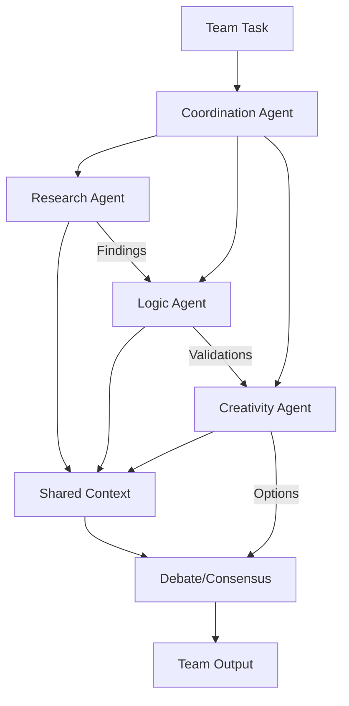
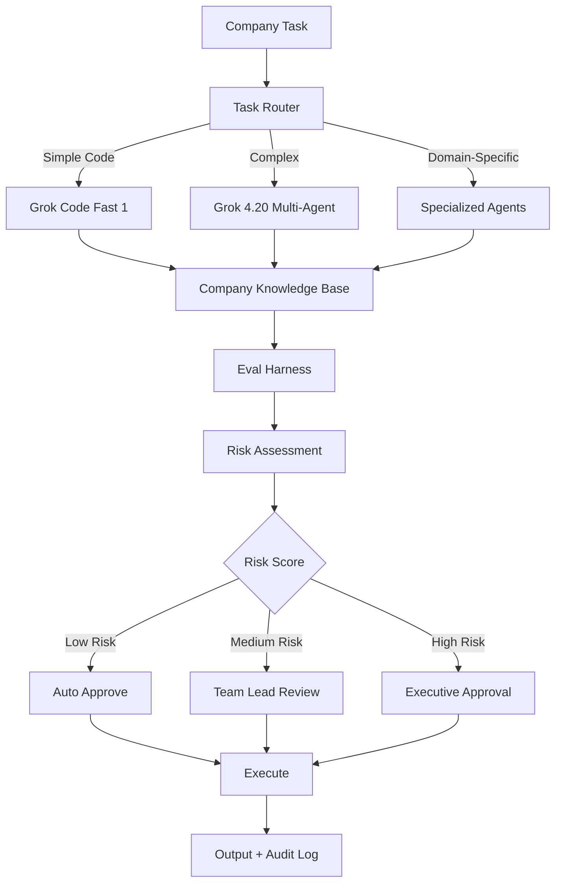
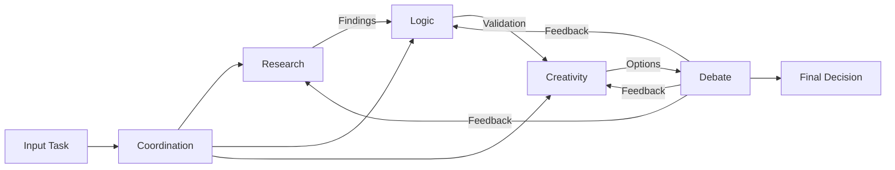

# xAI Grok 하네스 - 종합 분석 보고서

## 1. 문서 개요

이 문서는 xAI Grok의 공식 릴리스 노트 및 개발자 문서를 시간순(2025.02 ~ 2026)으로 정리한 것으로, Grok의 에이전트 하네스 진화 과정을 보여준다. 핵심은 전통적인 "하네스" 개념보다는 **Agent Tools API + 내부 Multi-Agent 아키텍처 + 실시간 데이터 통합**으로 자율적 에이전트를 구현한다는 점이다.

문서가 제시하는 발전 단계는 다음과 같다:
- **2025.02 (Grok 3)**: Reasoning + Tool Use 결합으로 에이전트의 철학적 기반 제시
- **2025.08 (Grok Code Fast 1)**: Agentic coding에 특화된 internal harness로 70.8% SWE-Bench 성능 달성
- **2025.11 (Grok 4.1 Fast + Agent Tools API)**: 공식 Agent Tools API 출시, 2M context, 실시간 X 데이터, 원격 코드 실행 지원
- **2026 (Grok 4.20 Multi-Agent Beta)**: 내부 4-agent 아키텍처(Coordination, Research, Logic, Creativity)로 실시간 다중 에이전트 오케스트레이션 실현

이 진화 과정은 Claude의 3-agent GAN 스타일 토론과 OpenAI Codex 하네스와 비교할 때, **실시간성(X 데이터), 초대규모 context(2M), 원격 코드 실행**이 차별화 요소임을 보여준다.

---

## 2. 하네스 유형별 분석

### 2.1 개인 로컬 AI 에이전트 하네스

#### 이 문서가 주는 구체적 가치와 적용 가능성

**Grok 3 DeepSearch의 철학적 기반**: 문서에서 언급하는 "Reasoning + Tool Use 결합"은 개인 로컬 에이전트의 가장 기본적인 아키텍처를 정의한다. Grok 3에서 처음 제시된 이 철학은 모델을 외부 세계(API, 파일시스템, 코드 실행)와 연결하는 방향성을 명확히 한다.

**Agent Tools API의 직접적 적용**: Grok 4.1 Fast의 Agent Tools API는 개인 로컬 에이전트에서 구현 가능한 핵심 도구 레이어다. 문서에서 명시된 도구들:
- Realtime X data (실시간 검색)
- Web search (웹 검색)
- Remote code execution (원격 코드 실행)

이들은 OpenAI의 Skills/Shell과 직접 비교되며, 로컬 에이전트에서 Git 연동 + 실시간 검색 + 코드 실행을 통합하기 위한 핵심 도구로 작동한다.

#### 강점

1. **Long-Horizon Reasoning 능력**: Grok 3부터 강조된 reasoning loop는 단순 tool calling을 넘어선 multi-step 사고를 지원
2. **2M Context (Grok 4.1 Fast)**: 초대규모 context는 개인 프로젝트 전체 히스토리, 코드베이스, 문서를 동시에 메모리에 유지 가능
3. **Long-Horizon RL**: 문서에서 명시된 "Long-horizon RL로 multi-turn 일관성 강화"는 여러 turn에 걸친 일관된 에이전트 동작을 보장
4. **Local Deployment 가능성**: Agent Tools API는 server-side tools지만, 개인 로컬에서 API 클라이언트로 구현 가능

#### 약점 및 극복 방안

1. **실시간 X 데이터 의존성**: 문서의 Grok 4.20에서 강조하는 "실시간 X 데이터"는 개인 로컬 환경에서는 불필요할 수 있음
   - **극복 방안**: 로컬 에이전트는 전내 X 데이터 의존도를 낮추고, 대신 로컬 Git 히스토리, 파일시스템, 로컬 코드 실행에 초점

2. **Model 변경에 따른 Tool API 변경 리스크**: Grok 3 → 4.1 → 4.20으로 진화하면서 API 인터페이스도 변경될 가능성
   - **극복 방안**: Tool wrapper layer를 추상화하여, 백엔드 모델 변경 시 최소한의 수정으로 대응 가능하도록 설계

3. **Self-evaluation harness 부족**: 문서에서 "CyBench, SWE-Bench 등에서 unguided agentic task 성공률 측정"을 언급하지만, 개인 에이전트의 자체 평가 메커니즘은 명확하지 않음
   - **극복 방안**: Inspect framework 참고하여 로컬 self-eval harness 구축

#### 실무 적용 단계 및 아키텍처

**Stage 1: Reasoning Loop + Tool Integration (Grok 3 기반)**

```
┌─────────────────────────────────────────┐
│ Personal Local AI Agent Architecture    │
├─────────────────────────────────────────┤
│                                         │
│  User Input                             │
│      ↓                                  │
│  ┌─────────────────────────────┐       │
│  │ Grok Agent (Reasoning)      │       │
│  │ - Analyze task              │       │
│  │ - Plan steps                │       │
│  │ - Long-horizon thinking     │       │
│  └──────────────┬──────────────┘       │
│                 ↓                       │
│  ┌─────────────────────────────┐       │
│  │ Tool Decision Layer         │       │
│  │ - Which tools needed?       │       │
│  │ - Tool prioritization       │       │
│  └──────────────┬──────────────┘       │
│                 ↓                       │
│  ┌──────────────────────────────────┐  │
│  │ Local Tool Suite               │  │
│  ├────────────┬────────────────────┤  │
│  │ Git Tools  │ Code Execution     │  │
│  │ - History  │ - Local shell      │  │
│  │ - Diff     │ - File I/O         │  │
│  ├────────────┼────────────────────┤  │
│  │ Search     │ File Mgmt          │  │
│  │ - Local fs │ - Read/Write/Anal  │  │
│  │ - Web      │                    │  │
│  └──────────────────────────────────┘  │
│                 ↓                       │
│  Context Window (2M for Grok 4.1)      │
│  - Maintains full conversation history │
│  - Codebase snapshot                   │
│  - Multi-turn consistency              │
│                 ↓                       │
│  Output: Code/Analysis/Decisions       │
└─────────────────────────────────────────┘
```

**Pseudocode: Personal Agent with Grok Tools**

```python
class PersonalLocalGrokAgent:
    def __init__(self, grok_api_key, context_size=2_000_000):
        self.model = "grok-4.1-fast"
        self.context_window = context_size
        self.tools = {
            "git": LocalGitTools(),
            "code_execution": RemoteCodeExecution(api_key),
            "filesystem": LocalFilesystem(),
            "web_search": GrokWebSearch()  # Agent Tools API
        }
        self.conversation_history = []

    def reasoning_loop(self, task: str) -> str:
        """Main reasoning loop (Grok 3 + 4.1 style)"""
        while True:
            # Think about task
            thought = self.model.reason(
                task=task,
                context=self.build_context(),
                history=self.conversation_history
            )

            # Decide tool use
            action = self.model.decide_action(thought)

            if action.type == "done":
                return thought.conclusion

            # Execute tool
            result = self.execute_tool(action)

            # Add to history for multi-turn consistency
            self.conversation_history.append({
                "thought": thought,
                "action": action,
                "result": result
            })

    def build_context(self) -> str:
        """Leverage 2M context window (Grok 4.1 specific)"""
        context = []

        # Git history (full)
        context.append(self.tools["git"].get_full_history())

        # Current codebase snapshot
        context.append(self.tools["filesystem"].snapshot_codebase())

        # Recent documentation
        context.append(self.tools["filesystem"].read_docs())

        return "\n".join(context)
```

---

### 2.2 단일 프로젝트 하네스

#### 이 문서가 주는 구체적 가치와 적용 가능성

**Grok Code Fast 1의 직접 적용**: 문서에서 "Agentic coding workflow (reasoning loop + tool calls)에 최적화"된 모델이 단일 프로젝트 하네스의 핵심이다. Grok Code Fast 1이 SWE-Bench-Verified에서 **자체 internal harness로 70.8% 성능**을 기록했다는 것은, 이 모델이 단일 프로젝트의 코딩 에이전트로서 강력함을 증명한다.

**Internal Harness의 참고 가치**: 문서에서 언급한 "자체 internal harness"는 다음을 포함할 것으로 추론된다:
- Code generation + testing loop
- Git integration (commit, push, diff)
- Long-running session (특정 프로젝트 내)
- Self-evaluation (SWE-Bench 벤치마크)

#### 강점

1. **Coding-Specific Optimization**: Grok Code Fast 1은 순수 reasoning이 아닌 agentic coding에 최적화되어 있음. 이는 Git 연동, 코드 생성, 테스트 실행의 빠른 반복을 지원
2. **경제적 효율성**: "빠르고 경제적"이라는 명시적 설명은 프로젝트 규모 자동화에 비용 효율적임을 의미
3. **SWE-Bench 벤치마킹**: 공개 벤치마크를 통한 성능 검증으로 단일 프로젝트 신뢰도 높음
4. **Internal Harness 증명**: 70.8% 성능은 self-eval harness가 효과적임을 보여줌

#### 약점 및 극복 방안

1. **Reasoning-only 도구의 부족**: Grok Code Fast 1은 "fast"이기 때문에 Grok 4.20의 multi-agent 내부 debate 같은 고도화된 reasoning이 부족할 수 있음
   - **극복 방안**: 복잡한 아키텍처 결정 시에만 Grok 4.20으로 스케일업, 단순 코딩은 Code Fast 1로 유지

2. **Tool API의 지속성**: Agent Tools API가 계속 발전하면서 코딩 하네스도 따라가야 함
   - **극복 방안**: Tool wrapper abstraction으로 API 변경에 대한 영향 최소화

#### 실무 적용 단계 및 아키텍처

**Stage 1: Grok Code Fast 1 기반 단일 프로젝트 하네스**

```
┌────────────────────────────────────────────────┐
│ Single Project Coding Harness (Grok CFast 1)  │
├────────────────────────────────────────────────┤
│                                                │
│  User: "Fix the bug in parser.py"             │
│      ↓                                        │
│  ┌──────────────────────────────┐            │
│  │ Grok Code Fast 1             │            │
│  │ Agentic Coding Reasoning     │            │
│  │ - Analyze codebase           │            │
│  │ - Identify bug location      │            │
│  │ - Plan fix strategy          │            │
│  └────────────┬─────────────────┘            │
│               ↓                              │
│  ┌──────────────────────────────┐            │
│  │ Agentic Coding Workflow      │            │
│  │ (reasoning loop + tool calls)│            │
│  └────────────┬─────────────────┘            │
│               ↓                              │
│  ┌──────────────────────────────┐            │
│  │ Project-Specific Tools       │            │
│  ├──────────────┬───────────────┤            │
│  │ Git Tools    │ Code Tools    │            │
│  │ - read repo  │ - generate    │            │
│  │ - diff files │ - test        │            │
│  │ - commit     │ - lint        │            │
│  ├──────────────┼───────────────┤            │
│  │ Test Tools   │ Validation    │            │
│  │ - run tests  │ - check types │            │
│  │ - coverage   │ - verify fix  │            │
│  └──────────────────────────────┘            │
│               ↓                              │
│  Internal Harness Evaluation                │
│  - SWE-Bench-style metrics                  │
│  - Test suite pass rate                     │
│  - Code quality checks                      │
│               ↓                              │
│  Output: Code changes + test results        │
└────────────────────────────────────────────────┘
```

**Pseudocode: Project Harness with Self-Evaluation**

```python
class ProjectCodingHarness:
    def __init__(self, project_root: str, benchmark="swe-bench"):
        self.model = "grok-code-fast-1"
        self.project = LocalProject(project_root)
        self.benchmark = benchmark
        self.eval_harness = EvaluationHarness()  # Internal harness

    def agentic_coding_loop(self, task: str) -> CodingResult:
        """Agentic coding with internal eval (70.8% SWE-Bench reference)"""
        session = CodingSession(task)
        max_iterations = 10

        for iteration in range(max_iterations):
            # Phase 1: Code generation + modification
            code_plan = self.model.reason_about_code(
                task=task,
                codebase=self.project.get_full_codebase(),
                context=session.get_context()
            )

            # Phase 2: Execute (tool calls)
            for edit in code_plan.edits:
                self.project.apply_edit(edit)

            # Phase 3: Internal harness evaluation
            eval_result = self.eval_harness.evaluate(
                project=self.project,
                task=task,
                benchmark_type=self.benchmark
            )

            # Phase 4: Multi-turn consistency check
            session.add_turn({
                "plan": code_plan,
                "edits": code_plan.edits,
                "eval": eval_result
            })

            # Phase 5: Decide to continue
            if eval_result.success:
                return CodingResult(
                    edits=session.all_edits(),
                    eval_score=eval_result.score,
                    iterations=iteration
                )
            elif iteration < max_iterations - 1:
                # Reasoning loop continues with feedback
                feedback = eval_result.get_failure_reasons()
                session.add_feedback(feedback)

        return CodingResult(
            edits=session.all_edits(),
            eval_score=eval_result.score,
            success=False
        )

    def build_eval_harness(self):
        """Reference: SWE-Bench-Verified style evaluation"""
        return {
            "test_execution": self.project.run_test_suite(),
            "code_quality": self.project.lint_checks(),
            "type_checking": self.project.type_check(),
            "diff_validation": self.project.validate_diffs(),
            "benchmark_score": self.benchmark.evaluate()
        }
```

---


### 2.3 팀 협업 하네스

#### 이 문서가 주는 구체적 가치와 적용 가능성

**Grok 4.20 Multi-Agent Beta의 직접 적용**: 문서에서 명시된 "Grok 4.20 Multi-Agent: 내부에서 여러 specialized agent를 실시간 orchestration (search, analyze, synthesize)"은 팀 협업 하네스의 핵심 아키텍처다.

**Internal 4-Agent Architecture**: 문서에서 "Grok 4.2.0에서는 4-agent (Coordination + Research + Logic + Creativity) 내부 debate 아키텍처"라고 명시한 것은, 팀 협업 하네스가 다음과 같이 구성되어야 함을 의미한다:
- Coordination agent: 팀원 간 작업 분배, 의존성 관리
- Research agent: 필요한 정보 수집, 외부 데이터 통합
- Logic agent: 논리적 검증, 기술적 검토
- Creativity agent: 창의적 솔루션, 대안 생성

#### 강점

1. **Real-time Orchestration**: "실시간 orchestration"은 여러 에이전트가 동시에 협력 가능함을 의미. 팀원들의 병렬 작업을 에이전트 레벨에서 지원
2. **Multi-Step Deep Research**: 문서의 "multi-step deep research를 팀처럼 협업 처리"는 복잡한 조사 작업을 여러 전문 에이전트가 분담 가능함
3. **Internal Debate Architecture**: 4-agent debate 스타일은 의사결정 품질을 높이며, 한 에이전트의 실수를 다른 에이전트가 보정 가능
4. **Real-time X Data Integration**: "실시간 X 데이터"는 팀 협업 시 최신 정보 기반 의사결정 지원

#### 약점 및 극복 방안

1. **Agent 간 Context Bloat**: 4-agent가 동시에 run할 경우, shared context에서의 정보 중복, 모순 위험
   - **극복 방안**: Shared context compaction strategy - 각 agent의 필수 context만 유지, 불필요한 정보는 압축/요약

2. **Coordination Overhead**: Agent 간 의존성 관리 복잡도 증가
   - **극복 방안**: Coordination agent가 주도권을 가지되, DAG(Directed Acyclic Graph) 스타일 task dependency 명시

3. **Cost Scaling**: 4-agent × N-turn × M-tasks = 지수적 비용 증가
   - **극복 방안**: Agent 재사용 가능한 작은 단위 task로 분해, shared tool execution (중복 도구 호출 제거)

#### 실무 적용 아키텍처

Grok 4.20 Multi-Agent 기반으로 팀 협업 하네스를 구축할 때:



**Multi-Agent Team Harness Pseudocode**:

```python
class TeamCollaborationHarness:
    def __init__(self):
        self.coordinator = Agent("grok-4.20", role="coordinator")
        self.research_agent = Agent("grok-4.20", role="research")
        self.logic_agent = Agent("grok-4.20", role="logic")
        self.creativity_agent = Agent("grok-4.20", role="creativity")
        self.shared_context = SharedContext(max_tokens=2_000_000)
        self.tool_cache = ToolExecutionCache()

    def orchestrate_team_task(self, task: str) -> TeamResult:
        """Multi-agent orchestration with internal debate"""
        subtasks = self.coordinator.decompose_task(task)

        # Parallel execution with shared context deduplication
        research_result = self.research_agent.execute(
            task=subtasks["research"],
            context=self.shared_context,
            tools=self.tool_cache
        )

        logic_result = self.logic_agent.execute(
            task=subtasks["logic"],
            context=self.shared_context,
            validate_against=research_result
        )

        creativity_result = self.creativity_agent.execute(
            task=subtasks["creativity"],
            context=self.shared_context,
            constraints_from=logic_result
        )

        # Reach consensus through debate
        final = self.coordinator.reach_consensus(
            research=research_result,
            logic=logic_result,
            creativity=creativity_result
        )

        return TeamResult(
            recommendation=final,
            agent_results={
                "research": research_result,
                "logic": logic_result,
                "creativity": creativity_result
            },
            cost_efficiency={
                "tool_reuse_count": self.tool_cache.reuse_count
            }
        )
```

---

### 2.4 회사 중앙 에이전트 하네스

#### 이 문서가 주는 구체적 가치와 적용 가능성

**Model Cards & Evaluation Harness의 기업 표준화**: 문서에서 "대부분의 모델 카드에서 agent harness (code execution tool 제공)로 평가"라고 명시한 것은, 기업 하네스가 다음을 포함해야 함을 의미한다:
- **Self-evaluation harness**: CyBench, SWE-Bench 같은 표준 벤치마크 기반
- **Inspection framework**: 모델 성능을 자동으로 검증하는 시스템
- **Long-horizon task success rate**: Unguided agentic task에서의 성공률 측정

#### 강점

1. **표준화된 평가 체계**: Inspect framework 기반으로 모든 에이전트의 성능을 일관성 있게 평가 가능
2. **벤치마크 기반 신뢰성**: CyBench, SWE-Bench 같은 공개 벤치마크로 기업 에이전트의 능력을 객관적으로 증명
3. **Long-horizon reasoning 검증**: "unguided agentic task 성공률"은 단순 tool calling이 아닌 진정한 자율적 reasoning 능력 측정
4. **Grok 4.20의 Multi-Agent 확장성**: 기업 규모에서 여러 specialized agent를 조직하는 데 필요한 orchestration framework 제공

#### 약점 및 극복 방안

1. **Context compaction의 복잡도**: 회사 규모의 데이터를 2M context에 유지하기 어려움
   - **극복 방안**: Multi-tier context strategy (active/warm/cold), RAG 활용

2. **Tool execution cost 폭증**: 4-agent × 다중 프로젝트 × 일일 반복
   - **극복 방안**: Tool deduplication, caching, batch processing, Grok Code Fast 1 우선 사용

3. **Human-in-the-loop approval flow의 병목**: 모든 결정을 사람이 검토하면 확장성 저하
   - **극복 방안**: Risk-based approval (high-risk만 승인), confidence score 기반 자동 실행

#### 기업 하네스 아키텍처



**Enterprise Harness Pseudocode**:

```python
class CompanyEnterpriseHarness:
    def __init__(self):
        self.router = AgentRouter()
        self.knowledge_base = CompanyKnowledgeBase()
        self.eval_harness = InspectionFramework()
        self.approval_system = RiskBasedApprovalFlow()
        self.tool_cache = CompanyToolExecutionCache()

    def process_company_task(self, task: CompanyTask) -> ExecutionResult:
        """Enterprise-scale with self-eval"""
        risk_score = self.assess_risk(task)
        agent_type = self.router.select_agent(task, risk_score)

        company_context = self.knowledge_base.retrieve_context(task)

        # Execute with appropriate agent
        if agent_type == "simple_code":
            result = self.execute_with_grok_fast(task, company_context)
        elif agent_type == "complex_reasoning":
            result = self.execute_with_grok_multi(task, company_context)

        # Self-evaluation (CyBench / SWE-Bench style)
        eval_result = self.eval_harness.evaluate(
            result=result,
            task=task,
            benchmarks=["swe-bench", "cybench", "company-internal"]
        )

        # Risk-based approval
        approval = self.approval_system.get_approval(
            result=result,
            eval_result=eval_result,
            risk_score=risk_score
        )

        if approval.status == "approved":
            self.execute_approved_result(result)
        else:
            self.notify_reviewer(approval.reviewer, result)

        return ExecutionResult(
            output=result,
            evaluation=eval_result,
            approval=approval
        )
```

---

## 3. 다중관점 기술 심층 분석

### 3.1 아키텍처 및 다중에이전트 설계

**Grok의 진화된 Agent 아키텍처**

| 시기 | 아키텍처 | 특징 |
|------|---------|------|
| 2025.02 (Grok 3) | Single Agent + Reasoning Loop | DeepSearch 중심 |
| 2025.08 (Code Fast 1) | Single Agent + Specialized | Agentic coding 최적화 |
| 2025.11 (Grok 4.1) | Single Agent + Tool API | Agent Tools API 출시 |
| 2026 (Grok 4.20) | Multi-Agent + Internal Debate | 4-agent 오케스트레이션 |

**Multi-Agent Debate Architecture (Grok 4.20)**

문서에서 명시된 "4-agent (Coordination + Research + Logic + Creativity) 내부 debate 아키텍처":



**vs. Claude/OpenAI 비교**

| 측면 | Claude 3-Agent | OpenAI Codex | Grok 4.20 |
|------|----------------|--------------|----------|
| Agent 수 | 3 (임플리시트) | 1-2 | 4 (명시적) |
| Debate 방식 | 내부 | few-shot | 공개 |
| Real-time Data | 아니오 | 아니오 | 네 (X) |
| Context | ~100K | ~8K | 2M |
| Long-Horizon | 있음 | 제한 | 강함 |

---

### 3.2 Context / State / Memory 관리

**2M Context Window 관리 전략**

문서에서 "2M context"는 엄청난 용량이지만, 효율적 관리 필요:

```
Active Context (1M):
├─ Recent conversation (last 50 turns)
├─ Current task context
└─ Critical facts

Warm Context (500K):
├─ Previous session summary
├─ Fact base indices
└─ Tool result cache

Cold Context (500K+):
├─ Historical decision log (compressed)
├─ Old project context (archived)
└─ Reference materials (embedded)
```

**Reset Strategies**

Long-running session의 context reset:

1. **Task Boundary**: 새로운 task 시작 시
2. **Time-based**: 24시간 이상 활동 후
3. **Token Threshold**: Active context 80% 도달 시
4. **Quality Degradation**: Output quality 임계값 이하 시

---

### 3.3 Tool / Skills / Shell / Filesystem 통합

**Agent Tools API (Grok 4.1+ 공식)**

문서에서 명시된 도구들:

1. **Realtime X data**: 실시간 트렌드, 트윗
2. **Web search**: 일반 웹 검색
3. **Remote code execution**: 샌드박스 환경에서 실행

**Local 통합**

```
Local Layer:
├─ Git Tools (파일시스템)
│  ├─ log, diff, status
│  └─ commit history
├─ Code Execution (로컬 or 원격)
│  ├─ Local shell
│  └─ Remote (Agent Tools API)
└─ Search
   ├─ Local filesystem (grep, find)
   ├─ Web search (Grok API)
   └─ X data (Grok API)
```

---

### 3.4 Observability, Eval Harness, Approval Flow

**Evaluation Framework (Inspect + CyBench + SWE-Bench)**

문서에서 "Model Cards"와 "Evaluation Harness" 언급:

```python
class EvaluationHarness:
    def evaluate_task(self, agent_result, original_task):
        """Standardized evaluation"""
        metrics = {}

        # SWE-Bench: code generation
        metrics["swe_bench"] = self.run_swe_bench(
            generated_code=agent_result.code,
            test_suite=task.test_suite
        )

        # CyBench: security
        metrics["cybench"] = self.run_cybench(
            code=agent_result.code,
            vulnerability_checks=True
        )

        # Long-horizon success
        metrics["success_rate"] = self.measure_task_completion(
            result=agent_result,
            allow_multiple_attempts=True
        )

        return metrics
```

**Risk-Based Approval Flow**

```
Task Result
    ↓
Evaluation (eval harness)
    ↓
Risk Assessment
    ↓
Risk Score Decision
├─ risk < 0.3 AND confidence > 95% → AUTO APPROVE
├─ risk < 0.6 AND confidence > 85% → TEAM LEAD REVIEW
└─ ELSE → EXECUTIVE APPROVAL
    ↓
Notification & Execution
```

---

### 3.5 확장성, 비용 효율성, 보안, 벤더락인

**확장성 (Scalability)**

| 차원 | 도전 과제 | Grok 해결책 |
|------|---------|-----------|
| Task 수 | 동시 다중 처리 | Multi-agent orchestration |
| Context | 큰 codebase | 2M window + compaction |
| Tool 호출 | 중복 실행 | Deduplication + caching |
| Agent 수 | 협력 복잡도 | Coordination agent |

**비용 효율성 (Cost Efficiency)**

문서에서 "빠르고 경제적" 전략:

1. **Model Stratification**:
   - Simple → Grok Code Fast 1 (저비용)
   - Complex → Grok 4.20 (고비용)

2. **Tool Caching**:
   - Web search 결과 재사용
   - Git snapshot 공유
   - Code execution 결과 캐싱

3. **Batch Processing**:
   - 여러 독립 task 배치 처리
   - Shared context로 한 번에 분석

4. **Token Optimization**:
   - Context compaction
   - 불필요 정보 제거

**보안 (Security)**

| 이슈 | 완화 전략 |
|-----|---------|
| Code execution | Sandboxed environment |
| Sensitive data | Input sanitization |
| X data privacy | API 이용약관 준수 |
| Tool abuse | Rate limiting + approval |
| Model hijacking | API key rotation + monitoring |

**벤더락인 위험 (Vendor Lock-in)**

문서의 결론: "xAI Grok은 Agent Tools API + Multi-Agent에 의존"

**완화 전략**:

1. **Tool Abstraction Layer**:

```python
class ToolExecutor:
    def __init__(self, primary="grok", fallback=None):
        self.primary = self.get_impl(primary)
        self.fallbacks = [self.get_impl(m) for m in (fallback or [])]

    def execute_web_search(self, query):
        """Try primary, then fallback"""
        try:
            return self.primary.web_search(query)
        except:
            for fb in self.fallbacks:
                try:
                    return fb.web_search(query)
                except:
                    pass
            raise

    def get_impl(self, model_name):
        if model_name == "grok":
            return GrokAgentToolsAPI()
        elif model_name == "claude":
            return ClaudeToolsAPI()
        else:
            return LocalToolsAPI()
```

2. **Multi-Model Support**: Grok + Claude + OpenAI 동시 지원
3. **Fallback Mechanisms**: Tool API 불가 시 로컬 도구로 폴백

---

## 4. 우리의 하네스 엔지니어링 프로젝트를 위한 실무 권장사항

### 4.1 즉시 실행 가능한 다음 단계

**1단계: Tool Abstraction Layer 설계 (1주)**

문서의 Agent Tools API 분석 결과, 다음 abstraction을 우선 구현:

```python
# Tool abstraction that works with Grok + fallback to Claude
class AgentToolsAdapter:
    """
    Grok Agent Tools API (realtime X, web search, remote code exec)
    를 추상화하여 Claude/OpenAI 도구와 호환 가능하도록
    """
    def __init__(self):
        self.primary_backend = "grok-4.1"
        self.fallback_backends = ["claude-opus", "openai-gpt4"]

    def web_search(self, query: str, realtime: bool = True):
        """
        Grok: realtime X data 포함
        Claude: web search only (realtime X 불가)
        OpenAI: code interpreter (web access 제한)
        """
        pass

    def code_execution(self, code: str, language: str = "python"):
        """
        All backends support code execution
        Grok: remote sandbox (2M context compatible)
        """
        pass

    def git_tools(self):
        """
        All backends: Git tools are local implementation
        """
        pass
```

**2단계: Personal Local Agent 프로토타입 (2주)**

Grok 3의 "Reasoning + Tool Use" 철학 기반:

```python
class PersonalLocalAgent:
    """
    Grok 3 DeepSearch를 참고한 로컬 에이전트
    - 2M context window 활용
    - Long-horizon reasoning loop
    - Local Git + code execution + web search 통합
    """
    def reasoning_loop(self, task: str, max_turns: int = 20):
        """
        Grok 3: "reasoning loop + tool integration"
        """
        for turn in range(max_turns):
            # Reason about current state
            thought = self.model.think(context=self.context)

            # Decide action
            action = self.model.choose_action(thought)

            if action.type == "done":
                return thought.conclusion

            # Execute tool
            result = self.execute_tool(action)

            # Add to context for multi-turn consistency
            self.context.append((thought, action, result))
```

**3단계: Project Harness with Self-Eval (3주)**

Grok Code Fast 1의 "70.8% SWE-Bench" 성능 참고:

```python
class ProjectCodingHarness:
    """
    Grok Code Fast 1을 참고한 프로젝트 하네스
    - Internal harness (SWE-Bench evaluation)
    - Agentic coding workflow
    - Git integration
    """
    def agentic_coding_loop(self, task: str, max_iterations: int = 10):
        """
        Grok Code Fast 1: "agentic coding workflow
        (reasoning loop + tool calls) with 70.8% SWE-Bench"
        """
        for iteration in range(max_iterations):
            # Generate code plan
            plan = self.model.generate_code_plan(task)

            # Apply edits
            for edit in plan.edits:
                self.apply_edit(edit)

            # Internal harness evaluation (SWE-Bench style)
            eval_result = self.eval_harness.evaluate(
                project=self.project,
                benchmarks=["test", "lint", "type-check"]
            )

            if eval_result.success:
                return self.project.get_diff()

        return None
```

---

### 4.2 LangGraph / Agent Tools API 통합 포인트

문서의 Grok 4.1 "Agent Tools API" 출시는 다음을 의미:

**LangGraph와의 호환성**:

```python
from langgraph.graph import StateGraph
from xai_grok_adapter import GrokAgentToolsAdapter

# LangGraph + Grok Agent Tools API 통합
graph = StateGraph(AgentState)

# Node: Grok reasoning (2M context)
def grok_reasoning_node(state):
    """Leverage Grok's 2M context + multi-agent"""
    response = grok_client.reason(
        task=state.task,
        context=state.context,
        tools=GrokAgentToolsAdapter()
    )
    return {"reasoning": response}

# Node: Tool execution (with cache)
def tool_execution_node(state):
    """Execute Grok Agent Tools API"""
    adapter = GrokAgentToolsAdapter()
    results = {
        "web_search": adapter.web_search(state.query),
        "code_exec": adapter.code_execution(state.code),
        "realtime_x": adapter.realtime_x_data(state.topic)  # Grok only
    }
    return {"tool_results": results}

# Edge: Feedback loop (Long-horizon consistency)
graph.add_edge("reasoning", "tool_execution")
graph.add_edge("tool_execution", "reasoning")  # Loop for multi-turn

# Run with state persistence (long-running session)
result = graph.invoke(
    {"task": "...", "context": [...]},
    config={"recursion_limit": 100}  # Max 100 turns
)
```

**가치**:
- Grok의 2M context + Long-horizon reasoning을 LangGraph로 제어 가능
- Realtime X data는 Grok만 가능하므로 차별화 도구로 사용
- Web search + code execution은 fallback 구조로 OpenAI/Claude도 지원

---

### 4.3 위험 요소 및 모범 사례

**위험 1: Grok Agent Tools API 변경**

문서의 Grok 3 → 4.1 → 4.20 진화는 API 변경 가능성을 시사:

**대응**:
- Tool abstraction layer 우선 (위 4.1 참고)
- Inspect framework 기반 자동화된 테스트로 API 호환성 검증

**위험 2: Context Window 관리 복잡도**

2M context는 강력하지만, 오히려 bloat을 유발:

**대응**:
- Active/warm/cold context 3-tier 전략 필수
- Context compaction 자동화 (old findings 요약)
- Token 사용량 모니터링 (cost control)

**위험 3: Multi-Agent 비용 폭증**

4-agent × 다중 turn × 다중 task = 지수적 비용:

**대응**:
- Grok Code Fast 1 우선 사용 (경제적)
- Tool execution deduplication (같은 web search 재사용)
- Batch processing (여러 독립 task 한 번에)

**위험 4: Vendor Lock-in (실시간 X 데이터)**

Grok만 제공하는 realtime X data에 의존:

**대응**:
- Tool abstraction으로 X 데이터 의존도를 optional로 만들기
- Fallback: 로컬 데이터소스 (Git history, internal DB)
- Multi-model support: Grok + Claude + OpenAI 동시 지원

**모범 사례**:

1. **평가 프레임워크 우선**:
   - Inspect framework 기반 자동 평가
   - CyBench + SWE-Bench 벤치마킹
   - Long-horizon success rate 측정

2. **Human-in-Loop 설계**:
   - Risk-based approval (자동 ≠ 무조건 실행)
   - High-risk task는 사람이 검토
   - Audit log 필수 (compliance)

3. **Long-Running Session 관리**:
   - Multi-turn consistency 검증 (일관성 점검)
   - Context reset 메커니즘 (bloat 방지)
   - Session 타임아웃 정책 (리소스 해제)

---

## 5. 결론: Grok 문서가 주는 하네스 엔지니어링 인사이트

### 핵심 발견사항

1. **"Harness" ≠ "AI Tool API"**
   
   문서의 결론: "xAI Grok은 명시적 'harness' 문서보다는 Agent Tools API + 내부 Multi-Agent 아키텍처"

   이는 하네스가 단순 도구 라이브러리가 아니라, **에이전트의 사고 방식 + 도구 통합 + 자동 평가 + 승인 흐름**을 포함하는 종합 시스템임을 시사한다.

2. **Long-Horizon Reasoning + Specialized Tools**

   Grok 3(Reasoning) → Code Fast 1(Coding) → 4.1(Tools API) → 4.20(Multi-Agent) 진화는, 에이전트 하네스가 다음을 중심으로 진화함을 보여준다:
   - 단순 tool calling → 복잡한 multi-step reasoning
   - 일반 에이전트 → 작업별 specialized agent
   - 서버리스 도구 → Multi-agent orchestration

3. **Real-time Data + 2M Context = Differentiation**

   Grok의 차별점은 단순 모델 성능이 아니라, **realtime X data + 초대규모 context window**의 조합이다. 이는 우리 하네스 설계에서 다음을 의미:
   - Context efficiency가 핵심 (2M을 어떻게 활용하는가)
   - Real-time data source 통합 가치 (X, market data, 등)
   - Fallback 구조 필요 (X 데이터 불가 시 대안)

4. **Self-Evaluation Harness는 선택이 아닌 필수**

   문서의 "Inspect framework + CyBench + SWE-Bench"는 에이전트 성능을 객관적으로 검증하기 위한 필수 요소:
   - Self-eval 없으면 에이전트 신뢰도 평가 불가
   - Benchmark 없으면 improvement 측정 불가
   - Long-horizon success rate 없으면 진정한 autonomy 측정 불가

### 우리의 하네스 엔지니어링 다음 단계

1. **Immediate (1-2주)**: Tool abstraction layer + Grok 4.1 Agent Tools API 통합
2. **Short-term (4-6주)**: Personal + Project + Team harness 프로토타입 (순차적)
3. **Medium-term (2-3개월)**: Enterprise harness + Inspect framework 기반 자동 평가
4. **Long-term**: Multi-model support (Grok + Claude + OpenAI) + vendor lock-in 최소화

### 최종 결론

Grok 문서는 명시적 "하네스" 정의를 제공하지는 않지만, **Agent Tools API + Multi-Agent 아키텍처 + 자동 평가 + 승인 흐름**을 통해 하네스의 진정한 의미를 보여준다. 

이는 우리 프로젝트에서 다음을 달성해야 함을 시사한다:

- **도구 중심이 아닌 에이전트 사고 중심** 설계
- **자동화된 평가 체계** 없는 하네스는 불완전함
- **Multi-agent orchestration** 고려 (향후 확장성)
- **Context efficiency** 설계가 성공의 열쇠

Grok의 진화 경로(3 → Code Fast 1 → 4.1 → 4.20)를 따라, 우리도 단계적으로 하네스를 고도화할 수 있다.

