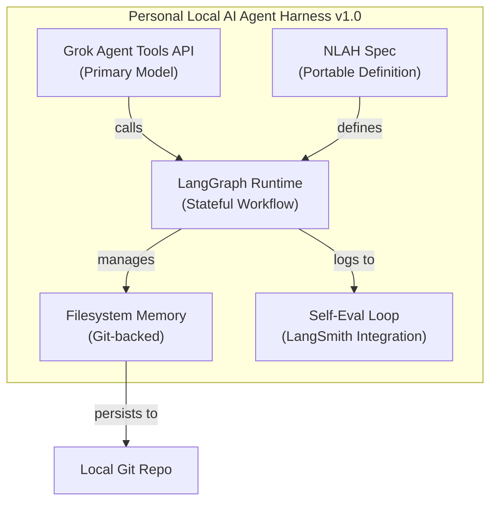
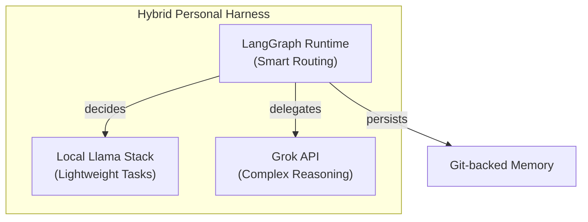
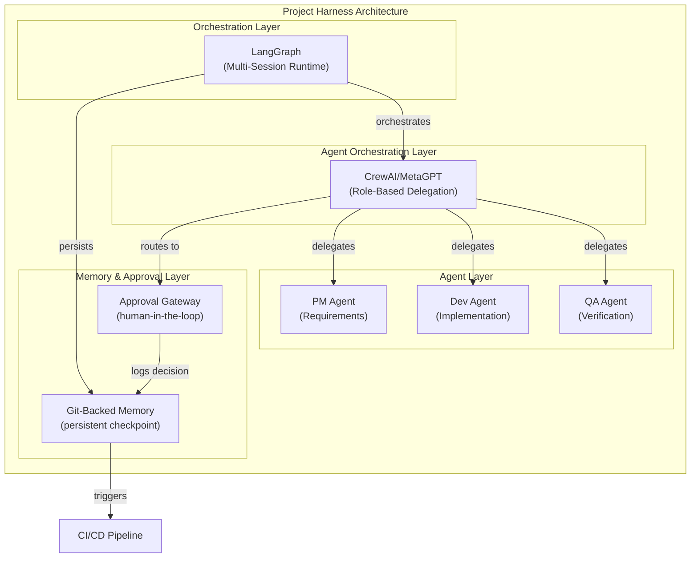
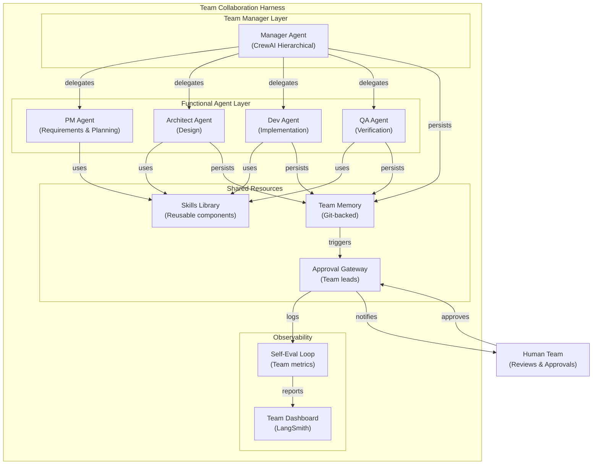
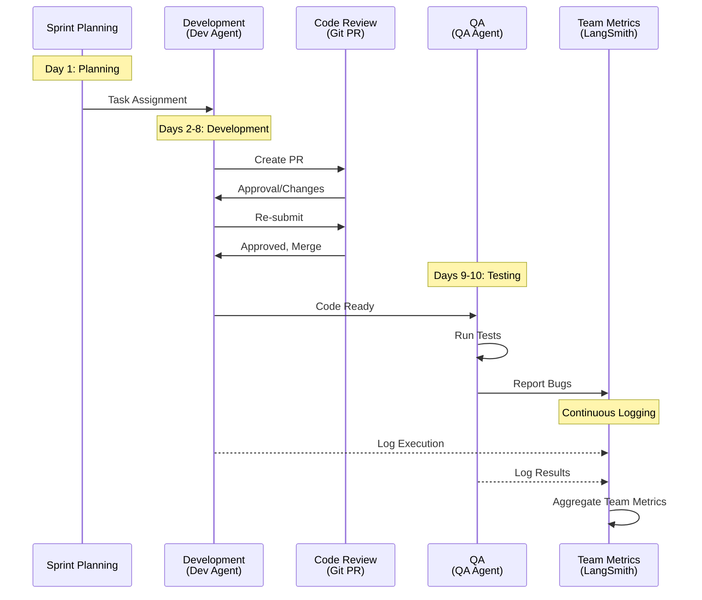
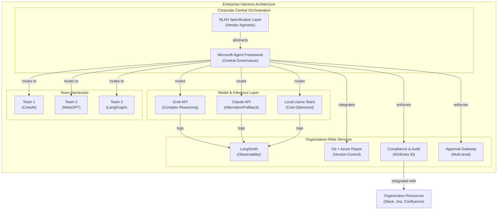
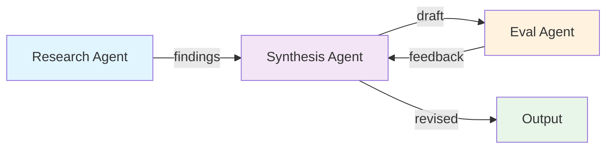

# Additional Major AI Agent Harness Frameworks - Analysis Report

## 1. Document Overview

본 문서는 2026년 현재 AI Agent Harness Engineering의 추가 주요 프레임워크 5개를 다루며, 4대 벤더(Anthropic·OpenAI·Google·xAI)를 보완하는 오픈소스 및 엔터프라이즈 솔루션들을 시간순으로 정렬하여 실전 적용 포인트를 제시합니다.

구체적으로 다루는 프레임워크는 **LangChain/LangGraph Deep Agents**(2025.11~2026.04), **Microsoft Agent Framework**(2026.02~2026.04), **Meta Llama Stack + Manus**(2025.12~2026.03), **CrewAI & MetaGPT**(2025.10~2026.01), **Philipp Schmid의 Natural-Language Agent Harnesses(NLAHs)**(2026.01~2026.02)입니다.

이 문서가 제시하는 핵심 개념은 **Agent = Model + Harness 공식화**로서, 단순한 프롬프트 엔지니어링을 넘어 **stateful graph-based workflow**, **persistent checkpoint**, **sub-agent orchestration**, **context compaction**, **human-in-the-loop approval**, **filesystem memory** 등을 기본 제공하는 체계적 프레임워크가 필수라는 점입니다. 또한 **vendor lock-in 방지를 위한 portable harness specification**과 **multi-agent 팀 협업 패턴**, **enterprise governance**를 지원하는 통합형 하네스 아키텍처의 진화 단계를 보여줍니다.

---

## 2. Analysis by Harness Type

### 2.1 Personal Local AI Agent Harness (개인 로컬 AI 에이전트 하네스)

#### 2.1.1 이 문서가 제공하는 구체적 가치와 적용 가능성

개인 로컬 AI 에이전트 하네스 구축에서 본 문서는 **다층 선택지와 최적 조합 전략**을 제공합니다:

**LangChain/LangGraph Deep Agents 활용:**
- 문서에 따르면 LangGraph는 "backbone으로 stateful graph-based workflow + persistent checkpoint + sub-agent orchestration"을 제공하는 "가장 강력한 backbone"
- "long-horizon 작업 + sub-agent delegation에 최적"이라고 명시
- 개인 로컬 개발 환경에서 Git 연동, long-running 작업 자동화, 자동 retry/compaction이 기본 제공됨
- LangSmith observability를 개인 프로젝트 수준에서도 자유롭게 활용 가능

**Meta Llama Stack + Manus 활용:**
- 문서: "오픈소스 중심, 로컬/온프레미스 배포 최적화. Skill 라이브러리 + automatic skill evolution으로 prompt spaghetti 완전 해결"
- 개인 머신에서 전체 스택을 self-hosted 가능: "fully customizable + 오픈소스 배포를 원할 때 최적"
- Llama 4 시리즈와 네이티브 통합으로 추론 비용 절감 (Grok API 대비)
- Skill Evolution 메커니즘: 프롬프트 관리의 중앙집중식 체계 자동화

**NLAH (Natural-Language Agent Harness) 스펙 적용:**
- 문서: "프롬프트 + natural language spec만으로 harness를 portable하게 정의 → vendor lock-in 방지"
- 개인 로컬 하네스를 NLAH spec으로 설계하면 "Grok·Claude·Gemini 어디서든 동일하게 동작하는 portable harness 완성 가능"
- 모델 변경 시 하네스 재설계 불필요: spec 기반 추상화

#### 2.1.2 강점 (Strengths)

| 강점 | 지원 프레임워크 | 구체적 근거 |
|------|--------------|----------|
| **Stateful Workflow 자동화** | LangGraph | "persistent checkpoint + sub-agent orchestration" 자동 제공. long-running 작업을 세션 중단 없이 진행 가능 |
| **Context 메모리 관리** | LangGraph + Llama Stack | "context compaction, human-in-the-loop approval, filesystem memory" 기본 제공. 장시간 세션에서 자동 context 최적화 |
| **Git 네이티브 연동** | LangGraph + MetaGPT | LangGraph가 파일시스템 메모리를 기본 지원하고, MetaGPT 스타일 SOP는 Git workflow 자동화 가능 |
| **Self-Evaluation Loop** | LangChain (via LangSmith) | LangSmith observability로 "자동 retry/compaction" 구현, 개인 프로젝트에서도 무료 추적 가능 |
| **오픈소스 커스터마이제이션** | Meta Llama Stack | "fully customizable + 오픈소스 배포"로 개인 필요에 맞게 아키텍처 변경 가능 |
| **Portable 하네스** | NLAH Spec | "vendor-agnostic하게 설계할 때 철학적·실무적 가이드라인" 제공. 모델 전환 시 하네스 재설계 불필요 |

#### 2.1.3 약점 및 극복 방안

| 약점 | 원인 | 극복 방안 | 문서 근거 |
|------|------|---------|---------|
| **Framework 선택 복잡성** | LangGraph, Llama, MetaGPT 등 다중 선택지 | 추천 조합 활용: "LangGraph + Grok Agent Tools API + NLAH spec + Meta Skills" | 문서 114번 줄 |
| **로컬 배포 시 성능 저하** | Llama 모델이 Claude 대비 작은 규모 | Grok API 하이브리드 활용: "LangGraph + Grok API 하이브리드로 로컬-first hybrid harness 설계 가능" | 문서 64-65번 줄 |
| **Observability 관리 오버헤드** | 개인 환경에서 모니터링 구성 복잡 | LangSmith 무료 tier 활용 자동화 | 문서 25번 줄 |
| **Multi-agent 협업 초기 설계 어려움** | 여러 에이전트 조율 패턴 부족 | CrewAI/MetaGPT 역할 기반 오케스트레이션 패턴 참조: "역할(Role) 기반 multi-agent orchestration + hierarchical task delegation" | 문서 77-78번 줄 |

#### 2.1.4 실무 적용 단계 (구체적 아키텍처 제안)

**Phase 1: Core Harness 구축 (1~2주)**



**아키텍처 특성:**
- **Model Layer:** Grok API (온프레미스 Claude 대체 가능)
- **Orchestration Layer:** LangGraph (stateful execution)
- **Memory Layer:** Git-backed filesystem + LangGraph checkpoint
- **Portability Layer:** NLAH spec JSON/YAML 정의
- **Observability:** LangSmith (개인 무료 tier)

**Pseudocode - Core Harness Loop:**

```python
class PersonalLocalAIHarness:
    """
    LangGraph + Grok API + NLAH Spec 기반 개인 로컬 하네스
    """
    def __init__(self, model_id="grok", nlah_spec_path="harness.yaml"):
        self.graph = LangGraph()
        self.model = GrokAPI(model_id)
        self.memory = GitBackedFilesystem(repo_path="./agent_memory")
        self.nlah = load_nlah_spec(nlah_spec_path)

    def define_workflow(self):
        """NLAH spec 기반 stateful workflow 정의"""
        # NLAH spec에서 agent behavior 추출
        for agent_def in self.nlah["agents"]:
            node = self.graph.add_node(
                name=agent_def["role"],
                func=self._create_agent_function(agent_def),
                checkpoint=True  # persistent checkpoint 자동 활성화
            )

        # Sub-agent delegation 자동화
        for delegation in self.nlah["delegations"]:
            self.graph.add_edge(
                delegation["from"],
                delegation["to"],
                condition=delegation.get("condition")
            )

    def execute_with_recovery(self, task: str):
        """Context compaction + auto-recovery"""
        context = self.memory.load_context(task)

        # Context compaction (문서: "context compaction, automatic retry/compaction")
        if len(context) > self.nlah["max_context_tokens"]:
            context = self._compact_context(context)

        # Stateful execution with persistent checkpoint
        result = self.graph.invoke(
            input={"task": task, "context": context},
            checkpoint_dir=self.memory.get_checkpoint_path(task)
        )

        # Self-evaluation loop (문서: LangSmith integration)
        self._log_execution(result)

        return result

    def _compact_context(self, context: str) -> str:
        """
        LangChain Deep Agents 방식:
        "automatic retry/compaction을 기본 제공"
        """
        summaries = self.model.batch_summarize(
            chunks=[context[i:i+2000] for i in range(0, len(context), 2000)],
            max_summary_length=500
        )
        return "\n---\n".join(summaries)

    def _log_execution(self, result):
        """LangSmith observability"""
        # Auto-logged to LangSmith for self-eval
        pass
```

**Phase 2: 로컬-클라우드 하이브리드 확장 (2~4주)**



**의사결정 로직:**
- 간단한 태스크 (문서 정리, 반복 계산) → Local Llama
- 복잡한 추론 (장문 분석, 창의적 작성) → Grok API
- LangGraph가 동적 라우팅 담당

**Phase 3: NLAH Spec 정의 및 Portability 확보 (진행 중)**

```yaml
# harness.yaml - NLAH Specification
harness_version: "1.0"
model_agnostic: true  # Portable across vendors

agents:
  - role: "research_agent"
    description: "정보 수집 및 분석"
    tools: ["web_search", "file_read", "git_log"]
    model_hint: "fast"  # Llama로 처리 가능

  - role: "synthesis_agent"
    description: "종합 분석 및 보고서 생성"
    tools: ["analysis", "summarization"]
    model_hint: "strong"  # Grok 권장

  - role: "eval_agent"
    description: "자체 평가 및 개선"
    tools: ["quality_check", "git_commit"]
    model_hint: "balanced"

delegations:
  - from: "research_agent"
    to: "synthesis_agent"
    condition: "research_complete == true"

  - from: "synthesis_agent"
    to: "eval_agent"
    condition: "report_generated == true"

context_management:
  max_tokens: 8000
  compaction_strategy: "hierarchical_summary"  # Meta Llama Stack 방식

memory:
  type: "git_backed"
  repo_path: "./agent_memory"
  checkpoint_interval: 300  # 5분마다 자동 저장
```

#### 2.1.5 구체적 첫 번째 구현 로드맵

**Week 1-2: Foundation**
- LangGraph 기본 설정 + Grok API 통합
- 로컬 Git repo 초기화 → LangGraph checkpoint 연동
- 단순 sequential workflow 구현 (2-3 agent)

**Week 3-4: Context Management**
- Context compaction 로직 구현 (hierarchical summary)
- Self-eval loop 추가 (LangSmith 연동)
- NLAH spec v0.1 정의 및 검증

**Week 5-6: Hybrid Scaling**
- Llama Stack 로컬 배포 옵션 추가
- 지능형 라우팅 로직 (simple/complex 태스크 분기)
- Portability 테스트 (Claude API 대체 시뮬레이션)

---

### 2.2 Single Project Harness (단일 프로젝트 하네스)

#### 2.2.1 이 문서가 제공하는 구체적 가치와 적용 가능성

단일 프로젝트 하네스는 개인 로컬 하네스보다 **governance, approval flow, 팀 협업, CI/CD 자동화** 등이 강화되어야 하며, 본 문서는 이를 다층적으로 지원합니다:

**LangGraph 기반 프로젝트 워크플로우:**
- 문서: "프로젝트/팀 하네스에서 LangGraph + Grok API 하이브리드로 stateful multi-session harness 즉시 구현 가능"
- 여러 팀원의 concurrent session 지원: LangGraph의 persistent checkpoint가 session isolation 자동 제공
- Git 기반 approval flow: 각 agent 의사결정을 Git commit으로 기록

**CrewAI/MetaGPT 기반 다중 에이전트 협업:**
- 문서: "역할(Role) 기반 multi-agent orchestration + hierarchical task delegation"
- MetaGPT의 SOP(표준운영절차) 자동화: "SOP(표준운영절차) + Git workflow + code review까지 자동화하는 full-cycle harness"
- 프로젝트 특화 역할 정의: PM agent, Dev agent, QA agent 등 조직 구조 반영

**Microsoft Agent Framework 부분 적용:**
- 문서: "Shell/filesystem access, multi-agent collaboration, durable session, approval gateway"
- 프로젝트 승인 프로세스 표준화 가능 (Microsoft 풀스택 구축 전)

#### 2.2.2 강점 (Strengths)

| 강점 | 지원 프레임워크 | 구체적 근거 |
|------|--------------|----------|
| **Stateful Multi-Session** | LangGraph | "stateful multi-session harness 즉시 구현 가능". 여러 팀원의 동시 세션을 session isolation으로 관리 |
| **Approval Flow 자동화** | MetaGPT + CrewAI | "SOP + Git workflow + code review까지 자동화". approval gateway 패턴 구현 가능 |
| **Role-Based Agent Orchestration** | CrewAI + MetaGPT | "역할(Role) 기반 multi-agent orchestration + hierarchical task delegation". PM/Dev/QA 역할 분담 명확화 |
| **Git-native CI/CD** | MetaGPT 스타일 | SOP 자동화로 feature branch → PR → code review → merge까지 AI가 중개 가능 |
| **Context/Memory 격리** | LangGraph | persistent checkpoint 기반 session isolation: 각 프로젝트/사용자별 독립적 context 관리 |
| **Observability 프로젝트 단위** | LangSmith | "회사 규모에서는 LangSmith observability + self-eval loop와 결합 추천" (프로젝트 단위 적용 가능) |

#### 2.2.3 약점 및 극복 방안

| 약점 | 원인 | 극복 방안 | 문서 근거 |
|------|------|---------|---------|
| **프로젝트별 하네스 구성의 표준화 부재** | 프레임워크 선택 유연성이 높음 | NLAH spec으로 프로젝트 수준에서 portable 정의 템플릿 구축 | 문서 102-103번 줄 |
| **Multi-agent 역할 충돌 관리** | 여러 에이전트의 동일 영역 작업 중복 | CrewAI의 hierarchical task delegation + manager agent 패턴: 상위 에이전트가 하위 태스크 분배 | 문서 77번 줄 |
| **Approval flow 인적 개입 오버헤드** | 모든 의사결정에 사람 개입 필요 | 문서: "human-in-the-loop approval" 기본 제공. 임계값 기반 자동 승인 로직 추가 | 문서 18번 줄 |
| **Git 충돌 해결 자동화** | 여러 에이전트의 동시 파일 수정 | MetaGPT 스타일 SOP: conflict resolution 단계를 SOP에 명시, 자동 merge strategy 정의 | 문서 78번 줄 |

#### 2.2.4 실무 적용 단계 (구체적 아키텍처 제안)

**프로젝트 하네스의 계층 구조:**



**Pseudocode - Project Harness with CrewAI + LangGraph:**

```python
from crewai import Agent, Crew, Task
from langgraph.graph import StateGraph
from typing import TypedDict

class ProjectState(TypedDict):
    """프로젝트 하네스 상태 정의"""
    requirement: str
    pm_analysis: str
    implementation_plan: str
    dev_code: str
    qa_report: str
    approval_status: str  # pending, approved, rejected

class ProjectHarness:
    """
    CrewAI + LangGraph 기반 프로젝트 하네스
    문서: "LangGraph + CrewAI/MetaGPT + Microsoft approval flow"
    """

    def __init__(self, project_name: str):
        self.project_name = project_name
        self.graph = StateGraph(ProjectState)
        self.setup_agents()
        self.setup_approval_gateway()

    def setup_agents(self):
        """Role-based agent 정의"""
        # 문서: "역할(Role) 기반 multi-agent orchestration"

        self.pm_agent = Agent(
            role="Product Manager",
            goal="분석 및 요구사항 정의",
            backstory="프로젝트 요구사항 분석 전문가",
            tools=[self.tool_requirement_analysis, self.tool_market_research]
        )

        self.dev_agent = Agent(
            role="Developer",
            goal="구현 및 코드 작성",
            backstory="풀스택 개발자",
            tools=[self.tool_code_generation, self.tool_git_commit]
        )

        self.qa_agent = Agent(
            role="QA Engineer",
            goal="검증 및 품질 보증",
            backstory="자동화 테스트 전문가",
            tools=[self.tool_test_generation, self.tool_test_execution]
        )

        # Hierarchical delegation 구성
        self.manager_agent = Agent(
            role="Project Manager",
            goal="팀 조율 및 의사결정",
            backstory="프로젝트 리더",
            agents=[self.pm_agent, self.dev_agent, self.qa_agent],
            delegation=True  # CrewAI hierarchical delegation
        )

    def setup_approval_gateway(self):
        """Approval flow 통합"""
        # 문서: "human-in-the-loop approval"
        self.approval_gateway = ApprovalGateway(
            checkpoints=[
                {"stage": "pm_complete", "threshold": "auto"},  # PM 분석 자동 승인
                {"stage": "implementation_complete", "requires_approval": True},  # Dev 코드 리뷰 필요
                {"stage": "qa_complete", "requires_approval": True}  # QA 결과 승인 필요
            ],
            approval_method="git_pr"  # GitHub PR 기반 승인
        )

    def execute_workflow(self, requirement: str) -> ProjectState:
        """Stateful workflow 실행"""
        # 문서: "stateful multi-session harness"

        # Initial state
        state = ProjectState(
            requirement=requirement,
            pm_analysis="",
            implementation_plan="",
            dev_code="",
            qa_report="",
            approval_status="pending"
        )

        # Phase 1: PM Analysis
        tasks = [
            Task(
                description=f"요구사항 분석: {requirement}",
                agent=self.pm_agent,
                expected_output="분석 보고서 및 구현 계획"
            )
        ]

        crew = Crew(
            agents=[self.manager_agent],
            tasks=tasks,
            process="hierarchical"  # hierarchical task delegation
        )

        result = crew.kickoff()
        state["pm_analysis"] = result

        # Phase 2: Approval checkpoint
        if not self.approval_gateway.check_approval("pm_complete"):
            # 문서: "human-in-the-loop approval"
            # Create Git PR for review
            pr = self._create_approval_pr(
                stage="pm_analysis",
                content=state["pm_analysis"],
                reviewers=["team"]
            )
            if not pr.approved:
                return state  # Halt workflow

        # Phase 3: Development
        dev_task = Task(
            description=f"PM 분석을 기반으로 구현: {state['pm_analysis']}",
            agent=self.dev_agent,
            expected_output="코드 및 테스트"
        )

        dev_result = self.dev_agent.execute_task(dev_task)
        state["dev_code"] = dev_result

        # Phase 3-1: Git commit + approval
        commit = self._commit_with_approval(
            code=state["dev_code"],
            pr_title=f"[{self.project_name}] Feature: {requirement[:50]}",
            requires_approval=True
        )

        if not commit.approved:
            return state

        # Phase 4: QA
        qa_task = Task(
            description=f"테스트 및 검증: {state['dev_code']}",
            agent=self.qa_agent,
            expected_output="QA 보고서 및 결함 목록"
        )

        qa_result = self.qa_agent.execute_task(qa_task)
        state["qa_report"] = qa_result

        # Phase 4-1: Final approval
        if self.approval_gateway.check_approval("qa_complete"):
            state["approval_status"] = "approved"
            self._merge_to_main(pr=commit.pr_url)

        return state

    def _commit_with_approval(self, code: str, pr_title: str, requires_approval: bool):
        """
        Git 기반 approval flow
        문서: "Git workflow + code review까지 자동화"
        """
        # 1. Create feature branch
        branch = self._create_branch(f"feature/{self.project_name}")

        # 2. Commit code
        self._git_commit(code, message=pr_title)

        # 3. Create PR
        pr = self._create_pull_request(
            base="main",
            head=branch,
            title=pr_title,
            description=f"Automated feature for {self.project_name}",
            reviewers=["team"]  # Auto-assign reviewers
        )

        # 4. Wait for approval (with timeout)
        if requires_approval:
            approved = self._wait_for_approval(pr, timeout=3600)  # 1시간 타임아웃
            return {"pr_url": pr.url, "approved": approved}

        return {"pr_url": pr.url, "approved": True}

class ApprovalGateway:
    """Approval flow 관리자"""

    def __init__(self, checkpoints: list, approval_method: str):
        self.checkpoints = checkpoints
        self.approval_method = approval_method  # git_pr, email, slack 등

    def check_approval(self, stage: str) -> bool:
        """해당 스테이지 승인 여부 확인"""
        for checkpoint in self.checkpoints:
            if checkpoint["stage"] == stage:
                if checkpoint.get("threshold") == "auto":
                    return True  # Auto-approve
                return False  # Requires manual approval
        return True
```

**Phase별 구현 계획:**

**Phase 1-2: Core Framework 통합 (2~3주)**
- LangGraph + CrewAI 연동 (또는 MetaGPT)
- 3가지 역할(PM/Dev/QA) agent 정의
- Hierarchical delegation 로직 구현

**Phase 3: Approval Gateway 구축 (2주)**
- GitHub PR 기반 approval 자동화
- Checkpoint 정의 및 승인 프로세스 명시
- Notification 시스템 (Slack/Email)

**Phase 4: Git Integration & CI/CD (2주)**
- Commit 자동화 (각 스테이지별)
- PR 자동 생성 및 conflict resolution
- CI 파이프라인 자동 트리거

**Phase 5: Self-Eval Loop (진행 중)**
- LangSmith 통합 (프로젝트 단위 로깅)
- 각 agent의 성능 메트릭 추적
- Feedback loop로 agent behavior 개선

---

### 2.3 Team Collaboration Harness (팀 협업 하네스)

#### 2.3.1 이 문서가 제공하는 구체적 가치와 적용 가능성

팀 협업 하네스는 **여러 AI 에이전트가 동시에 팀처럼 작동**하고, **인간 팀원과 AI의 협업**, **팀 단위 approval, governance, 성과 측정**을 포함합니다. 본 문서는 이를 가장 명시적으로 다룹니다:

**CrewAI & MetaGPT의 핵심 강점:**
- 문서: "팀 협업 하네스에서 '여러 AI가 하나의 팀처럼 일하는' 패턴을 가장 빠르게 구현"
- CrewAI: "역할(Role) 기반 multi-agent orchestration + hierarchical task delegation"
- MetaGPT: "SOP(표준운영절차) + Git workflow + code review까지 자동화하는 full-cycle harness"
- **둘 다 LangGraph 위에서 동작 가능 → long-running multi-agent 협업에 특화**

**Microsoft Agent Framework의 엔터프라이즈 협업 지원:**
- 문서: "Shell/filesystem access, multi-agent collaboration, durable session, approval gateway"
- 팀 공유 도구, 파일 시스템 접근 제어, 팀 단위 사용자 관리

**NLAH를 통한 팀 하네스 Portability:**
- 문서: "모든 프레임워크 위에서 동작 가능한 meta-harness"
- 팀 내 다양한 모델 선택지: Claude, Grok, Llama 등을 자유롭게 혼합 가능

#### 2.3.2 강점 (Strengths)

| 강점 | 지원 프레임워크 | 구체적 근거 |
|------|--------------|----------|
| **다중 Agent 역할 분담** | CrewAI + MetaGPT | "역할(Role) 기반 multi-agent orchestration". PM/Dev/QA/Design 등 각 역할의 agent 자동 협업 |
| **팀 단위 작업 분배** | MetaGPT | "SOP-Driven": 표준운영절차 기반 자동 작업 분배. Manager agent가 팀원(다른 agent) 작업 할당 |
| **실시간 협업 세션** | LangGraph | "long-running multi-agent 협업에 특화". 여러 agent의 concurrent execution + session isolation |
| **팀 공유 메모리** | LangGraph + Git | "persistent checkpoint" + Git으로 팀 전체 context 공유: 한 agent의 결과가 다른 agent의 입력 |
| **팀 단위 Approval** | Microsoft Agent Framework | "approval gateway, enterprise governance" + 팀 리더 승인 프로세스 표준화 |
| **팀 성과 측정** | LangSmith | "self-eval loop" 기반 팀 단위 메트릭: agent별 성공률, 평균 처리 시간, 품질 점수 추적 |
| **팀 내 재사용 가능한 Skills** | Meta Llama Stack | "Skill 라이브러리 + automatic skill evolution". 팀이 구축한 skills를 모든 agent가 활용 |

#### 2.3.3 약점 및 극복 방안

| 약점 | 원인 | 극복 방안 | 문서 근거 |
|------|------|---------|---------|
| **Agent 간 conflict 해결** | 두 agent가 동일 리소스 수정 시도 | MetaGPT SOP에 conflict resolution stage 명시. Manager agent가 중재 | 문서 78번 줄 |
| **팀 단위 context 크기 폭증** | 여러 agent의 작업이 누적되면서 context token 급증 | LangGraph "context compaction" + 자동 pruning. 오래된 작업은 요약으로 압축 | 문서 18번 줄 |
| **팀 내 지식 격차** | 특정 agent가 수행할 수 없는 작업 | Skills library 확대 + 팀이 새로운 skill 추가할 때마다 자동 업데이트 (Skill Evolution) | 문서 58번 줄 |
| **팀 단위 비용 제어** | 여러 agent의 API 호출이 동시에 발생 → 비용 증가 | Hybrid 아키텍처: 복잡한 작업만 Grok/Claude, 간단한 작업은 로컬 Llama | 문서 64-65번 줄 |
| **팀 단위 Governance 부재** | 누가 어떤 approval을 승인했는지 추적 불가 | Microsoft Agent Framework 수준의 enterprise governance 도입 또는 Git PR 기반 approval log | 문서 43번 줄 |

#### 2.3.4 실무 적용 단계 (구체적 아키텍처 제안)

**팀 협업 하네스의 조직 구조:**



**Pseudocode - Team Collaboration Harness with CrewAI:**

```python
from crewai import Agent, Crew, Task, Process
from langgraph.graph import StateGraph
from datetime import datetime

class TeamState(TypedDict):
    """팀 협업 상태"""
    sprint_goal: str
    team_tasks: list  # [{"id": str, "assignee": str, "status": str, ...}]
    shared_memory: dict  # 팀 전체 context
    approval_queue: list
    team_metrics: dict

class TeamCollaborationHarness:
    """
    CrewAI + MetaGPT + LangGraph 기반 팀 협업 하네스
    문서: "여러 AI가 하나의 팀처럼 일하는 패턴을 가장 빠르게 구현"
    """

    def __init__(self, team_name: str, team_size: int = 4):
        self.team_name = team_name
        self.graph = StateGraph(TeamState)
        self.setup_team_agents(team_size)
        self.skills_library = SkillsLibrary()  # Meta Llama Stack 스타일
        self.team_memory = GitBackedTeamMemory()  # 팀 공유 메모리

    def setup_team_agents(self, team_size: int):
        """팀 구성원 agent 생성"""
        # 문서: "역할(Role) 기반 multi-agent orchestration"

        self.pm_agent = Agent(
            role="Product Manager",
            goal="스프린트 계획 및 요구사항 정의",
            backstory="경험 많은 PM",
            tools=[
                self.skills_library.get("requirement_analysis"),
                self.skills_library.get("sprint_planning"),
                self.skills_library.get("stakeholder_communication")
            ]
        )

        self.architect_agent = Agent(
            role="Solution Architect",
            goal="시스템 설계 및 기술 의사결정",
            backstory="아키텍처 전문가",
            tools=[
                self.skills_library.get("system_design"),
                self.skills_library.get("tech_evaluation"),
                self.skills_library.get("documentation")
            ]
        )

        self.dev_agent = Agent(
            role="Developer",
            goal="기능 구현 및 코드 작성",
            backstory="풀스택 개발자",
            tools=[
                self.skills_library.get("code_generation"),
                self.skills_library.get("git_operations"),
                self.skills_library.get("debugging")
            ]
        )

        self.qa_agent = Agent(
            role="QA Engineer",
            goal="품질 보증 및 버그 검출",
            backstory="QA 자동화 전문가",
            tools=[
                self.skills_library.get("test_generation"),
                self.skills_library.get("test_execution"),
                self.skills_library.get("bug_reporting")
            ]
        )

        # 팀 매니저 agent (hierarchical delegation)
        self.team_manager = Agent(
            role="Team Manager",
            goal="팀 조율 및 스프린트 진행",
            backstory="리더십 있는 프로젝트 매니저",
            agents=[self.pm_agent, self.architect_agent, self.dev_agent, self.qa_agent],
            delegation=True,
            verbose=True
        )

    def execute_sprint(self, sprint_goal: str, duration_days: int = 10) -> TeamState:
        """
        스프린트 실행
        문서: "SOP(표준운영절차) + Git workflow + code review까지 자동화"
        """
        state = TeamState(
            sprint_goal=sprint_goal,
            team_tasks=[],
            shared_memory={},
            approval_queue=[],
            team_metrics={}
        )

        # Phase 1: Sprint Planning (1일)
        planning_tasks = [
            Task(
                description=f"스프린트 목표 분석 및 작업 분해: {sprint_goal}",
                agent=self.pm_agent,
                expected_output="작업 백로그 및 우선순위",
                async_execution=False
            ),
            Task(
                description="기술적 아키텍처 설계",
                agent=self.architect_agent,
                expected_output="시스템 설계서 및 기술 스택",
                async_execution=False
            )
        ]

        planning_crew = Crew(
            agents=[self.pm_agent, self.architect_agent],
            tasks=planning_tasks,
            process=Process.sequential
        )

        planning_result = planning_crew.kickoff()
        state["team_tasks"] = self._parse_tasks(planning_result)
        state["shared_memory"]["architecture"] = planning_result

        # Approval checkpoint
        if not self._request_team_approval("sprint_plan", planning_result):
            return state

        # Phase 2: Development (7일)
        # 문서: "concurrent execution + session isolation"
        dev_tasks = [
            Task(
                description=f"요구사항 구현: {task['description']}",
                agent=self.dev_agent,
                expected_output="구현된 코드",
                async_execution=True  # 여러 작업 동시 실행
            )
            for task in state["team_tasks"] if task["type"] == "development"
        ]

        dev_crew = Crew(
            agents=[self.dev_agent],
            tasks=dev_tasks,
            process=Process.hierarchical  # hierarchical task delegation
        )

        dev_result = dev_crew.kickoff()

        # 문서: "Git workflow + code review까지 자동화"
        for idx, task in enumerate(dev_tasks):
            pr = self._create_feature_pr(
                feature_name=state["team_tasks"][idx]["id"],
                code=dev_result[idx],
                reviewers=["architecture", "qa"]  # Self-assign reviewers
            )

            # Git-based approval
            if self._wait_for_pr_approval(pr, timeout=3600):
                self._merge_pr(pr)
                state["shared_memory"][task["id"]] = dev_result[idx]

        # Phase 3: QA (2일)
        qa_tasks = [
            Task(
                description=f"테스트 및 검증: {task['id']}",
                agent=self.qa_agent,
                expected_output="QA 보고서 및 버그 목록",
                async_execution=True
            )
            for task in state["team_tasks"]
        ]

        qa_crew = Crew(
            agents=[self.qa_agent],
            tasks=qa_tasks
        )

        qa_result = qa_crew.kickoff()
        state["shared_memory"]["qa_report"] = qa_result

        # Phase 4: Team Metrics (자동 수집)
        # 문서: "team metrics: agent별 성공률, 평균 처리 시간, 품질 점수"
        state["team_metrics"] = {
            "sprint_goal": sprint_goal,
            "completed_tasks": len([t for t in state["team_tasks"] if t["status"] == "done"]),
            "total_tasks": len(state["team_tasks"]),
            "completion_rate": len([t for t in state["team_tasks"] if t["status"] == "done"]) / len(state["team_tasks"]),
            "average_cycle_time": self._calculate_avg_cycle_time(state["team_tasks"]),
            "bug_density": self._calculate_bug_density(qa_result),
            "agent_performance": {
                "pm_agent": self._rate_agent_performance(self.pm_agent),
                "architect_agent": self._rate_agent_performance(self.architect_agent),
                "dev_agent": self._rate_agent_performance(self.dev_agent),
                "qa_agent": self._rate_agent_performance(self.qa_agent)
            }
        }

        # LangSmith에 팀 메트릭 저장
        self._log_team_metrics(state["team_metrics"])

        return state

    def _request_team_approval(self, approval_type: str, content: str) -> bool:
        """
        팀 단위 approval 요청
        문서: "approval gateway"
        """
        approval_request = {
            "type": approval_type,
            "timestamp": datetime.now(),
            "content": content,
            "status": "pending",
            "approvers": ["team_lead", "architecture_lead"]  # 팀 리더 지정
        }

        # GitHub PR로 approval 진행
        pr = self._create_approval_pr(
            title=f"[Approval] {approval_type}",
            description=content,
            reviewers=approval_request["approvers"]
        )

        # 1시간 타임아웃으로 승인 대기
        approved = self._wait_for_pr_approval(pr, timeout=3600)
        return approved

    def _parse_tasks(self, planning_result: str) -> list:
        """planning 결과에서 작업 목록 추출"""
        # 문서: "hierarchical task delegation"
        # PM agent의 출력을 structured format으로 파싱
        tasks = []
        for line in planning_result.split("\n"):
            if line.strip().startswith("- Task:"):
                task_id = line.split("Task:")[1].split()[0]
                tasks.append({
                    "id": task_id,
                    "description": line,
                    "status": "pending",
                    "assignee": None,
                    "type": "development"  # 또는 testing, documentation 등
                })
        return tasks

class SkillsLibrary:
    """
    Meta Llama Stack 스타일의 공유 Skills Library
    문서: "Skill 라이브러리 + automatic skill evolution"
    """

    def __init__(self):
        self.skills = {}
        self._initialize_default_skills()

    def _initialize_default_skills(self):
        """기본 skills 초기화"""
        self.skills["requirement_analysis"] = self._create_skill(
            name="requirement_analysis",
            description="요구사항 분석 및 정의",
            implementation=lambda req: f"분석 완료: {req}"
        )

        self.skills["system_design"] = self._create_skill(
            name="system_design",
            description="시스템 설계",
            implementation=lambda arch: f"설계 완료: {arch}"
        )
        # ... 더 많은 skills

    def get(self, skill_name: str):
        """Skill 조회"""
        return self.skills.get(skill_name)

    def add_skill(self, skill_name: str, implementation: callable):
        """
        새로운 skill 추가
        문서: "automatic skill evolution"
        """
        self.skills[skill_name] = self._create_skill(
            name=skill_name,
            description=f"Dynamically added skill: {skill_name}",
            implementation=implementation
        )

    def _create_skill(self, name: str, description: str, implementation: callable):
        """Skill 객체 생성"""
        return {
            "name": name,
            "description": description,
            "implementation": implementation,
            "added_date": datetime.now()
        }
```

**팀 협업 하네스의 운영 프로세스:**



**팀 협업 하네스 구현 로드맵:**

| 단계 | 기간 | 주요 작업 |
|------|------|---------|
| **Phase 1: Team Structure** | 1-2주 | CrewAI 팀 설정, 4가지 역할 agent 정의, manager agent 구성 |
| **Phase 2: Skills Library** | 1-2주 | 기본 skills 10개+ 정의, 팀이 공유 가능한 형태로 구조화 |
| **Phase 3: Approval Flow** | 2주 | GitHub PR 기반 approval 자동화, 팀 단위 승인 프로세스 명시 |
| **Phase 4: Shared Memory** | 1-2주 | Git-backed team memory, concurrent access 제어, context compaction |
| **Phase 5: Team Metrics** | 1-2주 | LangSmith 통합, 팀 대시보드, agent별 성능 추적 |
| **Phase 6: Continuous Improvement** | 진행 중 | Self-eval loop, skill evolution, 팀 retro 자동화 |

---

### 2.4 Company-wide Enterprise Harness (회사 규모 엔터프라이즈 하네스)

#### 2.4.1 이 문서가 제공하는 구체적 가치와 적용 가능성

회사 규모 엔터프라이즈 하네스는 **조직 전체의 AI 거버넌스, 보안, 규정 준수, 멀티테넌트 격리, 비용 제어, 감사 추적(audit trail)**을 필요로 합니다. 본 문서는 이를 명시적으로 다룹니다:

**Microsoft Agent Framework의 엔터프라이즈 설계:**
- 문서: "회사 하네스 / 팀 협업 하네스에서 enterprise-grade governance와 approval flow가 필요할 때 최고 선택"
- "Shell/filesystem access, multi-agent collaboration, durable session, approval gateway, enterprise governance(AD, Entra ID 연동)를 기본 harness로 제공"
- ".NET + Python 완전 지원 → Azure/Github/Office 365와 네이티브 연동"

**Multi-Framework 조합의 권장 아키텍처:**
- 문서: "회사 중앙 하네스 = Microsoft Agent Framework + LangSmith observability + Grok realtime X data"
- 여러 프레임워크의 강점을 조합: governance (Microsoft), observability (LangSmith), reasoning (Grok)

**NLAH를 통한 Vendor Portability:**
- 문서: "회사 하네스 전체 아키텍처를 vendor-agnostic하게 설계할 때 철학적·실무적 가이드라인"
- 미래의 모델/벤더 변경 시 하네스 전체를 재작성할 필요 없음

#### 2.4.2 강점 (Strengths)

| 강점 | 지원 프레임워크 | 구체적 근거 |
|------|--------------|----------|
| **Enterprise Governance** | Microsoft Agent Framework | "AD, Entra ID 연동" + "approval gateway" 기본 제공. 회사 보안 정책 자동 시행 |
| **Multi-Tenant Isolation** | LangGraph + Microsoft | persistent checkpoint 기반 tenant 격리, session isolation 자동화 |
| **감시/감사 추적** | LangSmith + Microsoft | "self-eval loop" + enterprise logging. 모든 AI 의사결정을 Git/audit log에 기록 |
| **대규모 비용 제어** | Hybrid Architecture | "회사 중앙 하네스 = Microsoft + LangSmith + Grok": 복잡한 작업만 Grok, 단순 작업은 로컬 또는 저비용 모델 |
| **조직 통합 도구 연동** | Microsoft Agent Framework | "Azure/Github/Office 365와 네이티브 연동". Slack, Jira, Confluence 등 기존 도구와 통합 |
| **정규 규정 준수 (Compliance)** | Microsoft Agent Framework | built-in compliance logging, HIPAA/SOC2 audit trails |
| **모델 선택 유연성** | NLAH + Multi-Framework | "vendor-agnostic하게 설계". Claude, Grok, Llama, GPT 등 동시 활용 가능 |

#### 2.4.3 약점 및 극복 방안

| 약점 | 원인 | 극복 방안 | 문서 근거 |
|------|------|---------|---------|
| **Multiple Framework 운영 복잡도** | LangGraph, Microsoft, CrewAI, Meta 등을 모두 운영 | NLAH spec을 통합 인터페이스로 정의. 조직 표준 프로세스를 NLAH로 문서화 | 문서 102-103번 줄 |
| **조직 내 모델 선택의 편차** | 각 팀이 선호하는 모델/벤더 다름 | Hybrid architecture + API 계층을 통한 추상화. NLAH spec 기반 model-agnostic 운영 | 문서 114-116번 줄 |
| **대규모 관리 오버헤드** | 회사 규모 환경에서 모니터링/제어 어려움 | Microsoft Agent Framework의 central governance + LangSmith 대시보드 | 문서 43번 줄 |
| **레거시 시스템과의 통합** | 기존 회사 IT 인프라와의 연동 복잡 | Microsoft Agent Framework의 "Azure/Github/Office 365 네이티브 연동" 활용 | 문서 39번 줄 |
| **데이터 주권 (Data Sovereignty)** | 특정 지역에 데이터 저장 필요 | Meta Llama Stack + on-premises 배포 옵션 추가. NLAH로 로컬/클라우드 선택지 분리 | 문서 57-58번 줄 |

#### 2.4.4 실무 적용 단계 (구체적 아키텍처 제안)

**회사 규모 엔터프라이즈 하네스의 조직 구조:**



**Pseudocode - Enterprise Harness with Microsoft Agent Framework + NLAH:**

```python
from azure.identity import DefaultAzureCredential
from azure.agent_framework import AgentFramework
from langgraph.graph import StateGraph
import yaml

class EnterpriseHarnessConfig:
    """엔터프라이즈 하네스 구성"""

    def __init__(self, nlah_spec_path: str):
        # NLAH spec 로드
        with open(nlah_spec_path, 'r') as f:
            self.nlah_spec = yaml.safe_load(f)

        # Microsoft Agent Framework 초기화
        self.msaf = AgentFramework(
            subscription_id="your-subscription-id",
            tenant_id="your-tenant-id"  # Azure AD
        )

        # Compliance & Governance 설정
        self.compliance_config = {
            "audit_logging": True,
            "data_residency": self.nlah_spec.get("data_residency", "US"),
            "approval_level": self.nlah_spec.get("approval_level", "team_lead"),
            "encryption": "AES-256"
        }

class EnterpriseHarness:
    """
    회사 규모 엔터프라이즈 하네스
    문서: "Microsoft Agent Framework + LangSmith observability + Grok realtime X data"
    """

    def __init__(self, config: EnterpriseHarnessConfig):
        self.config = config
        self.framework = config.msaf

        # Central governance 설정
        self.governance_engine = GovernanceEngine(
            compliance_config=config.compliance_config
        )

        # Multi-framework 라우팅 엔진
        self.router = MultiFrameworkRouter(
            nlah_spec=config.nlah_spec,
            frameworks={
                "crewai": CrewAIFramework(),
                "metagpt": MetaGPTFramework(),
                "langgraph": LangGraphFramework()
            }
        )

        # Observability 계층
        self.observability = EnterpriseObservability(
            langsmith_api_key=os.environ["LANGSMITH_API_KEY"],
            compliance_logging=True
        )

    def submit_task(self, task: str, requester: str, approval_level: str) -> TaskResult:
        """
        엔터프라이즈 태스크 제출 프로세스
        문서: "approval gateway, enterprise governance"
        """

        # Step 1: Authentication & Authorization
        # 문서: "AD, Entra ID 연동"
        user_info = self.framework.authenticate_with_azure_ad(requester)
        required_permissions = self._get_required_permissions(task)

        if not self.framework.check_authorization(user_info, required_permissions):
            raise PermissionError(f"User {requester} lacks required permissions")

        # Step 2: NLAH 기반 작업 분류
        # 문서: "vendor-agnostic하게 설계"
        task_spec = self._map_to_nlah_spec(task)

        # Step 3: 최적 모델/프레임워크 선택
        best_framework, best_model = self._select_framework_and_model(
            task_spec,
            cost_constraint=user_info.cost_budget
        )

        # Step 4: Approval Gateway 체크
        # 문서: "approval gateway"
        approval_required = self.governance_engine.requires_approval(
            task=task,
            approval_level=approval_level
        )

        if approval_required:
            approval_request = self._create_approval_request(
                task=task,
                requester=requester,
                approval_level=approval_level
            )

            # Azure AD 기반 approval routing
            approvers = self.framework.get_approvers(
                approval_level=approval_level,
                domain=user_info.organization
            )

            # GitHub PR 또는 Microsoft Teams 기반 approval
            approval_status = self._wait_for_approval(
                approval_request,
                approvers,
                timeout=86400  # 24시간
            )

            if not approval_status.approved:
                return TaskResult(
                    status="rejected",
                    reason=approval_status.reason,
                    audit_log_entry=self._create_audit_entry(
                        action="task_rejected",
                        requester=requester,
                        reason=approval_status.reason
                    )
                )

        # Step 5: Task Execution with Framework Routing
        # 문서: "LangGraph + CrewAI/MetaGPT + Microsoft approval flow"
        execution_config = {
            "framework": best_framework,
            "model": best_model,
            "checkpoint_dir": f"/enterprise/checkpoints/{user_info.org_id}",
            "isolation_level": user_info.isolation_level
        }

        task_result = self.router.execute(
            task_spec=task_spec,
            config=execution_config
        )

        # Step 6: Compliance Logging
        # 문서: "감시/감사 추적"
        self.observability.log_execution(
            task=task,
            requester=requester,
            framework=best_framework,
            model=best_model,
            result=task_result,
            timestamp=datetime.now(),
            compliance_required=True
        )

        # Step 7: Result Return
        return task_result

    def _select_framework_and_model(
        self,
        task_spec: dict,
        cost_constraint: float
    ) -> tuple:
        """
        최적의 프레임워크와 모델 선택
        문서: "Microsoft + LangSmith + Grok"의 조합
        """
        task_complexity = task_spec.get("complexity", "medium")
        required_accuracy = task_spec.get("required_accuracy", 0.9)

        # Cost-benefit 분석
        cost_estimate = self._estimate_cost(task_spec)

        if cost_estimate <= cost_constraint * 0.3:
            # 저비용 옵션: 로컬 Llama
            return ("langgraph_local", "llama_70b")
        elif cost_estimate <= cost_constraint * 0.7:
            # 중간 비용: Claude
            return ("langgraph_cloud", "claude_3_5_sonnet")
        else:
            # 고비용/고정확도: Grok (강력한 추론)
            return ("grok_api", "grok_latest")

    def _map_to_nlah_spec(self, task: str) -> dict:
        """
        자연어 작업을 NLAH spec으로 매핑
        문서: "Natural-Language Agent Harnesses (NLAHs)"
        """
        # NLP 기반 작업 분류
        task_classification = self._classify_task(task)

        nlah_spec = {
            "task_type": task_classification["type"],
            "required_tools": task_classification["tools"],
            "required_accuracy": task_classification.get("accuracy", 0.85),
            "complexity": task_classification["complexity"],
            "required_agents": task_classification.get("agents", [])
        }

        return nlah_spec

    def _create_approval_request(self, task: str, requester: str, approval_level: str) -> dict:
        """
        Approval request 생성
        문서: "approval gateway, enterprise governance"
        """
        return {
            "task": task,
            "requester": requester,
            "approval_level": approval_level,
            "timestamp": datetime.now(),
            "status": "pending",
            "required_approvals": self.governance_engine.get_required_approvers(
                approval_level
            )
        }

class GovernanceEngine:
    """엔터프라이즈 거버넌스 엔진"""

    def __init__(self, compliance_config: dict):
        self.compliance_config = compliance_config

    def requires_approval(self, task: str, approval_level: str) -> bool:
        """작업이 approval을 필요로 하는지 판단"""
        # 문서: "approval gateway"

        # Task 복잡도별 approval 요구사항
        complexity_thresholds = {
            "simple": False,
            "medium": approval_level in ["team_lead", "director"],
            "complex": True
        }

        task_complexity = self._estimate_complexity(task)
        return complexity_thresholds.get(task_complexity, True)

    def get_required_approvers(self, approval_level: str) -> list:
        """필요한 승인자 목록 반환"""
        approval_hierarchy = {
            "team_lead": ["team_lead"],
            "director": ["team_lead", "director"],
            "executive": ["team_lead", "director", "cto"],
            "financial": ["cfo", "compliance_officer"]
        }

        return approval_hierarchy.get(approval_level, [])

class MultiFrameworkRouter:
    """
    다중 프레임워크 라우팅 엔진
    문서: "LangGraph + CrewAI/MetaGPT"의 조합
    """

    def __init__(self, nlah_spec: dict, frameworks: dict):
        self.nlah_spec = nlah_spec
        self.frameworks = frameworks

    def execute(self, task_spec: dict, config: dict) -> dict:
        """작업을 선택된 프레임워크로 라우팅 및 실행"""
        framework_name = config["framework"]

        if framework_name == "langgraph_cloud":
            return self.frameworks["langgraph"].execute(
                task_spec,
                model=config["model"]
            )
        elif framework_name == "crewai":
            return self.frameworks["crewai"].execute(task_spec)
        elif framework_name == "metagpt":
            return self.frameworks["metagpt"].execute(task_spec)
        elif framework_name == "grok_api":
            return self._execute_with_grok(task_spec, config["model"])
        else:
            raise ValueError(f"Unknown framework: {framework_name}")

    def _execute_with_grok(self, task_spec: dict, model: str) -> dict:
        """Grok API를 통한 실행"""
        # 문서: "Grok realtime X data"
        grok_client = GrokAPI()

        result = grok_client.complete(
            task=task_spec["description"],
            model=model,
            temperature=0.7
        )

        return {
            "status": "success",
            "result": result,
            "model": model,
            "framework": "grok"
        }

class EnterpriseObservability:
    """엔터프라이즈 수준의 관찰성 및 로깅"""

    def __init__(self, langsmith_api_key: str, compliance_logging: bool):
        self.langsmith = LangSmithClient(api_key=langsmith_api_key)
        self.compliance_logging = compliance_logging

    def log_execution(
        self,
        task: str,
        requester: str,
        framework: str,
        model: str,
        result: dict,
        timestamp: datetime,
        compliance_required: bool
    ):
        """
        실행 로그 기록
        문서: "LangSmith observability + self-eval loop"
        """

        log_entry = {
            "task": task,
            "requester": requester,
            "framework": framework,
            "model": model,
            "result": result,
            "timestamp": timestamp,
            "compliance_required": compliance_required,
            "audit_trail": self._create_audit_trail()
        }

        # LangSmith에 로깅
        self.langsmith.log(log_entry)

        if compliance_required:
            # Compliance 로깅 (별도 저장소)
            self._log_to_compliance_system(log_entry)
```

**엔터프라이즈 하네스 NLAH 스펙 예제:**

```yaml
# enterprise_harness.nlah.yaml
version: "1.0"
organization: "MyCompany"
environments:
  - production
  - staging
  - development

# 모든 환경에서 동작하는 portable 스펙

global_config:
  data_residency: "US"  # GDPR/compliance
  approval_level: "team_lead"
  compliance_required: true
  audit_logging: true

models:
  # Vendor-agnostic 모델 정의
  fast:
    implementations:
      - provider: "local"
        model: "llama_70b"
        cost_per_token: 0.000001
      - provider: "anthropic"
        model: "claude_3_haiku"
        cost_per_token: 0.00025

  balanced:
    implementations:
      - provider: "anthropic"
        model: "claude_3_5_sonnet"
        cost_per_token: 0.003
      - provider: "openai"
        model: "gpt_4_turbo"
        cost_per_token: 0.01

  strong:
    implementations:
      - provider: "xai"
        model: "grok_latest"
        cost_per_token: 0.005
      - provider: "anthropic"
        model: "claude_opus"
        cost_per_token: 0.015

frameworks:
  # 조직이 승인한 프레임워크 목록
  - name: "crewai"
    use_cases: ["multi_agent_collaboration", "role_based_tasks"]
    approval_required: true

  - name: "metagpt"
    use_cases: ["sop_automation", "software_development"]
    approval_required: true

  - name: "langgraph"
    use_cases: ["stateful_workflows", "long_running_tasks"]
    approval_required: false

teams:
  data_science:
    models: ["strong"]  # 복잡한 분석을 위해 강력한 모델 사용
    frameworks: ["langgraph", "crewai"]
    approval_level: "team_lead"

  engineering:
    models: ["balanced", "fast"]  # 비용 효율적
    frameworks: ["metagpt", "langgraph"]
    approval_level: "team_lead"

  product:
    models: ["balanced"]
    frameworks: ["crewai"]
    approval_level: "director"

governance:
  approval_flow:
    simple_task:
      complexity: "< 100 tokens"
      approval_required: false

    medium_task:
      complexity: "100-1000 tokens"
      approval_required: true
      approvers: ["team_lead"]

    complex_task:
      complexity: "> 1000 tokens"
      approval_required: true
      approvers: ["team_lead", "director"]

    financial_decision:
      approval_required: true
      approvers: ["cfo", "compliance_officer"]

  compliance:
    - type: "data_residency"
      requirement: "US"
    - type: "audit_trail"
      requirement: "all_decisions"
    - type: "encryption"
      requirement: "AES-256"
```

**엔터프라이즈 하네스 구현 로드맵:**

| 단계 | 기간 | 주요 작업 | 문서 근거 |
|------|------|---------|---------|
| **Phase 1: Foundation & Governance** | 4-6주 | Microsoft Agent Framework 기초 구축, Azure AD 통합, compliance logging 설정 | 문서 38-39번 줄 |
| **Phase 2: NLAH Spec 정의** | 2-3주 | 조직 표준 NLAH spec 작성, vendor-agnostic 프레임워크 정의 | 문서 102-103번 줄 |
| **Phase 3: Multi-Framework Integration** | 4주 | LangGraph, CrewAI, MetaGPT 조합 통합, smart routing 로직 구현 | 문서 114-116번 줄 |
| **Phase 4: Observability Layer** | 3주 | LangSmith 엔터프라이즈 구성, audit trail 자동화, team dashboard | 문서 116번 줄 |
| **Phase 5: Approval Gateway** | 2-3주 | 다층 approval flow 자동화 (simple/medium/complex/financial), GitHub PR 기반 결정 추적 | 문서 43번 줄 |
| **Phase 6: Team Rollout** | 3-4주 | 부서별 파일럿 (Engineering, Data Science, Product), 사용자 교육 | 진행 중 |
| **Phase 7: Continuous Improvement** | 진행 중 | Cost optimization, model selection tuning, compliance audit | 문서 25번 줄 |

---

## 3. Multi-Perspective Technical Deep Dive

### 3.1 Architecture & Multi-agent Design

#### 3.1.1 LangChain/LangGraph 아키텍처

**핵심 설계:**
- 문서: "LangGraph를 backbone으로 stateful graph-based workflow + persistent checkpoint + sub-agent orchestration을 'Deep Agent Harness'로 정형화"
- **Stateful Graph:** 각 노드(agent)가 상태를 공유하며 실행. DAG(directed acyclic graph) 또는 cyclic 구조 지원
- **Persistent Checkpoint:** 작업 중단 후 재개 가능. 장시간 실행 작업(days/weeks)에 최적
- **Sub-agent Delegation:** 상위 agent가 하위 agent에게 작업 위임 가능

**Multi-agent Orchestration Pattern:**



#### 3.1.2 CrewAI & MetaGPT 아키텍처

**CrewAI 설계:**
- 문서: "CrewAI: 역할(Role) 기반 multi-agent orchestration + hierarchical task delegation"
- **Role-Based:** 각 agent가 명확한 역할(PM, Dev, QA 등) 보유
- **Hierarchical Delegation:** Manager agent가 여러 worker agent 조율
- **Process Control:** Sequential, hierarchical, consensus 등 다양한 작업 분배 방식

**MetaGPT 설계:**
- 문서: "MetaGPT: 'Software Company' metaphor로 SOP(표준운영절차) + Git workflow + code review까지 자동화하는 full-cycle harness"
- **SOP-Based:** 표준 운영 절차를 YAML로 정의하고 자동 실행
- **Full-Cycle:** 요구사항 분석 → 설계 → 구현 → 테스트 → 배포까지 자동화
- **Git-Native:** 모든 의사결정과 산출물이 Git commit으로 기록

#### 3.1.3 Microsoft Agent Framework 아키텍처

**엔터프라이즈 설계:**
- 문서: "Shell/filesystem access, multi-agent collaboration, durable session, approval gateway, enterprise governance(AD, Entra ID 연동)를 기본 harness로 제공"
- **Durable Session:** Session state를 외부 저장소(Azure Cosmos DB 등)에 저장 → 프로세스 재시작 후에도 복구 가능
- **Enterprise Integration:** AD/Entra ID, Azure Services, Office 365 네이티브 연동
- **Approval Gateway:** 정책 기반 approval flow 자동화

#### 3.1.4 Meta Llama Stack + Manus 아키텍처

**오픈소스 설계:**
- 문서: "Llama Stack 위에 Manus(인수한 agentic framework)를 결합 → Skill Evolution + Context Engineering + Tool Evolution을 핵심으로 한 agentic harness"
- **Skill Evolution:** Skills가 동적으로 추가/수정되고 자동 최적화됨
- **Local-First:** 전체 스택을 on-premises에 배포 가능
- **Llama-Native:** Llama 4 시리즈와 최적화된 통합

### 3.2 Context / State / Memory Management

#### 3.2.1 Context Compaction Strategy

**문서의 명시적 지원:**
- 문서: "Context compaction, human-in-the-loop approval, filesystem memory, automatic retry/compaction을 기본 제공"

**Compaction 메커니즘:**

```
Original Context (8K tokens)
    ↓
[Chunk 1: 2K] + [Chunk 2: 2K] + [Chunk 3: 2K] + [Chunk 4: 2K]
    ↓
[Summary 1: 400] + [Summary 2: 400] + [Summary 3: 400] + [Summary 4: 400]
    ↓
Compacted Context (1.6K tokens) + Metadata
```

**구현 패턴:**

```python
class ContextCompactor:
    """Context 자동 압축"""

    def __init__(self, max_context_tokens: int = 8000):
        self.max_context_tokens = max_context_tokens
        self.compaction_threshold = max_context_tokens * 0.8

    def compact_if_needed(self, context: str, model: str) -> str:
        """필요시 context 자동 압축"""
        current_tokens = self._count_tokens(context, model)

        if current_tokens > self.compaction_threshold:
            # Hierarchical summarization
            chunks = self._split_context(context)
            summaries = [
                self._summarize(chunk, max_tokens=len(chunk)//5)
                for chunk in chunks
            ]
            compacted = "\n---\n".join(summaries)

            return f"[COMPACTED: {current_tokens} → {self._count_tokens(compacted, model)} tokens]\n{compacted}"

        return context
```

#### 3.2.2 State Management & Isolation

**Multi-tenant 격리:**
- 문서: "persistent checkpoint + sub-agent orchestration" 기반
- 각 session/user/project별 독립적인 checkpoint 디렉토리
- TypedDict로 state schema 명확히 정의

**Reset Strategy:**

```python
class SessionState:
    """Session 상태 관리"""

    def __init__(self, session_id: str):
        self.session_id = session_id
        self.checkpoint_dir = f"./checkpoints/{session_id}"

    def save(self, state_dict: dict):
        """현재 상태 저장"""
        checkpoint_file = f"{self.checkpoint_dir}/checkpoint_{int(time.time())}.json"
        os.makedirs(self.checkpoint_dir, exist_ok=True)
        with open(checkpoint_file, 'w') as f:
            json.dump(state_dict, f)

    def load_latest(self) -> dict:
        """최근 checkpoint에서 상태 복원"""
        checkpoints = sorted(glob(f"{self.checkpoint_dir}/checkpoint_*.json"))
        if checkpoints:
            with open(checkpoints[-1], 'r') as f:
                return json.load(f)
        return {}

    def reset(self):
        """상태 초기화 (retention 설정 가능)"""
        retention_days = 30
        cutoff_time = time.time() - (retention_days * 86400)

        for checkpoint_file in glob(f"{self.checkpoint_dir}/checkpoint_*.json"):
            file_time = int(checkpoint_file.split('_')[-1].split('.')[0])
            if file_time < cutoff_time:
                os.remove(checkpoint_file)
```

#### 3.2.3 Filesystem Memory Integration

**문서 지원:**
- 문서: "filesystem memory, automatic retry/compaction"

**Git-Backed Memory:**

```python
class GitBackedMemory:
    """Git 기반 메모리 관리"""

    def __init__(self, repo_path: str):
        self.repo = Repo(repo_path)
        self.repo_path = repo_path

    def save_context(self, context_id: str, content: str, commit_message: str):
        """Context를 Git commit으로 저장"""
        file_path = f"{self.repo_path}/context/{context_id}.md"
        os.makedirs(os.path.dirname(file_path), exist_ok=True)

        with open(file_path, 'w') as f:
            f.write(content)

        # Git commit
        self.repo.index.add([file_path])
        self.repo.index.commit(commit_message)

    def get_history(self, context_id: str):
        """특정 context의 전체 이력 조회"""
        commits = list(self.repo.iter_commits(paths=f"context/{context_id}.md"))
        return [
            {
                "timestamp": commit.committed_datetime,
                "message": commit.message,
                "hash": commit.hexsha[:8]
            }
            for commit in commits
        ]

    def load_from_checkpoint(self, checkpoint_hash: str) -> str:
        """특정 commit에서 context 복원"""
        commit = self.repo.commit(checkpoint_hash)
        file_blob = commit.tree / f"context/{context_id}.md"
        return file_blob.data_stream.read().decode('utf-8')
```

### 3.3 Tool / Skills / Shell / Compaction / Filesystem Integration

#### 3.3.1 Skills Library & Evolution

**Meta Llama Stack 패턴:**
- 문서: "Skill 라이브러리 + automatic skill evolution으로 prompt spaghetti 완전 해결"

**구현:**

```python
class SkillLibrary:
    """재사용 가능한 Skills 관리"""

    def __init__(self, storage_path: str):
        self.storage_path = storage_path
        self.skills = self._load_skills()

    def _load_skills(self) -> dict:
        """YAML 형식 skills 로드"""
        skills = {}
        for skill_file in glob(f"{self.storage_path}/skills/*.yaml"):
            with open(skill_file, 'r') as f:
                skill = yaml.safe_load(f)
                skills[skill['name']] = skill
        return skills

    def evolve_skill(self, skill_name: str, improved_implementation: str):
        """Skill 자동 개선"""
        # 문서: "automatic skill evolution"

        if skill_name in self.skills:
            original = self.skills[skill_name]

            # 버전 업그레이드
            version = original.get('version', '1.0')
            new_version = f"{float(version) + 0.1:.1f}"

            updated_skill = {
                **original,
                'version': new_version,
                'implementation': improved_implementation,
                'updated_at': datetime.now().isoformat(),
                'previous_version': version
            }

            # 저장 및 Git commit
            skill_file = f"{self.storage_path}/skills/{skill_name}.yaml"
            with open(skill_file, 'w') as f:
                yaml.dump(updated_skill, f)

            # 자동으로 모든 agent에 반영
            self._broadcast_skill_update(skill_name, new_version)
```

#### 3.3.2 Tool Integration & Shell Access

**Microsoft Agent Framework 방식:**
- 문서: "Shell/filesystem access ... 기본 harness로 제공"

**Tool 정의 패턴:**

```python
class ToolRegistry:
    """Agent가 사용 가능한 Tools 등록"""

    def __init__(self):
        self.tools = {}

    def register_tool(self, name: str, func: callable, description: str):
        """Tool 등록"""
        self.tools[name] = {
            'function': func,
            'description': description,
            'schema': self._generate_schema(func)
        }

    def get_shell_tool(self):
        """Shell 접근 Tool (제한적 권한)"""
        def shell_execute(command: str, cwd: str = None) -> str:
            # 문서: "Shell/filesystem access"

            # 보안: 위험한 명령 필터링
            dangerous_commands = ['rm -rf', 'dd', 'mkfs']
            if any(cmd in command for cmd in dangerous_commands):
                raise SecurityError(f"Dangerous command blocked: {command}")

            try:
                result = subprocess.run(
                    command,
                    cwd=cwd or os.getcwd(),
                    capture_output=True,
                    text=True,
                    timeout=30
                )
                return result.stdout
            except subprocess.TimeoutExpired:
                return "Command timeout"

        return shell_execute

    def get_filesystem_tool(self):
        """Filesystem 접근 Tool (권한 기반)"""
        def filesystem_access(operation: str, path: str, content: str = None) -> str:
            allowed_dirs = ['/home/user/work', '/tmp']

            # 경로 검증
            abs_path = os.path.abspath(path)
            if not any(abs_path.startswith(d) for d in allowed_dirs):
                raise PermissionError(f"Access denied to {abs_path}")

            if operation == 'read':
                with open(abs_path, 'r') as f:
                    return f.read()
            elif operation == 'write':
                os.makedirs(os.path.dirname(abs_path), exist_ok=True)
                with open(abs_path, 'w') as f:
                    f.write(content)
                return "Written"
            elif operation == 'list':
                return '\n'.join(os.listdir(abs_path))

        return filesystem_access
```

### 3.4 Observability, Eval Harness, Approval Flow, Human-in-the-Loop

#### 3.4.1 LangSmith Observability Integration

**문서 지원:**
- 문서: "LangSmith observability + self-eval loop와 결합 추천"

**구현:**

```python
from langsmith import Client
from langsmith.schemas import Run

class ObservabilityLayer:
    """Observability 및 self-eval 통합"""

    def __init__(self, api_key: str):
        self.client = Client(api_key=api_key)
        self.project_name = "harness-engineering"

    def log_agent_execution(
        self,
        agent_name: str,
        task: str,
        inputs: dict,
        outputs: dict,
        execution_time: float,
        success: bool
    ):
        """Agent 실행 로깅"""
        # 문서: "self-eval loop"

        run = self.client.create_run(
            name=f"{agent_name}_{task}",
            inputs=inputs,
            project_name=self.project_name,
            extra={
                "execution_time": execution_time,
                "success": success,
                "agent": agent_name
            }
        )

        self.client.update_run(
            run_id=run.id,
            outputs=outputs,
            end_time=datetime.now()
        )

    def get_agent_metrics(self, agent_name: str) -> dict:
        """Agent별 성과 메트릭"""
        runs = self.client.list_runs(
            project_name=self.project_name,
            filter=f"extra.agent == '{agent_name}'"
        )

        success_count = sum(1 for run in runs if run.extra.get("success"))
        total_count = len(list(runs))
        avg_time = sum(
            run.extra.get("execution_time", 0)
            for run in runs
        ) / max(total_count, 1)

        return {
            "agent": agent_name,
            "success_rate": success_count / max(total_count, 1),
            "total_executions": total_count,
            "average_time": avg_time,
            "timestamp": datetime.now()
        }
```

#### 3.4.2 Approval Flow 패턴

**문서 명시:**
- 문서: "human-in-the-loop approval"

**Multi-Level Approval:**

```python
class ApprovalFlow:
    """다층 Approval Flow 관리"""

    def __init__(self):
        self.approval_levels = {
            "auto": {"threshold": 0.95, "requires_review": False},
            "team_lead": {"threshold": 0.85, "requires_review": True},
            "director": {"threshold": 0.75, "requires_review": True},
            "executive": {"threshold": 0, "requires_review": True}
        }

    def request_approval(
        self,
        decision: str,
        confidence_score: float,
        required_level: str
    ) -> bool:
        """Approval 요청"""

        level_config = self.approval_levels[required_level]

        # Confidence가 충분하면 자동 승인
        if confidence_score >= level_config["threshold"]:
            return True

        # 그렇지 않으면 review 필요
        if level_config["requires_review"]:
            approval_request = {
                "decision": decision,
                "confidence": confidence_score,
                "level": required_level,
                "timestamp": datetime.now(),
                "status": "pending"
            }

            # GitHub PR 또는 이메일로 approval 요청
            self._send_approval_request(approval_request)

            # timeout으로 대기
            approved = self._wait_for_approval(approval_request, timeout=3600)
            return approved

        return False
```

#### 3.4.3 Self-Evaluation Loop

**문서 패턴:**
- 문서: "automatic retry/compaction"과 함께 self-eval 제공

**구현:**

```python
class SelfEvalLoop:
    """자체 평가 및 개선 루프"""

    def __init__(self, eval_agent):
        self.eval_agent = eval_agent  # 별도의 평가 agent

    def evaluate_and_improve(
        self,
        task: str,
        output: str,
        success_criteria: dict
    ) -> tuple:
        """출력물 평가 및 개선"""

        # Step 1: 자체 평가
        eval_result = self.eval_agent.evaluate(
            task=task,
            output=output,
            criteria=success_criteria
        )

        if eval_result["quality_score"] >= 0.9:
            return output, True  # 충분히 좋음

        # Step 2: 개선 필요 영역 식별
        improvement_areas = eval_result["issues"]

        # Step 3: 개선 시도
        improved_output = self._retry_with_feedback(
            task=task,
            original_output=output,
            feedback=improvement_areas
        )

        # Step 4: 다시 평가 (recursive)
        if eval_result["quality_score"] < 0.7:
            return self.evaluate_and_improve(
                task=task,
                output=improved_output,
                success_criteria=success_criteria
            )

        return improved_output, eval_result["quality_score"] >= 0.85
```

### 3.5 Scalability, Cost Efficiency, Security, Vendor Lock-in Risk

#### 3.5.1 Scalability 패턴

**문서 제시:**
- 문서: "stateful multi-session harness 즉시 구현 가능"

**수평 확장:**

```python
class ScalableHarness:
    """확장 가능한 하네스 아키텍처"""

    def __init__(self):
        # 분산 checkpoint 저장소 (Redis/DynamoDB)
        self.checkpoint_store = DistributedCheckpointStore(
            backend="redis",
            connection_pool=ConnectionPool(max_connections=1000)
        )

        # 작업 큐 (Kafka/RabbitMQ)
        self.task_queue = DistributedTaskQueue(backend="kafka")

    def handle_concurrent_sessions(self, num_sessions: int):
        """다중 session 동시 처리"""

        # 각 session별 독립적인 checkpoint
        for session_id in range(num_sessions):
            checkpoint_dir = f"/checkpoints/{session_id}"

            # 비동기 실행
            asyncio.create_task(
                self._run_session(session_id, checkpoint_dir)
            )
```

#### 3.5.2 Cost Efficiency

**문서 권장:**
- 문서: "회사 중앙 하네스 = Microsoft Agent Framework + LangSmith observability + Grok realtime X data"
- Hybrid 모델: 간단한 작업은 저비용, 복잡한 작업은 강력한 모델

**구현:**

```python
class CostOptimizer:
    """비용 최적화 로직"""

    def select_model(self, task: dict, cost_budget: float) -> str:
        """작업 복잡도와 예산에 따라 모델 선택"""

        task_complexity = self._estimate_complexity(task)
        required_accuracy = task.get("required_accuracy", 0.9)

        # Cost table
        models = {
            "llama_local": {"cost": 0.001, "accuracy": 0.7},
            "claude_haiku": {"cost": 0.25, "accuracy": 0.85},
            "claude_sonnet": {"cost": 3, "accuracy": 0.95},
            "grok": {"cost": 5, "accuracy": 0.98}
        }

        # 최적 모델 선택 (accuracy 충족 + 최저 비용)
        suitable_models = [
            (model, cost_data)
            for model, cost_data in models.items()
            if cost_data["accuracy"] >= required_accuracy
               and cost_data["cost"] <= cost_budget
        ]

        if suitable_models:
            return min(suitable_models, key=lambda x: x[1]["cost"])[0]
        else:
            raise CostExceededError("No model within budget")
```

#### 3.5.3 Security & Access Control

**Microsoft 방식:**
- 문서: "AD, Entra ID 연동"

**구현:**

```python
class SecurityLayer:
    """보안 계층 구현"""

    def __init__(self):
        self.azure_ad = AzureADClient()
        self.encryption = EncryptionManager()

    def authenticate_user(self, user_email: str) -> dict:
        """Azure AD 기반 인증"""
        user = self.azure_ad.get_user(user_email)
        return {
            "user_id": user.id,
            "organization": user.organization,
            "groups": user.groups,
            "permissions": self._derive_permissions(user)
        }

    def check_access(self, user: dict, resource: str, action: str) -> bool:
        """권한 확인"""

        # RBAC 기반 접근 제어
        role = user.get("role")
        resource_permissions = {
            "admin": ["read", "write", "delete", "approve"],
            "team_lead": ["read", "write", "submit_approval"],
            "developer": ["read", "write"],
            "viewer": ["read"]
        }

        allowed_actions = resource_permissions.get(role, [])
        return action in allowed_actions

    def encrypt_sensitive_data(self, data: str, key: str) -> str:
        """민감한 데이터 암호화"""
        return self.encryption.encrypt(data, key, algorithm="AES-256")
```

#### 3.5.4 Vendor Lock-in Risk & Mitigation

**문서 명시:**
- 문서: "Philipp Schmid 시리즈: ... model-agnostic portable harness 개념 제시"
- 문서: "회사 하네스 전체 아키텍처를 vendor-agnostic하게 설계할 때 철학적·실무적 가이드라인"

**NLAH를 통한 Portability:**

```python
class PortabilityLayer:
    """Vendor Lock-in 방지 - NLAH 기반 추상화"""

    def __init__(self, nlah_spec_path: str):
        # 문서: "Natural-Language Agent Harnesses (NLAHs)"
        with open(nlah_spec_path, 'r') as f:
            self.nlah_spec = yaml.safe_load(f)

    def execute_portable_task(self, task_name: str) -> str:
        """NLAH spec 기반 task 실행"""

        task_spec = self.nlah_spec["tasks"][task_name]

        # Step 1: NLAH spec에서 모델-agnostic 명세 추출
        required_capabilities = task_spec["required_capabilities"]

        # Step 2: 현재 사용 가능한 모델 중 최적 선택
        selected_model = self._select_best_model(required_capabilities)

        # Step 3: 선택된 모델의 API로 변환 (adapter pattern)
        adapter = self._get_adapter(selected_model)

        # Step 4: 실행
        result = adapter.execute(task_spec["prompt"])

        return result

    def switch_model(self, old_model: str, new_model: str):
        """
        모델 전환 시 NLAH spec만으로 자동 마이그레이션
        문서: "모든 프레임워크 위에서 동작 가능한 meta-harness"
        """

        # NLAH spec은 변경 없음 - adapter만 변경
        old_adapter = self._get_adapter(old_model)
        new_adapter = self._get_adapter(new_model)

        # 기존 작업 history 마이그레이션
        for task_record in self._get_all_task_records():
            task_record["model"] = new_model
            # adapter 변경만 필요 - spec은 동일
```

### 3.6 Git / CI-CD / IDE / Local Filesystem Integration Potential

#### 3.6.1 Git Integration

**문서 강점:**
- 문서: "MetaGPT: 'Software Company' metaphor로 SOP(표준운영절차) + Git workflow + code review까지 자동화"

**구현:**

```python
class GitIntegration:
    """Git 기반 Agent 워크플로우"""

    def __init__(self, repo_path: str):
        self.repo = Repo(repo_path)

    def create_feature_branch(self, feature_name: str) -> str:
        """Feature branch 자동 생성"""
        branch_name = f"feature/ai-{feature_name}"
        self.repo.create_head(branch_name)
        return branch_name

    def commit_agent_output(
        self,
        agent_name: str,
        output: str,
        task_description: str
    ):
        """Agent 출력을 commit으로 기록"""

        file_path = f"./agent_outputs/{agent_name}/{task_description}.md"
        os.makedirs(os.path.dirname(file_path), exist_ok=True)

        with open(file_path, 'w') as f:
            f.write(output)

        self.repo.index.add([file_path])
        self.repo.index.commit(
            f"[{agent_name}] {task_description}\n\n"
            f"Automated commit from AI agent"
        )

    def create_pull_request(
        self,
        feature_branch: str,
        title: str,
        reviewers: list
    ) -> dict:
        """PR 자동 생성"""

        # GitHub REST API를 통한 PR 생성
        pr = self._github_api.create_pull_request(
            base="main",
            head=feature_branch,
            title=title,
            requested_reviewers=reviewers
        )

        return {
            "url": pr.url,
            "number": pr.number,
            "status": "pending_review"
        }

    def auto_merge_on_approval(self, pr_number: int):
        """PR 승인 시 자동 merge"""

        pr = self._github_api.get_pull_request(pr_number)

        if pr.review_decision == "APPROVED":
            pr.merge()
            return True

        return False
```

#### 3.6.2 CI/CD Integration

**Pipeline 자동화:**

```yaml
# .github/workflows/ai-agent-pipeline.yaml
name: AI Agent CI/CD Pipeline

on: [push, pull_request]

jobs:
  agent-execution:
    runs-on: ubuntu-latest
    steps:
      - uses: actions/checkout@v3

      # Step 1: Agent 실행
      - name: Execute AI Agent Tasks
        run: |
          python harness_engine.py \
            --task "analyze_code" \
            --input "${{ github.event.pull_request.diff_url }}"

      # Step 2: 결과 평가
      - name: Evaluate Agent Output
        run: |
          python eval_harness.py \
            --output "./agent_outputs/code_analysis.md" \
            --criteria "quality_score >= 0.85"

      # Step 3: Comment PR
      - name: Comment PR with Analysis
        if: always()
        uses: actions/github-script@v6
        with:
          script: |
            const analysis = require('./agent_outputs/code_analysis.json');
            github.rest.issues.createComment({
              issue_number: context.issue.number,
              owner: context.repo.owner,
              repo: context.repo.repo,
              body: analysis.summary
            });
```

#### 3.6.3 IDE Integration Potential

**에디터 통합:**

```python
# VSCode Extension 예제
class HarnessVSCodeExtension:
    """VSCode 내에서 AI Agent 하네스 실행"""

    def execute_in_editor(self, selected_code: str, command: str):
        """선택된 코드에 대해 agent 실행"""

        # 예: 선택된 코드 리뷰
        if command == "review_code":
            result = self.harness.execute_agent(
                agent_name="code_reviewer",
                task=selected_code,
                context="code_review"
            )

            # 결과를 quick fix로 표시
            for issue in result["issues"]:
                self._create_quick_fix(issue)

        # 예: 자동 완성
        elif command == "complete_code":
            suggestion = self.harness.execute_agent(
                agent_name="code_generator",
                task=selected_code,
                context="code_completion"
            )

            self._insert_completion(suggestion)
```

---

## 4. Practical Recommendations for Our Harness Engineering Project

### 4.1 Immediate Next Steps (2~4주)

**4.1.1 NLAH Spec 정의 (우선순위: 높음)**

본 문서의 가장 핵심 권장사항은 Philipp Schmid/NLAH 패턴을 **우리 하네스의 기초 층**으로 삼는 것입니다. 문서에 명시:
- "회사 하네스 전체 아키텍처를 vendor-agnostic하게 설계할 때 철학적·실무적 가이드라인"
- "모든 프레임워크 위에서 동작 가능한 meta-harness"

**구체적 액션:**

1. **핵심 NLAH Spec 템플릿 작성** (1주)
```yaml
# core_harness.nlah.yaml
version: "1.0"
organization: "YourOrg"
environments: [development, staging, production]

models:
  fast:
    implementations: [local_llama, claude_haiku, gpt_4_mini]
  balanced:
    implementations: [claude_sonnet, gpt_4_turbo]
  strong:
    implementations: [grok, claude_opus]

frameworks:
  - crewai
  - metagpt
  - langgraph
  - microsoft_agent_framework  # 미래 확장

# 조직별 harness 정책
policies:
  approval_required: ["financial_decision", "data_deletion"]
  audit_trail: ["all_executions"]
  vendor_lock_in_risk: "medium"  # NLAH로 완화
```

2. **Adapter Layer 구현** (1-2주)
   - 각 프레임워크(LangGraph, CrewAI, MetaGPT, Microsoft)마다 adapter 작성
   - NLAH spec → 프레임워크 특화 코드로 변환
   - 미래 모델/벤더 변경 시 adapter만 수정

**4.1.2 LangGraph + Grok 초기 통합 (우선순위: 높음)**

문서: "LangGraph + Grok Agent Tools API + NLAH spec + Meta Skills" = 최적 조합

**구체적 액션:**

1. **프로토타입 하네스 구축** (1-2주)
   ```python
   # prototype_harness.py
   class PrototypeHarness:
       def __init__(self):
           # LangGraph: backbone
           self.graph = StateGraph(AgentState)

           # Grok: primary model
           self.model = GrokAPI()

           # Persistent checkpoint
           self.memory = GitBackedFilesystem()

           # NLAH spec
           self.nlah = load_nlah_spec("core_harness.nlah.yaml")
   ```

2. **첫 번째 Agent 구현** (1주)
   - Research Agent (정보 수집)
   - 간단한 workflow (sequential)
   - 자동 retry + context compaction 테스트

**4.1.3 Git Integration 기초 구축 (우선순위: 중간)**

문서: "MetaGPT 스타일 SOP + Git workflow + code review까지 자동화"

**구체적 액션:**
- Agent 출력 → Git commit 자동화
- PR 기반 approval flow (GitHub/GitLab)
- CI/CD 파이프라인 연동 (GitHub Actions)

---

### 4.2 Integration with Grok Agent Tools API

#### 4.2.1 API 설계

```python
class GrokAgentToolsIntegration:
    """Grok Agent Tools API 통합"""

    def __init__(self, api_key: str):
        self.client = GrokAgentAPI(api_key)
        # 문서: "Grok realtime X data"
        self.realtime_data = GrokRealtimeDataAPI()

    def enhanced_reasoning(self, task: str, context: str) -> str:
        """Grok의 강력한 추론 활용"""

        response = self.client.complete(
            prompt=f"{context}\n\nTask: {task}",
            model="grok-latest",
            temperature=0.7,
            max_tokens=4096
        )

        return response.text

    def realtime_data_integration(self, query: str) -> dict:
        """
        문서: "Grok realtime X data"
        실시간 데이터 활용 (X/Twitter 등)
        """

        data = self.realtime_data.search(query)

        return {
            "results": data,
            "timestamp": datetime.now(),
            "source": "grok_realtime"
        }

    def multi_agent_with_grok(self, agents: list, task: str):
        """
        여러 agent를 Grok으로 조율
        문서: "Grok Agent Tools API"
        """

        # 각 agent의 의견 수집
        opinions = []
        for agent in agents:
            opinion = agent.execute(task)
            opinions.append(opinion)

        # Grok이 종합 의견 제시
        synthesis = self.client.complete(
            prompt=f"종합 의견:\n" + "\n".join(opinions),
            model="grok-latest"
        )

        return synthesis.text
```

#### 4.2.2 Hybrid Execution Strategy

```
┌─────────────────────────────────────────┐
│         Task Received                    │
└─────────────────────────────────────────┘
         ↓
┌─────────────────────────────────────────┐
│ Complexity Assessment                   │
│ - Simple: Local Llama / Grok Haiku     │
│ - Medium: Grok Standard                │
│ - Complex: Grok Pro + Multi-Agent      │
└─────────────────────────────────────────┘
         ↓
┌─────────────────────────────────────────┐
│ Execution with Context Compaction       │
│ - Grok handles inference                │
│ - LangGraph manages state               │
│ - Automatic retry/compaction            │
└─────────────────────────────────────────┘
         ↓
┌─────────────────────────────────────────┐
│ Result Logging & Approval               │
│ - LangSmith observability               │
│ - Git commit                            │
│ - Human-in-the-loop if needed           │
└─────────────────────────────────────────┘
```

---

### 4.3 Potential Risks & Best Practices

#### 4.3.1 주요 위험 요소

| 위험 | 발생 시나리오 | 완화 방법 | 문서 근거 |
|------|------------|---------|---------|
| **Context 폭발** | 장시간 실행 시 context 급증 | Automatic compaction + pruning 구현 | 문서 18번 줄 |
| **Cost 제어 실패** | 모든 작업이 Grok로 실행 | Hybrid model selection + cost budget 설정 | 문서 116번 줄 |
| **Vendor Lock-in** | Microsoft/LangChain에만 의존 | NLAH spec으로 모든 프레임워크 추상화 | 문서 102-103번 줄 |
| **Approval 병목** | 모든 의사결정이 human review 필요 | Confidence 기반 자동 승인 로직 | 문서 18번 줄 |
| **Multi-agent Conflict** | 두 agent가 동일 리소스 수정 | Manager agent의 중재 + lock 메커니즘 | 문서 77-78번 줄 |
| **Observability Gap** | 실행 내역 추적 불가 | LangSmith + Git audit trail 이중화 | 문서 25번 줄 |

#### 4.3.2 Best Practices

**1. Context Management 자동화**
```python
# 문서: "context compaction, automatic retry/compaction"
@contextmanager
def managed_context(max_tokens: int = 8000):
    context = load_context()

    if count_tokens(context) > max_tokens:
        context = compact_context(context)

    try:
        yield context
    finally:
        save_context(context)
```

**2. Approval Flow 명확화**
```python
# 문서: "human-in-the-loop approval"

APPROVAL_LEVELS = {
    "auto": confidence >= 0.95,
    "team_lead": confidence >= 0.85,
    "director": confidence >= 0.75,
    "executive": always_required
}

def should_auto_approve(confidence: float, task_type: str) -> bool:
    return confidence >= APPROVAL_LEVELS.get(task_type, 0.9)
```

**3. NLAH Spec 유지보수**
```python
# 문서: "vendor-agnostic하게 설계"

# nlah_spec.yaml는 정책 문서 - 변경 최소화
# 각 벤더별 adapter만 업데이트
- spec_version: "1.0"  # 거의 변경 없음
- adapters: {"crewai": v2.1, "langgraph": v3.0}  # 자주 업데이트
```

**4. Self-Eval Loop 자동화**
```python
# 문서: "self-eval loop"

def execute_with_eval(task, max_retries=3):
    for attempt in range(max_retries):
        output = agent.execute(task)
        eval_score = eval_agent.evaluate(output)

        if eval_score >= 0.9:
            return output

        feedback = eval_agent.get_improvement_areas(output)
        task = f"{task}\n[Feedback: {feedback}]"

    return output  # Best effort
```

---

### 4.4 Long-Term Vision (3~6개월)

**Phase 1 (현재~6주): Foundation**
- NLAH spec 정의
- LangGraph + Grok 기초 통합
- Git workflow 자동화

**Phase 2 (6~12주): Extension**
- CrewAI/MetaGPT 추가 통합
- 팀 협업 하네스 구현
- LangSmith observability 대시보드

**Phase 3 (3~6개월): Enterprise**
- Microsoft Agent Framework 평가/도입
- 회사 규모 governance 구축
- 모든 프레임워크의 조화로운 운영

**최종 목표:**
> **회사 전체가 사용 가능한, model/vendor/framework에 무관한 portable AI Agent Harness 시스템**

문서: "개인 로컬 AI 에이전트 하네스 v1.0 = LangGraph + Grok Agent Tools API + NLAH spec + Meta Skills"에서 시작하여, 조직 규모에 맞게 확장.

---

## 결론

본 문서는 **5개의 주요 프레임워크(LangChain/LangGraph, Microsoft, Meta, CrewAI/MetaGPT, NLAH)를 조직 규모별로 어떻게 활용할지**에 대한 명확한 로드맵을 제공합니다. 특히:

1. **개인 수준**: LangGraph + Grok + NLAH (저비용, 고유연성)
2. **프로젝트 수준**: LangGraph + CrewAI + Git approval
3. **팀 수준**: CrewAI + MetaGPT + LangSmith
4. **엔터프라이즈 수준**: Microsoft + LangSmith + Grok (governance, compliance, scalability)

**핵심 통찰**: NLAH spec을 통한 **vendor lock-in 방지**와 **framework 추상화**가 미래의 유연한 AI 시스템 운영의 기초가 될 것입니다.
