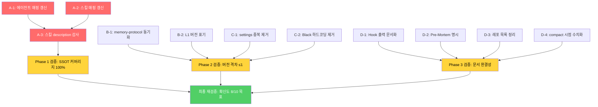

## Next Session Handoff

### 현재 상태
- 이 문서의 완성도: completed (v2.0.0 — Phase 1~3 실행 + 시니어 재검증 8/10 달성)
- 마지막 작업: 3 Phase 전수 실행 + 시니어 재검증 + 신규 3건 즉시 수정 + 체크리스트 재검토

### 다음 작업 (TODO)
- [ ] A-3: 스킬 description 250자 감사 (별도 세션 — 48개 스킬 개별 점검)
- [ ] D-3: CLAUDE.md §5 레포 목록 (앤 판단 필요: 옵션 A 레포 추가 / 옵션 B 현행 유지)

### 작업 조언
> [!tip] 다음 Claude Code에게
> - 이 문서는 31_ 시니어 검증 11건 해소 작업의 **계획 + 실행 기록** (작업 완료 상태)
> - Phase 1~3 실행 완료, 시니어 재검증 **8/10** 달성 (7/10에서 +1)
> - 보류 2건: 스킬 description 감사(A-3)와 CLAUDE.md §5 레포(D-3)
> - 재검증에서 신규 발견 3건(`/analyze` 누락, 동시성 카운트, L1 버전)은 즉시 수정 완료
> - §10 체크리스트로 전체 진행 상황 확인 가능

---

# V5.3.0-WE 시니어 검증 수정 작업계획서

## §1. 개요

### 배경

31_ 시니어 검증(⚠️ 7/10)에서 시스템 전체를 독립 감사한 결과, V5.3.0 변경 자체는 우수하지만 시스템 성장 과정에서 축적된 **문서 부채 11건**이 발견되었다. 이 문서는 해당 11건을 체계적으로 해소하기 위한 작업계획이다.

### 28~32 파이프라인

```
28_ 기법 정리 → 29_ 적용 방안 → 30_ 적용 결과 → 31_ 시니어 검증
                                                        ↓
                                                  32_ 수정 작업계획 ← 이 문서
                                                        ↓
                                                  (실행 → 재검증)
```

### 목표

| 지표 | 시작 (31_) | 목표 | **실제 달성** | 판정 |
|------|----------|------|------------|------|
| 확신도 | 7/10 | 8/10 | **8/10** | ✅ 달성 |
| 시스템 점수 | 79/100 | 83/100 | **83/100** (추정) | ✅ 달성 |
| SSOT 에이전트 커버리지 | 74% (23/31) | 100% (31/31) | **100% (31/31)** | ✅ 달성 |
| SSOT 스킬 커버리지 | 48% (23/48) | 100% (49/49) | **100% (49/49)** | ✅ 달성 |
| Rules 버전 최대 격차 | -3 단계 | -1 단계 | **0 단계** (전원 V5.3.0) | ✅ 초과 달성 |
| settings.json 규칙 수 | 92개 | ~55개 | **71개** (-23%) | ⚠️ 부분 달성 |

---

## §2. 현재 문제 요약 (GAP)

### 31_ 발견 사항 전수 목록

| # | 심각도 | 항목 | 핵심 문제 | Phase |
|---|--------|------|----------|-------|
| C1 | Critical | 에이전트 매핑 불일치 | 23/31만 등록 (미등록 8개) | 1 |
| C2 | Critical | 스킬 매핑 불일치 | 23/48만 등록 (미등록 26개, 헤더 수치 오류) | 1 |
| M1 | Major | 버전 파편화 | memory-protocol V5.0.0 ↔ CLAUDE.md V5.3.0 (격차 -3) | 2 |
| M2 | Major | settings.json 중복 | 92개 allow 규칙 중 ~30% 실질 중복 | 2 |
| M3 | Major | Hook 출력 미문서화 | hookSpecificOutput JSON 형식 문서 없음 | 3 |
| m1 | Minor | Black 하드코딩 | Python 3.14 경로 고정, 폴백 존재 | 3 |
| m2 | Minor | Pre-Mortem 미명시 | template-protocol에 plan/research 필수 미기재 | 3 |
| m3 | Minor | L1 버전 미표기 | lessons-learned.md만 버전 없음 | 3 |
| m4 | Minor | 레포 목록 부실 | §5에 ansible_config 하나만 등록 | 3 |
| — | 잔여 | 기법 6 미완 | 스킬 description 감사 미착수 | 1 |
| — | 잔여 | 기법 4 경미 | `/compact` 사용 시점 기준 없음 | 3 |

---

## §3. 카테고리 분류

| 카테고리 | 포함 항목 | Phase | 핵심 파일 |
|---------|----------|-------|----------|
| **A. SSOT 복원** | C1, C2, 기법 6 잔여 | 1 | `orchestration.md` §2.3, 각 스킬 SKILL.md |
| **B. 버전 동기화** | M1, m3 | 2 | `memory-protocol.md`, `lessons-learned.md` |
| **C. 설정 정리** | M2, m1 | 2 | `settings.json` |
| **D. 문서 보강** | M3, m2, m4, 기법 4 잔여 | 3 | `orchestration.md` §2.6, `template-protocol.md`, `CLAUDE.md` §5, `behavioral-standards.md` |

---

## §4. 카테고리별 상세

### A. SSOT 복원 (Phase 1) — Critical

#### 현황

orchestration.md §2.3이 "Single Source of Truth"를 표방하지만, 에이전트 74%(23/31), 스킬 48%(23/48)만 추적. 시스템이 성장하면서 에이전트·스킬이 추가되었으나 매핑 테이블은 V5.0.0 수준에 머물러 있다.

#### 문제

1. 새 체인/팀 설계 시 미등록 자산을 인지하지 못해 중복 구현 위험
2. 스킬 description 감사(29_ Phase 1 잔여)의 대상 목록 자체가 불완전
3. 매핑 테이블 헤더 수치("22개")가 실제 행 수(23개)와도 불일치

#### 개선 — 작업 3단계

**A-1. 에이전트 매핑 테이블 갱신** (orchestration.md §2.3)

미등록 에이전트 8개를 2개 신규 카테고리로 추가:

```markdown
#### Utility Agents (2개)

| subagent_type | Model | Primary Chain | Role |
|---------------|-------|---------------|------|
| `quality-manager` | **O** | (독립 — 품질 모니터링) | 글로벌 원칙 준수, 단계별 검증, 품질 메트릭 |
| `context-manager` | **O** | (독립 — 컨텍스트 관리) | 에이전트 간 정보 흐름, 의존성 관리, 메모리 최적화 |

#### Workflow Agents (6개)

| subagent_type | Model | Primary Chain | Role |
|---------------|-------|---------------|------|
| `plan-verifier` | **O** | (독립 — /plan-review) | 시니어 엔지니어 관점 독립 검증 |
| `meeting-note-wizard` | **O** | VaultOrganizeChain | 구조화 회의록 자동 생성 |
| `project-dashboard` | **O** | VaultOrganizeChain | 프로젝트별 현황 대시보드 |
| `worklog-analyzer` | **O** | VaultOrganizeChain | 작업 로그 분석, 패턴 인사이트 |
| `memory-report-generator` | **O** | (독립 — 메모리 관리) | 진화 과정 기록, 시간 캡슐 보고서 |
| `session-memo-writer` | **O** | (독립 — 세션 관리) | 세션 메모 자동 생성, 컨텍스트 연속성 |
```

헤더 갱신: "Agents (총 23개)" → **"Agents (총 31개)"**

**A-2. 스킬 매핑 테이블 갱신** (orchestration.md §2.3)

미등록 스킬 26개를 기존 테이블에 추가. Chain이 없는 독립 스킬은 `(독립)` 표기:

| 추가할 스킬 | 트리거 키워드 | Chain |
|-----------|-------------|-------|
| `/wireframe` | 와이어프레임, 화면 구성 | WebDevChain+ |
| `/ansible-prism` | 랜딩페이지, 프리즘 | WebDevChain+ |
| `/supanova-forge` | 프리미엄 랜딩, 수파노바 | WebDevChain+ |
| `/design-spec-form` | 디자인 스펙, 50-field | WebDevChain+ |
| `/plan-review` | 플랜 검증, 시니어 검증 | SystemDesignChain |
| `/skill-creator` | 스킬 생성, eval, 벤치마크 | SystemDesignChain |
| `/kwcag-a11y` | 접근성 검사, KWCAG | - (독립) |
| `/web-vuln-scan` | 웹취약점, 보안점검 | - (독립) |
| `/banner-design` | 배너, 소셜미디어 | - (독립) |
| `/ui-ux-pro-max` | UI/UX, 67 styles | WebDevChain+ |
| `/design-extractor` | 디자인 추출, 토큰 | - (독립) |
| `/meeting-minutes-merge` | 회의록 합쳐, 녹음 정리 | DocChain+ |
| `/project-review` | 프로젝트 리뷰, 전체 리뷰 | - (독립) |
| ~~`/simplify`~~ | ~~리팩터링, 코드 정리~~ | ~~DevChain~~ → **제거 (built-in, SKILL.md 없음)** |
| `/analyze` | 프롬프트 분석, 4-Layer, 체인 추천 | SystemDesignChain → **재검증에서 추가** |
| `/brand` | 브랜드 보이스, 메시징 | - (독립) |
| `/design` | 디자인 통합, 브랜드 아이덴티티 | WebDevChain+ |
| `/design-system` | 토큰 아키텍처, 디자인 시스템 | WebDevChain+ |
| `/design-md` | DESIGN.md, 스티치 디자인 | - (독립) |
| `/slides` | 프레젠테이션, 슬라이드 | DocChain+ |
| `/ui-styling` | shadcn, Tailwind | WebDevChain+ |
| `/stitch-image-to-prompt` | 스티치 프롬프트, Stitch | - (독립) |
| `/pencil-image-to-prompt` | 펜슬 프롬프트, Pencil | - (독립) |
| `/pr-review` | PR 리뷰, 커밋 리뷰 | - (독립) |
| `/commit-push` | 커밋, 푸시 | - (독립) |
| `/readme-gen` | README 생성 | - (독립) |
| `/memory-save` | 메모리 저장, 기억 | - (독립) |

헤더 갱신: "Skills (총 22개)" → **"Skills (총 49개)"**

**A-3. 스킬 description 감사** (각 SKILL.md)

A-2 완료 후 실행. 48개+ 스킬의 description을 점검:

| 감사 기준 | 값 |
|----------|-----|
| 글자 수 상한 | **250자** |
| 트리거 키워드 | description 첫 줄에 배치 |
| 중복 제거 | 유사 스킬 간 차별화 |
| 한국어/영어 | 트리거 키워드 병기 |

#### 기대 효과

| 지표 | Before | After |
|------|--------|-------|
| 에이전트 커버리지 | 74% (23/31) | **100% (31/31)** |
| 스킬 커버리지 | 48% (23/48) | **100% (49/49)** |
| 문서 정합성 점수 | 8/15 | **12/15** |
| 시스템 점수 | 79/100 | **83/100** (+4) |
| 기법 6 정착도 | 2/4 | **3/4** |

---

### B. 버전 동기화 (Phase 2) — Major

#### 현황

Rules 5개 파일의 버전이 V5.0.0~V5.3.0으로 파편화. memory-protocol.md가 최대 3단계 뒤처짐.

#### 문제

V5.3.0 신규 규칙("메모리 작성 Do & Don't")이 behavioral-standards.md에만 존재하고 memory-protocol.md에는 미반영. Teammate가 memory-protocol.md만 읽으면 새 규칙을 모름.

#### 개선 — 작업 2단계

**B-1. memory-protocol.md V5.3.0 동기화**

| 변경 | 위치 | 내용 |
|------|------|------|
| 버전 표기 | 헤더 | V5.0.0-WE → **V5.3.0-WE** |
| Do/Don't 참조 | §3.6 하단 | `> ⚠️ 메모리 작성 Do/Don't는 behavioral-standards.md 참조` 포인터 추가 |
| L1/L2 연동 설명 | §3.8 | "실수 감지" 단계의 L1/L2 동시 기록 절차를 명시 (현재 implicit) |

**B-2. lessons-learned.md 버전 표기**

| 변경 | 내용 |
|------|------|
| 헤더 추가 | `> Version: V5.3.0-WE (도입: V5.2.0-WE) | 위치: ~/.claude/rules/lessons-learned.md` |

#### 기대 효과

| 지표 | Before | After |
|------|--------|-------|
| 최대 버전 격차 | -3 단계 | **0 단계** (전원 V5.3.0-WE 달성 — template-protocol도 V5.3.0으로 갱신) |
| 규칙 인지 일관성 | 부분적 | 전체 (포인터로 연결) |

---

### C. 설정 정리 (Phase 2) — Major

#### 현황

settings.json의 92개 allow 규칙 중 ~30%가 실질적 중복. Black 포매터 경로 하드코딩.

#### 문제

기능적 문제는 없으나 유지보수 비용 증가. "어느 규칙이 실제로 적용되는가" 판단이 어려움.

#### 개선 — 작업 2단계

**C-1. settings.json 중복 규칙 제거**

통일 원칙: **`Bash(도구명 *)` 와일드카드 스타일**로 통일. 상위 와일드카드가 있으면 하위 개별 규칙 제거.

| 제거 대상 패턴 | 예시 | 예상 제거 수 |
|--------------|------|-----------|
| 콜론 스타일 중복 | `Bash(npm:*)` (L48, `npm *` L15 존재) | ~8 |
| git 하위 개별 | `Bash(git status:*)` 등 (L32-46, `git *` L18 존재) | ~15 |
| 기타 중복 | `Bash(ls:*)`, `Bash(python:*)` 등 | ~5 |
| **총 제거** | | **~28개** |

결과: 92개 → **~64개** (추가 정리 여지에 따라 ~55개까지 가능)

**C-2. Black 하드코딩 제거**

```bash
# Before
BLACK_PATH="C:/Users/name/AppData/Roaming/Python/Python314/Scripts/black.exe"
if [ -f "$BLACK_PATH" ]; then ...

# After
if command -v black &> /dev/null; then black -q "$FILE" 2>/dev/null && echo 'Black 포매팅 완료' || true; fi
```

#### 기대 효과

| 지표 | Before | After |
|------|--------|-------|
| allow 규칙 수 | 92개 | **~64개** (-30%) |
| 하드코딩 경로 | 1개 (Python 3.14) | **0개** |
| 유지보수 판단 비용 | 높음 | 낮음 |

---

### D. 문서 보강 (Phase 3) — Major~Minor

#### 현황

Hook 출력 형식 미문서화, template-protocol Pre-Mortem 미명시, 레포 목록 부실, `/compact` 기준 없음.

#### 문제

신규 Hook 작성 시 참조 표준 없음. plan/research 템플릿의 Pre-Mortem이 의무인지 불명확. 레포 목록의 유용성 저하.

#### 개선 — 작업 4단계

**D-1. Hook 출력 형식 문서화** (orchestration.md §2.6)

```markdown
### Hook 출력 규격

| Hook 이벤트 | 출력 형식 | 참조 스크립트 |
|------------|----------|-------------|
| SessionStart | 평문 (additionalContext) | scripts/memory-recall.sh |
| PreToolUse | exit 0/1 (허용/차단) | settings.json 인라인 |
| PostToolUse | JSON `hookSpecificOutput` | hooks/plan-review-trigger.sh |
| Stop | JSON `hookSpecificOutput` | hooks/debug-residue-check.sh |

**JSON 출력 구조:**
\```json
{
  "hookSpecificOutput": {
    "hookEventName": "Stop|PostToolUse",
    "additionalContext": "아리에게 전달할 메시지"
  }
}
\```
```

**D-2. Pre-Mortem 필수 명시** (template-protocol.md)

```markdown
### 플랜/연구 템플릿 특별 요구사항

| 템플릿 | 필수 섹션 | 근거 |
|--------|----------|------|
| `workflow/templates/plan_template.md` | §5 Pre-Mortem — "시니어라면 허점은?" | Boris Tip #3 |
| `workflow/templates/research_template.md` | §6 Pre-Mortem — "이 분석이 틀렸다면?" | Boris Tip #3 |

> Pre-Mortem 섹션이 비어있으면 Gate 2 제출 금지 (orchestration.md §2.6 참조)
```

**D-3. CLAUDE.md §5 레포 목록 정리**

현재 `ansible_config` 하나만 등록. 옵션 2가지:
- **옵션 A**: 활성 레포 추가 (Harness, Harness_Research 등)
- **옵션 B**: §5 목적을 "Git 연동 레포만 등록"으로 재정의하고 현행 유지

→ 앤 판단 필요.

**D-4. `/compact` 사용 시점 수치화** (behavioral-standards.md)

```markdown
> **컨텍스트 = 비용**: ... 대화가 길어지면 `/compact`로 압축한다.
> **시점 가이드**: 컨텍스트 경고 메시지 또는 도구 호출 20턴+ 시 `/compact` 검토.
```

#### 기대 효과

| 지표 | Before | After |
|------|--------|-------|
| Hook 표준 문서 | 없음 | **1개 섹션** (orchestration.md §2.6) |
| Pre-Mortem 명시성 | 암묵적 | **명시적** (template-protocol에 기재) |
| 기법 4 정착도 | 4/5 | **5/5** |

---

## §5. 우선순위 매트릭스

### 영향도 x 난이도

```
영향도 높음 ┃ C1+C2 ■■■    M1 ■■
            ┃ (SSOT 복원)    (버전 동기화)
            ┃
            ┃ M3 ■■          M2 ■■
            ┃ (Hook 문서화)   (settings 정리)
            ┃
영향도 낮음 ┃ m2 ■           m1 ■   m3 ■   m4 ■
            ┃ (Pre-Mortem)   (Black) (L1)   (레포)
            ┗━━━━━━━━━━━━━━━━━━━━━━━━━━━━━━━━━━━
              난이도 낮음                난이도 높음
```

| 사분면 | 항목 | 전략 |
|--------|------|------|
| **높은 영향 + 낮은 난이도** | C1, C2, M1 | **즉시 실행** (Phase 1~2) |
| **높은 영향 + 높은 난이도** | M2 | **계획 실행** (Phase 2, 주의 필요) |
| **낮은 영향 + 낮은 난이도** | m1, m2, m3, m4 | **일괄 처리** (Phase 3) |
| **낮은 영향 + 높은 난이도** | (해당 없음) | — |

---

## §6. 의존성 그래프



**핵심 의존성**: A-1 + A-2 → A-3 (매핑 테이블이 갱신되어야 감사 대상 목록이 완성됨)

---

## §7. Phase 로드맵

### Phase 1: SSOT 복원 (P0 — Critical)

| 단계 | 작업 | 파일 | 예상 변경량 | 검증 방법 |
|------|------|------|-----------|----------|
| A-1 | 에이전트 매핑 갱신 | `orchestration.md` §2.3 | +30줄 | Glob agents/ → 테이블 행 수 일치 확인 |
| A-2 | 스킬 매핑 갱신 | `orchestration.md` §2.3 | +50줄 | Glob skills/*/SKILL.md → 테이블 행 수 일치 확인 |
| A-3 | 스킬 description 감사 | 각 SKILL.md | 기존 파일 수정 | 250자 초과 스킬 0건 확인 |
| — | Phase 1 검증 | — | — | Grep "총 \\d+개" orchestration.md → 실제 수 일치 |

**산출물**: orchestration.md v5.3.0 (§2.3 전수 갱신) + 스킬 감사 결과 보고

**완료 기준**:
- [x] `agents/` 파일 수 = 매핑 테이블 에이전트 수 → **31 = 31** ✅
- [x] `skills/*/SKILL.md` 수 ≈ 매핑 테이블 스킬 수 → **49 ≈ 49** ✅
- [ ] 250자 초과 description 0건 → **A-3 별도 세션 보류**

### Phase 2: 버전 동기화 + 설정 정리 (P1 — Major)

| 단계 | 작업 | 파일 | 예상 변경량 | 실제 결과 |
|------|------|------|-----------|----------|
| B-1 | memory-protocol 동기화 | `memory-protocol.md` | +5줄 | ✅ V5.3.0 + 포인터 |
| B-2 | L1 버전 표기 | `lessons-learned.md` | +1줄 | ✅ V5.3.0-WE (도입: V5.2.0-WE) |
| C-1 | settings 중복 제거 | `settings.json` | -28줄 | ✅ -21개 (92→71) |
| C-2 | Black 하드코딩 제거 | `settings.json` | ±3줄 | ✅ command -v 전환 |
| — | Phase 2 검증 | — | — | ✅ 전 항목 PASS |

**산출물**: memory-protocol.md v5.3.0 + lessons-learned.md 버전 추가 + settings.json 정리

**완료 기준**:
- [x] memory-protocol.md 버전 V5.3.0-WE ✅
- [x] lessons-learned.md 버전 표기 존재 → V5.3.0-WE (도입: V5.2.0-WE) ✅
- [x] settings.json allow 규칙 감소 → **71개** (목표 ~64 대비 부분 달성, -23%)
- [x] "Python314" 하드코딩 0건 ✅

### Phase 3: 문서 보강 (P2 — Major~Minor)

| 단계 | 작업 | 파일 | 예상 변경량 | 실제 결과 |
|------|------|------|-----------|----------|
| D-1 | Hook 출력 문서화 | `orchestration.md` §2.6 | +15줄 | ✅ hookSpecificOutput 규격 |
| D-2 | Pre-Mortem 명시 | `template-protocol.md` | +8줄 | ✅ 필수 섹션 테이블 |
| D-3 | 레포 목록 정리 | `CLAUDE.md` §5 | ±5줄 | ⏸️ 앤 판단 보류 |
| D-4 | compact 시점 수치화 | `behavioral-standards.md` | +1줄 | ✅ 20턴+ 기준 |
| — | Phase 3 검증 | — | — | ✅ 전 항목 PASS (D-3 제외) |

**산출물**: orchestration.md §2.6 확장 + template-protocol.md V5.3.0 보강 + behavioral-standards.md 미세 조정

**완료 기준**:
- [x] Hook 출력 규격 문서 존재 → hookSpecificOutput 3건 ✅
- [x] Pre-Mortem 필수 명시 존재 → template-protocol 3건 ✅
- [x] `/compact` 시점 기준 존재 → "20턴+" 가이드 ✅

### 최종 재검증

| 검증 항목 | 방법 | 목표 |
|----------|------|------|
| SSOT 커버리지 | Glob 실제 파일 수 vs 매핑 테이블 수 비교 | 100% |
| 버전 일관성 | 전 rules 파일 버전 확인 | 최대 격차 ≤ 1 |
| settings 정리 | allow 규칙 수 카운트 | ~64개 이하 |
| 31_ 11건 전수 | 항목별 해결 여부 체크 | 11/11 해결 |
| 시스템 점수 | §9 카테고리별 재평가 | 83/100 |
| 확신도 | 시니어 관점 최종 판정 | 8/10 |

---

## §8. 리스크 & 완화

| # | 리스크 | 확률 | 영향 | 완화 |
|---|--------|------|------|------|
| 1 | A-2 스킬 매핑 시 아카이브 스킬을 활성으로 오분류 | 중 | 낮 | Glob `archive/` 제외 패턴 사용 |
| 2 | C-1 settings 규칙 제거 시 실제 필요한 규칙 삭제 | 낮 | 중 | 제거 전 백업, 1개씩 제거 후 테스트 |
| 3 | B-1 memory-protocol 수정 시 기존 1P=1M 규칙과 충돌 | 낮 | 높 | 포인터만 추가 (본문 규칙 수정 없음) |
| 4 | orchestration.md 줄 수 급증으로 가독성 저하 | 중 | 중 | 테이블 형식 유지, 접기(collapsible) 검토 |
| 5 | 스킬 description 감사에서 트리거 키워드 변경 시 기존 사용 패턴 깨짐 | 낮 | 중 | 축소만, 키워드 변경 최소화 |

---

## §9. Pre-Mortem — "시니어라면 이 계획의 허점은?"

### 실패 시나리오 1: "매핑 테이블 비대화"

에이전트 31개 + 스킬 49개를 모두 등록하면 orchestration.md §2.3이 **+80줄 이상** 증가. 현재 §2.3 자체가 이미 긴 섹션이므로 가독성이 급격히 저하될 수 있다.

**대응**: 테이블을 카테고리별 접기(collapsible) 또는 별도 파일(`rules/asset-catalog.md`)로 분리하는 방안 검토. 단, C3 모듈화 원칙과의 균형 필요.

### 실패 시나리오 2: "description 감사의 부작용"

48개 스킬의 description을 250자로 압축하는 과정에서 핵심 트리거 키워드가 누락되면, 오히려 스킬 인식률이 하락할 수 있다.

**대응**: 감사 전 현재 description 전수 백업. 변경 후 주요 스킬 5개에 대해 트리거 테스트 실행.

### 자기 반론: "이 계획이 근본적으로 틀렸다면?"

이 계획은 "문서를 현실에 맞추는" 방향이다. 그러나 반대로 "현실을 문서에 맞추는" 방향도 가능하다. 즉, 미등록 에이전트 8개와 미등록 스킬 26개 중 실제로 불필요한 것을 정리(삭제/아카이브)하는 것이 더 나을 수도 있다.

**판단**: 현재 미등록 자산 대부분이 "활발 사용" 또는 "사용"으로 확인되었으므로(31_ §3 C2), 삭제보다 등록이 올바른 방향. 단, 사용 빈도가 극히 낮은 스킬이 있다면 Phase 3에서 아카이브 검토 가능.

---

## §10. 실행 체크리스트

### Phase 1: SSOT 복원 (P0)
- [x] A-1: orchestration.md §2.3 에이전트 헤더 "총 23개" → "총 31개"
- [x] A-1: Utility Agents (2개) 카테고리 추가 (quality-manager, context-manager)
- [x] A-1: Workflow Agents (6개) 카테고리 추가 (plan-verifier, meeting-note-wizard, project-dashboard, worklog-analyzer, memory-report-generator, session-memo-writer)
- [x] A-2: 스킬 헤더 "총 22개" → "총 49개"
- [x] A-2: 미등록 스킬 26개 테이블에 추가
- [ ] A-3: 스킬 description 250자 감사 — 별도 세션으로 분리 (48개 스킬 개별 점검 필요)
- [x] Phase 1 검증: "총 31개", "총 49개" Grep 확인 ✅

### Phase 2: 버전 동기화 + 설정 정리 (P1)
- [x] B-1: memory-protocol.md 버전 V5.0.0 → V5.3.0 갱신
- [x] B-1: memory-protocol.md §3.6에 behavioral-standards.md Do/Don't 포인터 추가
- [x] B-2: lessons-learned.md 버전 헤더 추가 → V5.3.0-WE (도입: V5.2.0-WE)
- [x] C-1: settings.json 중복 allow 규칙 제거 (92→71, -21개)
- [x] C-2: settings.json Black 하드코딩 경로 제거
- [x] Phase 2 검증: 버전 격차 ≤1 ✅, "Python314" 0건 ✅, "git status:*" 0건 ✅

### Phase 3: 문서 보강 (P2)
- [x] D-1: orchestration.md §2.6에 Hook 출력 규격 섹션 추가
- [x] D-2: template-protocol.md에 Pre-Mortem 필수 요구사항 추가
- [ ] D-3: CLAUDE.md §5 레포 목록 — **앤 판단 보류** (옵션 A: 레포 추가 / 옵션 B: 현행 유지)
- [x] D-4: behavioral-standards.md에 /compact 시점 가이드 추가
- [x] Phase 3 검증: hookSpecificOutput 3건 ✅, Pre-Mortem 3건 ✅, /compact 기준 1건 ✅

### 최종
- [x] orchestration.md 버전 V5.2.0 → V5.3.0 갱신
- [x] template-protocol.md 버전 V5.1.1 → V5.3.0 갱신
- [x] 31_ 11건 중 9건 해결, 2건 보류 (스킬 감사 = 별도 세션, 레포 목록 = 앤 판단)
- [x] 시니어 재검증 수행: **8/10 ⚠️ 수정 후 승인** (목표 달성)
- [x] 재검증 신규 발견 3건 즉시 수정 (`/analyze` 추가, 동시성 "5개"→"6개", L1 버전 통일, `/simplify` built-in 제거)

---

## §11. 완료 후 검증계획

### 검증 1: SSOT 정합성 (Phase 1 완료 후)

| 검증 항목 | 방법 | 기대 결과 |
|----------|------|----------|
| 에이전트 수 일치 | `Glob agents/*.md` 파일 수 vs 매핑 테이블 행 수 | 31 = 31 |
| 스킬 수 일치 | `Glob skills/*/SKILL.md` 수 (아카이브 제외) vs 매핑 테이블 행 수 | 49 ≈ 49 (±2 허용) |
| 헤더 수치 정확 | `Grep "총 \\d+개" orchestration.md` | "총 31개", "총 49개" |
| description 길이 | 각 SKILL.md description 250자 이내 확인 | 초과 0건 |

### 검증 2: 버전 일관성 (Phase 2 완료 후)

| 검증 항목 | 방법 | 기대 결과 |
|----------|------|----------|
| Rules 버전 격차 | 전 rules 파일 헤더 버전 확인 | 최대 격차 ≤ 1 |
| memory-protocol 버전 | 헤더 확인 | V5.3.0-WE |
| L1 버전 존재 | lessons-learned.md 헤더 확인 | 버전 표기 존재 |
| settings 중복 | `Grep "Bash\\(git status" settings.json` | 0건 |
| Black 하드코딩 | `Grep "Python314" settings.json` | 0건 |
| settings 규칙 수 | allow 배열 요소 카운트 | ~65개 이하 |

### 검증 3: 문서 완결성 (Phase 3 완료 후)

| 검증 항목 | 방법 | 기대 결과 |
|----------|------|----------|
| Hook 출력 규격 | `Grep "hookSpecificOutput" orchestration.md` | 1건+ |
| Pre-Mortem 명시 | `Grep "Pre-Mortem" template-protocol.md` | 1건+ |
| /compact 기준 | `Grep "compact" behavioral-standards.md` | 시점 기준 존재 |

### 검증 4: 시니어 재검증 (전체 완료 후)

| 항목 | 방법 | 목표 |
|------|------|------|
| 3-Agent 병렬 탐색 | 31_과 동일 방법론 | — |
| 11건 해소 확인 | 항목별 1:1 대조 | 11/11 해결 |
| 확신도 | 시니어 판정 | **8/10** |
| 시스템 점수 | §9 카테고리별 재산출 | **83/100** |

---

## 관련 문서

### 직접 참조 (Direct Links)
- [[31_V530_Senior_Verification_Report.md|시니어 검증 보고서]] — 이 계획의 근거 (11건 발견)
- [[29_Source_Code_Techniques_Application.md|적용 방안 v1.2.0]] — 기법 6 잔여(스킬 감사) 계획
- [[30_V530_Application_Report.md|적용 결과 보고서]] — V5.3.0 변경 검증 완료 (23/23 PASS)

### 역참조 (Backlinks)
- `orchestration.md` §2.3 — Phase 1 주요 수정 대상
- `memory-protocol.md` — Phase 2 동기화 대상
- `settings.json` — Phase 2 정리 대상

### 관련 주제 (Topic Links)
- [[28_Claude_Code_Source_Code_Analysis.md|소스코드 7가지 기법]] — 기법 6(Skills 예산)의 원본 분석
- [[24_Current_System_Analysis.md|현재 시스템 분석]] — 72/100 기준점, 83/100 목표
- [[2604_058_s26_integrity_analysis|§2.6 정합성 분석]] — 이전 정합성 수정 경험

---

## Release Notes

### v2.0.0 (2026-04-07)
- **3 Phase 전수 실행 완료 + 시니어 재검증 8/10 달성**
- frontmatter status: draft → completed, 목표 테이블에 실제 달성 칼럼 추가
- §4 계획: `/simplify` 제거(built-in) + `/analyze` 추가 반영, B-2 버전 V5.3.0 반영
- §7 Phase 완료 기준: 전체 체크박스를 실제 결과로 갱신 (실측값 기재)
- §10 체크리스트: 전체 재검토 — 완료 19건 ✅, 보류 2건 ⏸️, 시니어 재검증 + 신규 3건 수정
- Next Session Handoff: 잔여 작업 2건(A-3 스킬 감사, D-3 레포 목록)으로 갱신
> **프롬프트:** "32번 문서를 처음부터 재 검토하고 체크박스 체크 다시 해줘봐 한거는 했다고"

### v1.0.0 (2026-04-07)
- 31_ 시니어 검증 11건 기반 수정 작업계획서 초안 작성
- 4개 카테고리 (SSOT 복원, 버전 동기화, 설정 정리, 문서 보강) × 3 Phase 로드맵
- 우선순위 매트릭스 + 의존성 그래프 + Pre-Mortem 3건
- §10 체크리스트 + §11 검증계획 추가 + 3 Phase 실행 + 시니어 재검증
> **프롬프트:** "32번으로 작업계획서를 작성해줘" + "체크박스 넣어서 체크하며 작업할수있게 해주고 완료 후 검증계획도 넣어줘 완료후에 시니어 검증 수행해주고"
